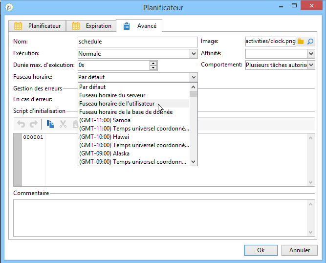

# Gérer les fuseaux horaires{#managing-time-zones}

Adobe Campaign vous permet de gérer les décalages horaires entre les différents pays concernés par la même instance.La configuration appliquée est paramétrée lors de la création de l’instance.

Pour plus d&#39;informations sur la configuration des fuseaux horaires dans Adobe Campaign, consultez le [Guide d&#39;installation de Campaign Classic v7](../../installation/using/time-zone-management.md).

Dans un workflow, vous pouvez adapter les plannings d’exécution des activités et lier un fuseau horaire spécifique à une activité ou à l’ensemble du workflow.Cette configuration peut être utile lors de l’import du fichier ou dans le cadre de la planification des diffusions.

## Planifier l&#39;exécution {#execution-scheduling}

Vous pouvez planifier l’exécution des tâches à l’aide du planificateur (voir [Planificateur](scheduler.md)). Vous pouvez également utiliser les options de planification disponibles dans les activités qui proposent cette fonctionnalité. Ces activités offrent un onglet **[!UICONTROL Planification]** : **[!UICONTROL Collecteur de fichiers]**, **[!UICONTROL Transfert de fichiers]**, **[!UICONTROL Téléchargement Web]**, **[!UICONTROL Réception d’emails]** et **[!UICONTROL SMS]**, etc.

Pour toute tâche planifiée, c&#39;est-à-dire dans toute activité qui propose des options de planification, vous pouvez choisir le fuseau horaire à appliquer. Le fuseau horaire est sélectionné à l&#39;aide de l’onglet **[!UICONTROL Avancé]** de l&#39;activité concernée :

Les valeurs possibles sont les suivantes :

* Fuseau horaire du serveur

  Utilise le fuseau horaire du serveur applicatif d&#39;Adobe Campaign.

* Fuseau horaire de l&#39;utilisateur

  Utilise le fuseau horaire de l&#39;opérateur Adobe Campaign qui lance l&#39;exécution du workflow.

* Fuseau horaire de la base de données

  Utilise le fuseau horaire du serveur de base de données utilisé.

* Fuseaux horaire spécifiques

  Utilise le fuseau horaire sélectionné.

Si la valeur **[!UICONTROL Par défaut]** est sélectionnée, le fuseau horaire du workflow est appliqué, ou, à défaut, celui du serveur applicatif.

## Associer un fuseau horaire à une activité {#linking-a-time-zone-to-an-activity}

L’onglet **[!UICONTROL Avancé]** des activités de workflow vous permet de sélectionner leur fuseau horaire.Si, la plupart du temps, le fuseau horaire du workflow est suffisant, il peut être nécessaire de le surcharger ponctuellement pour une activité spécifique, l’import de données par exemple, afin de lier des dates au fuseau horaire approprié.
