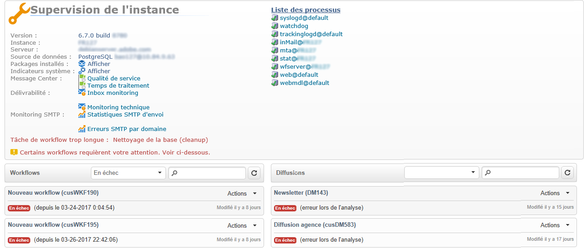

# Surveiller les workflows techniques {#monitoring-technical-workflows}

Les workflows techniques ont besoin d&#39;être surveillés, et des mesures doivent être prises en cas d&#39;échec.

D’autres méthodes de surveillance des différents processus de campagne sont présentées dans [cette page](https://helpx.adobe.com/campaign/kb/acc-maintenance.html).

## Tableau de bord de supervision de l&#39;instance {#instance-monitoring-dashboard}

Le tableau de bord de supervision de l&#39;instance est accessible via l&#39;univers **[!UICONTROL Supervision]**.

Dans Indicateurs système et fichiers core, vérifier qu&#39;aucun indicateur n&#39;est surligné en rouge. Si c&#39;est le cas et que certains indicateurs sont surlignés en rouge, procédez comme suit :

* Vérifiez que les traitements nécessaire sont toujours en cours d&#39;exécution,
* Vérifiez qu&#39;aucun des traitement n&#39;est trop vieux,
* Vérifiez que les fichiers de log des différents traitements ne contiennent pas d&#39;erreurs graves ou récurrentes.

## Workflows techniques {#technical-workflows}

Les workflows techniques sont disponibles via **[!UICONTROL Administration]** > **[!UICONTROL Exploitation]** > **[!UICONTROL Workflows techniques]**.

Selon le workflow technique, suivez les étapes détaillées ci-après pour vérifier que tout fonctionne comme prévu.

Pour comprendre la fonction de chaque workflow technique, consultez cette [section](../../workflow/using/about-technical-workflows.md).

Pour le **[!UICONTROL Workflow de Nettoyage de la base (&#39;cleanup&#39;)]** :

1. Vérifiez que le workflow **[!UICONTROL Nettoyage de la base]** s&#39;exécute et se termine correctement tous les jours. Voir à ce propos cette [page](../../workflow/using/delivery.md).
1. Allez voir le journal des logs pour vérifier que le temps écoulé reste relativement constant et n&#39;affecte pas d&#39;autres workflows.
1. Pour plus d&#39;informations, consultez cette [page](../../production/using/database-cleanup-workflow.md).

Pour le **[!UICONTROL Workflow de tracking (&#39;tracking&#39;)]** :

Vérifiez que le workflow de Tracking s&#39;exécute comme prévu (une fois par heure par défaut) et que le journal des logs n&#39;indique pas d&#39;erreurs récurrentes. Voir à ce propos cette [section](../../workflow/using/delivery.md).

Pour la **[!UICONTROL Mise à jour délivrabilité (&#39;deliverabilityUpdate&#39;)]** :

1. Vérifiez que le workflow **[!UICONTROL Mise à jour délivrabilité]** s&#39;exécute et se termine correctement tous les jours. Voir à ce propos cette [page](../../workflow/using/delivery.md).
1. Dans le journal des logs, vérifiez que les règles sont mises à jour régulièrement.

Pour le **[!UICONTROL Processus de campagne (&#39;operationMgt&#39;, &#39;deliveryMgt&#39;, ...)]** :

1. Examinez tous les workflows situés sous le dossier **[!UICONTROL Processus de campagne.]** Pour plus d’informations à ce propos, consultez [cette page](../../workflow/using/campaign.md).
1. Vérifiez que les workflow s&#39;exécutent comme prévu et que le journal des logs n&#39;indique pas d&#39;erreurs récurrentes.

## Supervision de workflow {#workflow-supervision}

Le groupe **[!UICONTROL Superviseurs de workflow]** doit contenir des opérateurs devant être tenus informés des échecs et pouvant réagir à temps.

En cas de problème, une alerte doit être générée et envoyée au bon groupe.

Vérifiez que chaque opérateur a une adresse email valide.

Tous les workflows devant être en état d&#39;exécution pour que la plate-forme soit opérationnelle (tels que les imports de données) doivent être déclarés comme des workflows de « Production » (case à cocher) et apparaître en gras.

## Liste de maintenance des workflows {#workflow-maintenance-list}

Tous les workflows techniques personnalisés doivent être documentés dans une feuille de travail contenant :

* Le nom et l&#39;emplacement du workflow.
* Objectif.
* La planification et les dépendances.
* L&#39;opérateur en charge de la surveillance.
* Des consignes sur les mesures à adopter en cas d&#39;erreur.

## Planification et automatisation de la surveillance {#planning-and-automation-of-monitoring}

La planification de la surveillance des workflows améliore son efficacité. Certaines tâches doivent avoir lieu tous les jours, alors que d&#39;autres sont nécessaires une fois par semaine ou une fois par mois.

Le fait de sauvegarder les workflows dans des dossiers nommés en fonction de leur récurrence et triés par planning d&#39;exécution augmente l&#39;efficacité de la surveillance.

L&#39;automatisation de la surveillance permet d&#39;économiser des ressources et garantit la planification des tâches à un intervalle adapté.

Il est possible de construire un workflow de surveillance qui enverra un email à chaque fois qu&#39;une tâche précise tombe en erreur ou qu&#39;une table critique devient trop volumineuse.

Il est possible de créer une vue permettant de surveiller tous les workflows d&#39;une même zone fonctionnelle ou d&#39;un même système.

Il est également possible d&#39;utiliser la fonctionnalité de traitement ou de rapport Adobe Campaign pour construire une documentation à la demande et toujours à jour.
