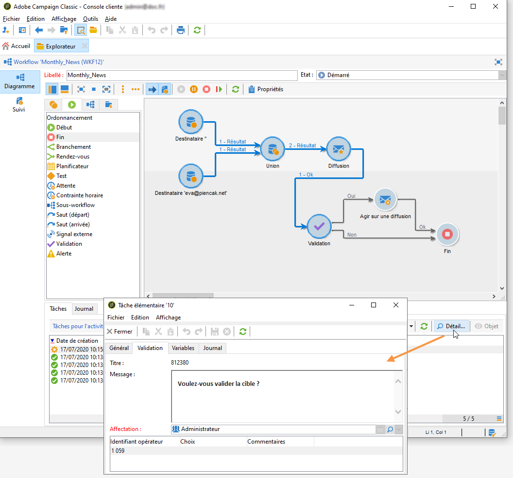
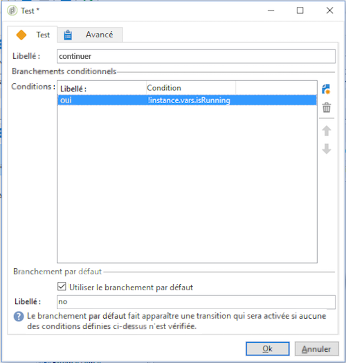

# Surveiller l&#39;exécution des workflows {#monitoring-workflow-execution}

Cette section présente des informations sur la manière de surveiller l’exécution de vos processus.

Vous trouverez également dans [cette section](../../workflow/using/supervising-workflows.md#supervising-workflows)un exemple d’utilisation de la création d’un flux de travail qui vous permet de surveiller l’état d’un ensemble de flux de travail en pause, arrêté ou avec des erreurs.

En outre, les administrateurs de l’instance peuvent utiliser le journal **** d’audit pour vérifier les activités et les dernières modifications apportées aux processus, l’état de vos processus. Pour plus de détails, reportez-vous à la [section dédiée](../../production/using/audit-trail.md).

D’autres méthodes de surveillance des différents processus de campagne sont présentées dans [cette page](https://helpx.adobe.com/campaign/kb/acc-maintenance.html).

## Afficher la progression {#displaying-progress}

Vous pouvez suivre l&#39;exécution en affichant la progression à partir de l&#39;icône correspondante de la barre d&#39;outils.

The **[!UICONTROL Display progress information]** icon lets you display the status and the activity result in the execution screen.


Lorsque cette option est sélectionnée, les activités exécutées apparaissent en bleu, les activités en attente clignotent, les avertissements sont affichés en orange et les erreurs en rouge. Cette option affiche également le résultat des activités sur leur transition sortante, suivi du libellé du résultat tel qu&#39;il a été défini dans les propriétés de l&#39;activité et de la durée du traitement, lorsqu&#39;elle est supérieure à une seconde.


## Afficher le journal {#displaying-logs}

Le journal contient l&#39;historique de l&#39;exécution du workflow. Il mémorise les actions effectuées par les opérateurs, les opérations réalisées et les erreurs d&#39;exécution. Vous pouvez :

* Sélectionnez l’ **[!UICONTROL Tracking]** onglet dans les détails. Cette liste contient tous les messages de flux de travaux.

   

* Filtrez les messages du journal par activité. Pour ce faire, cliquez **[!UICONTROL Display the tasks and the log]** sur la barre d’outils au-dessus du diagramme afin d’afficher les **[!UICONTROL Log]** onglets et **[!UICONTROL Tasks]** sous le diagramme. Sélectionnez une activité pour afficher tous les messages associés. Cette liste contient tous les messages lorsqu’aucune activité n’est sélectionnée.

   

   >[!NOTE]
   >
   >Cliquez sur l&#39;arrière-plan du diagramme pour tout désélectionner.

* Afficher uniquement les messages liés à une tâche donnée. Pour ce faire, sélectionnez l’ **[!UICONTROL Tasks]** onglet, puis sélectionnez une activité dans le diagramme afin de restreindre la liste. Cliquez deux fois sur une tâche pour afficher les informations ; le dernier onglet de la fenêtre contient le journal.

   

   Le **[!UICONTROL Details...]** bouton vous permet d’afficher toutes les informations supplémentaires sur l’exécution de l’activité. Par exemple, vous pouvez afficher l’opérateur de validation et, le cas échéant, le commentaire saisi lors de l’approbation, comme dans l’exemple suivant :

   

>[!NOTE]
>
>Le journal n&#39;est pas purgé lors d&#39;un redémarrage. Tous les messages sont conservés. Si vous ne voulez pas conserver les messages d&#39;une exécution précédente, vous devez purger l&#39;historique.

Le journal affiche la liste chronologique des messages d&#39;exécution des activités du workflow de ciblage.

* Journal d&#39;une opération de ciblage

   Once a targeting campaign has been executed, click the **[!UICONTROL Tracking]** tab to view the execution trace.

   

   Tous les messages de l&#39;opération sont affichés: les opérations réalisées et les avertissements ou les erreurs d&#39;exécution.

* Journal d&#39;une activité

   Vous pouvez également visualiser le journal de l&#39;exécution et le détail d&#39;exécution de chaque activité. Pour cela, deux méthodes sont possibles :

   1. Sélectionnez l’activité ciblée et cliquez sur l’ **[!UICONTROL Display the tasks and the log]** icône .

      

      La section inférieure du diagramme affiche alors deux onglets : Journal et Tâches.

      La sélection d&#39;une activité sur le diagramme agit comme un filtre sur le journal et la liste des tâches.

      

   1. Right-click the targeted activity and select **[!UICONTROL Display logs]**.

      

      Le journal est alors affiché dans une fenêtre distincte.

## Purger l&#39;historique {#purging-the-logs}

L’historique du flux de travail n’est pas purgé automatiquement : tous les messages sont conservés par défaut. L&#39;historique peut être purgé via le **[!UICONTROL File > Actions]** menu ou en cliquant sur le **[!UICONTROL Actions]** bouton situé dans la barre d&#39;outils au-dessus de la liste. Sélectionner **[!UICONTROL Purge history]**. Les options disponibles dans le **[!UICONTROL Actions]** menu sont détaillées dans la section de la barre d’outils [](../../workflow/using/executing-a-workflow.md#actions-toolbar) Actions.


## Tables de travail et schémas des workflows {#worktables-and-workflow-schema}

Le workflow véhicule des tables de travail qui peuvent être manipulées via certaines activités. Adobe Campaign permet, via les activités de Data Management, de transformer, renommer, enrichir, les colonnes des tables de travail du workflow, par exemple pour les aligner sur la nomenclature en fonction des besoins du client, collecter des informations complémentaires sur le co-titulaire d&#39;un contrat, etc.

Il est également possible de créer des liens entre des dimensions de travail différentes, et de définir des changements de dimension, par exemple pour chaque contrat enregistré dans la base, s&#39;adresser au titulaire principal et utiliser les données relatives au(x) co-titulaire(s) dans les informations additionnelles.

Les tables de travail du flux de travail sont automatiquement supprimées lorsque le flux de travail est passif. Si vous souhaitez conserver une table de travail, enregistrez-la dans une liste via l’ **[!UICONTROL List update]** activité (voir Mise à jour [de la](../../workflow/using/list-update.md)liste).

## Gérer les erreurs {#managing-errors}

Lorsqu’une erreur se produit, le flux de travaux est interrompu et l’activité en cours d’exécution lorsque l’erreur s’est produite clignote en rouge. Dans l’aperçu du flux de travaux (**[!UICONTROL Monitoring]** univers > **[!UICONTROL Workflows]** lien), vous pouvez afficher les flux de travaux avec des erreurs uniquement, comme illustré ci-dessous.


In the Adobe Campaign Explorer, the workflow list displays a **[!UICONTROL Failed]** column by default.


Lorsqu’un flux de travail est en erreur, le ou les opérateurs appartenant au groupe de supervision du flux de travail sont avertis par courrier électronique, dès lors que leur adresse électronique est répertoriée dans leur profil. Ce groupe est sélectionné dans le **[!UICONTROL Supervisor(s)]** champ des propriétés du processus.


Le contenu de la notification est configuré dans le modèle **[!UICONTROL Workflow manager notification]** par défaut : Ce modèle est sélectionné dans l’ **[!UICONTROL Execution]** onglet des propriétés du processus. La notification indique le nom du processus d’erreur et de la tâche concernée.

Exemple de notification :


Le lien permet d&#39;accéder en Web à la console Adobe Campaign et, après connexion, d&#39;agir sur le workflow en erreur.


Vous pouvez configurer le flux de travaux de sorte qu’il ne s’arrête pas et qu’il continue son exécution en cas d’erreur. Pour ce faire, modifiez le processus **[!UICONTROL Properties]** et, dans la **[!UICONTROL Error management]** section, sélectionnez l’ **[!UICONTROL Ignore]** option dans le **[!UICONTROL In case of error]** champ. Vous pouvez ensuite spécifier le nombre d’erreurs consécutives qui peuvent être ignorées avant la mise en pause du processus.

Dans ce cas, la tâche en erreur est abandonnée. Ce mode est particulièrement adapté aux workflows conçus pour retenter l&#39;opération ultérieurement (actions périodiques).


>[!NOTE]
>
>Vous pouvez appliquer ce paramétrage au niveau de chaque activité. Pour ce faire, modifiez les propriétés de l’activité et sélectionnez le mode de gestion des erreurs dans l’ **[!UICONTROL Advanced]** onglet.

Pour plus d’informations sur le dépannage de l’exécution des processus, reportez-vous à la section [](../../production/using/workflow-execution.md)dédiée.

## Traiter les erreurs {#processing-errors}

En ce qui concerne les activités, l’ **[!UICONTROL Process errors]** option affiche une transition spécifique qui sera activée si une erreur est générée. Dans ce cas, le flux de travail ne passe pas en mode d’erreur et l’exécution continue.

Les erreurs prises en compte sont les erreurs du système de fichiers (impossible de déplacer un fichier, impossible d&#39;accéder au répertoire, etc.).

Cette option ne traite pas les erreurs liées au paramétrage de l&#39;activité, c&#39;est-à-dire des valeurs invalides. Les erreurs liées à un mauvais paramétrage n&#39;activeront pas cette transition (répertoire inexistant, etc.).

Si un flux de travaux est en pause (manuellement ou automatiquement après une erreur), le **[!UICONTROL Start]** bouton redémarre l’exécution du flux de travaux là où il a été arrêté. L’activité erronée (ou l’activité suspendue) sera réexécutée. Les activités précédentes ne sont pas réexécutées.

To re-execute all of the workflow activities, use the **[!UICONTROL Restart]** button.

Si vous effectuez des modifications sur les activités déjà exécutées, elles ne sont pas prises en compte lorsque l&#39;exécution du workflow reprend.

Si vous effectuez des modifications sur les activités non exécutées, elles sont prises en compte lorsque l&#39;exécution du workflow reprend.

Si vous effectuez des modifications sur l&#39;activité en pause, elles peuvent ne pas être correctement prises en compte lors de la reprise du workflow.

Si possible, il est recommandé de le relancer complètement après avoir effectué des modifications.

## Supervision de l&#39;instance {#instance-supervision}

The **[!UICONTROL Instance supervision]** page lets you view the Adobe Campaign server activity and display the list of workflows and deliveries with errors.

To access this page, go to the **[!UICONTROL Monitoring]** universe and click the **[!UICONTROL General view]** link.


Pour afficher tous les processus, cliquez sur le **[!UICONTROL Workflows]** lien. Utilisez la liste déroulante pour afficher les processus dans la plateforme en fonction de leur état.


Lorsqu&#39;un workflow est en erreur, cliquez sur le lien pour l&#39;ouvrir et visualiser le journal.


## Empêcher les exécutions multiples simultanées {#preventing-simultaneous-multiple-executions}

Il peut arriver que plusieurs exécutions opèrent en même temps sur un même workflow. Dans certains cas, ce processus doit être empêché.

Par exemple, il se peut qu&#39;un planificateur déclenche l&#39;exécution du workflow une fois par heure, mais parfois, l&#39;exécution du workflow dans son ensemble dure plus d&#39;une heure. Il peut être préférable de passer l&#39;exécution si le workflow est déjà en cours d&#39;exécution.

En cas de présence d&#39;une activité signal au début du workflow,il peut être préférable de passer le signal si le workflow est déjà en cours d&#39;exécution.

Le principe général est le suivant :


La solution consiste à utiliser une variable d&#39;instance. Les variables d&#39;instance sont partagées par toutes les exécutions parallèles des workflows.

Voici un workflow de test simple :


L’événement **[!UICONTROL Scheduler]** déclenche un événement toutes les minutes. L’ **[!UICONTROL Test]** activité suivante va tester la variable d’instance **isRunning** pour décider si l’exécution doit se poursuivre ou non :



>[!NOTE]
>
>**isRunning** est un nom de variable choisi pour cet exemple. Il ne s&#39;agit pas d&#39;une variable native.

L&#39;activité qui suit le **[!UICONTROL Test]** dans la branche **oui** doit configurer la variable d&#39;instance dans son **Script d&#39;initialisation** :

```
instance.vars.isRunning = true
```

La dernière activité de la branche **oui** doit rétablir le statut faux de la variable dans son **Script d&#39;initialisation** :

```
instance.vars.isRunning = false
```

Notez que :

* La valeur actuelle de la variable d&#39;instance est visible dans l&#39;onglet **Variables** des **Propriétés** du workflow.
* Les variables d&#39;instance sont remise à zéro lorsqu&#39;un workflow est redémarré.
* Dans JavaScript, une valeur non définie est considérée comme fausse dans un test, ce qui permet de tester la variable d&#39;instance avant même de l&#39;avoir initiée.
* Il est possible de surveiller les activités non traitées par ce mécanisme en ajoutant une consigne d&#39;enregistrement au script d&#39;initialisation de la fin « non ».

   ```
   logInfo("Workflow already running, parallel execution not allowed.");
   ```

Cette section présente un cas d’utilisation : [Coordination des mises à jour](../../workflow/using/coordinating-data-updates.md)des données.

## Maintenance de la base de données {#database-maintenance}

Les workflows utilisent beaucoup de tables de travail qui occupent de l&#39;espace et finissent par ralentir l&#39;ensemble de la plate-forme s&#39;ils ne sont pas maintenus. Pour plus d&#39;informations sur la maintenance des bases de données, voir cette [section](../../production/using/tables-to-maintain.md).

Le workflow **Nettoyage de la base** (cleanup), accessible à partir du noeud **Administration > Exploitation > Workflows techniques**, permet de supprimer les données obsolètes afin d&#39;éviter une croissance exponentielle de la base. Le workflow se déclenche de manière automatique sans intervention de l&#39;utilisateur. Consultez cette [section](../../production/using/database-cleanup-workflow.md).

Vous pouvez également créer des workflows techniques spécifiques pour purger les données inutiles qui occupent de l&#39;espace. Voir cette [section](../../production/using/application-objects.md) et cette [page](#purging-the-logs).

## Gérer les workflows en pause {#handling-of-paused-workflows}

Par défaut, si un workflow est en pause, ses tables de travail ne sont jamais purgées. Depuis le build 8880, les workflows ayant été dans un état « en pause » pendant trop longtemps sont automatiquement arrêtés et leurs tables de travail sont purgées. Ce comportement est déclenché de la manière suivante :

* Les workflows qui sont en pause depuis plus de 7 jours apparaissent sous la forme d&#39;un avertissement dans le tableau de bord de supervision (et l&#39;API de supervision) et une notification est envoyée au groupe des superviseurs.
* Cette situation se produit chaque semaine, lorsque le workflow technique **[!UICONTROL cleanupPausedWorkflows]** est déclenché. For more details on the workflow, refer to [this section](../../workflow/using/delivery.md).
* Après 4 notifications (soit un mois en pause par défaut), le flux de travaux s’arrête inconditionnellement. Un journal s’affiche dans le flux de travaux une fois qu’il a été arrêté. Les tableaux sont purgés au prochain flux de travail d’exécution **[!UICONTROL cleanup]** .

Ces périodes peuvent être configurées à l&#39;aide de l&#39;option NmsServer_PausedWorkflowPeriod.

Les superviseurs de workflow sont avertis. Le créateur et le dernier utilisateur ayant modifié le workflow sont également informés. Les administrateurs ne reçoivent pas les notifications.

## Filtrage des processus en fonction de leur état{#filtering-workflows-status}

L’interface de Campaign Classic vous permet de surveiller l’état d’exécution de tous les processus de votre instance à l’aide de **vues** prédéfinies. Pour accéder à ces vues, ouvrez le noeud **[!UICONTROL Administration]**/**[!UICONTROL Audit]**/**[!UICONTROL Workflows Status]**.

Les vues suivantes sont disponibles :

* **[!UICONTROL Running]**: répertorie tous les processus en cours d’exécution.
* **[!UICONTROL Paused]**: répertorie tous les processus en pause.
* **[!UICONTROL Failed]**: répertorie tous les processus ayant échoué.
* **[!UICONTROL Start Pending]**: répertorie tous les processus en attente d’être démarrés par le processus operationMgt. Cette vue est disponible uniquement avec le package des campagnes **** marketing (voir [Installation des packs](../../installation/using/installing-campaign-standard-packages.md)standard de campagne).


Par défaut, ces vues sont accessibles dans le **[!UICONTROL Audit]** dossier. Vous pouvez toutefois les recréer à l’emplacement de votre choix dans l’arborescence des dossiers. De cette manière, ils seront accessibles aux utilisateurs standard sans droit d’administration.

Pour ce faire :

1. Cliquez avec le bouton droit sur le dossier dans lequel vous souhaitez ajouter la vue.
1. Dans **[!UICONTROL Add new folder]**/**[!UICONTROL Administration]**, sélectionnez la vue à ajouter.
1. Une fois le dossier ajouté à l&#39;arborescence, assurez-vous de le configurer en tant qu&#39;affichage afin qu&#39;il affiche tous les processus, quel que soit leur dossier d&#39;origine.Pour plus d&#39;informations sur la configuration des vues, reportez-vous à [cette section](../../platform/using/access-management.md#adding-folders-and-creating-views).

En outre, vous pouvez configurer des dossiers de filtres qui vous permettront de filtrer la liste des processus en fonction de leur état d’exécution. Pour cela :

1. Accédez à un dossier de type processus, puis sélectionnez le **[!UICONTROL Filters]** / **[!UICONTROL Advanced filter]** menu.
1. Configurez le filtre de sorte que le **[!UICONTROL @status]** champ du flux de travail soit égal à l’état de votre choix.
1. Enregistrez le filtre et nommez-le. Il sera alors directement disponible dans la liste des filtres.


Pour plus d’informations, reportez-vous aux sections suivantes :

* [Création de filtres avancés](../../platform/using/creating-filters.md#creating-an-advanced-filter)
* [Enregistrement des filtres](../../platform/using/creating-filters.md#saving-a-filter)
