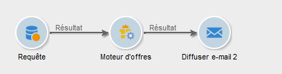
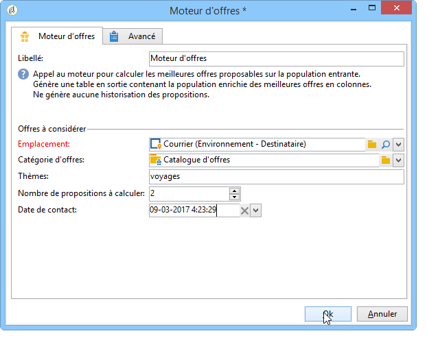

# Moteur d&#39;offres{#offer-engine}

L&#39;activité **[!UICONTROL Moteur d&#39;offres]** vous permet de définir un appel au moteur d&#39;offres en amont d&#39;une diffusion.

Cette activité fonctionne sur le même principe que l’activité d’enrichissement avec un appel au moteur, en enrichissant les données de la population entrante avec une offre calculée par le moteur, avant une diffusion.

Après avoir paramétré votre requête (voir cette [section](query.md)) :

1. Placez et ouvrez une activité **[!UICONTROL Moteur d&#39;offres]**.
1. Renseignez les différents champs disponibles afin de définir les paramètres d&#39;appel au moteur (emplacement, catégorie ou thème(s), date de contact, nombre d&#39;offres à conserver). Le moteur calculera automatiquement la ou les offres à ajouter en fonction de ces paramètres.

   >[!CAUTION]
   >
   >Si vous utilisez cette activité, seules les propositions utilisées dans la diffusion sont stockées.

   

1. Paramétrez ensuite une activité de diffusion correspondant au canal de votre choix. Voir à ce sujet la section [Diffusions cross-canal](cross-channel-deliveries.md).
