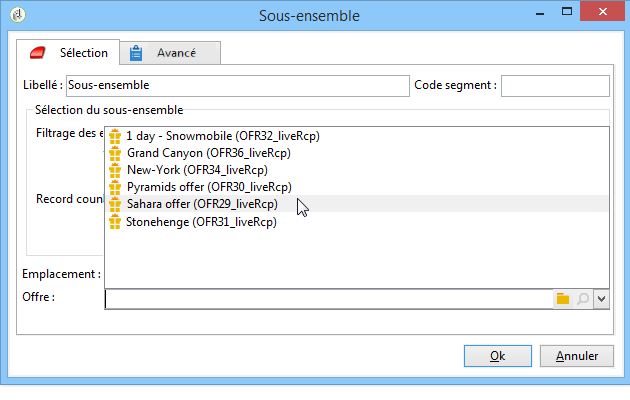

# Offres par cellule{#offers-by-cell}

L&#39;activité **[!UICONTROL Offres par cellules]** vous permet de répartir la population entrante (par exemple issue d&#39;une requête) en plusieurs segments, et de définir une offre à proposer pour chacun de ces segments.

Cette activité ne peut être utilisée qu’avec **Interaction**. Pour plus d&#39;informations, consultez cette [section](../../interaction/using/about-outbound-channels.md).

Pour cela :

1. Placez l&#39;activité **[!UICONTROL Offres par cellules]** après avoir défini la population cible, puis ouvrez-là.
1. Dans l&#39;onglet **[!UICONTROL Général]**, sélectionnez l&#39;emplacement sur lequel vous souhaitez proposer les offres.
1. Dans l&#39;onglet **[!UICONTROL Cellules]**, définissez les différents sous-ensembles via le bouton **[!UICONTROL Ajouter]** :

   * Définissez la population du sous-ensemble grâce aux règles de filtrage et de limitation disponibles.
   * Sélectionnez ensuite l&#39;offre que vous souhaitez présenter au sous-ensemble. Les offres disponibles sont celles qui sont éligibles sur l&#39;emplacement sélectionné à l&#39;étape précédente.

     

1. Paramétrez ensuite une activité de diffusion correspondant au canal de votre choix. Pour plus d&#39;informations, consultez la section [Diffusions cross-canal](cross-channel-deliveries.md).
