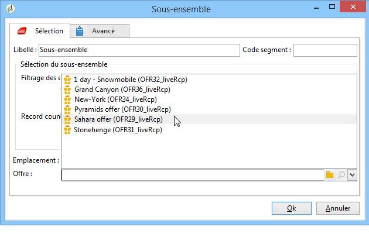

# Offres par cellule{#offers-by-cell}

The **[!UICONTROL Offers by cell]** activity lets you distribute the inbound population (from a query for example) into several segments and to specify an offer to present for each of these segments.

Cette activité ne peut être utilisée qu&#39;avec **Interaction**. Pour plus d&#39;informations, consultez cette [section](../../interaction/using/about-outbound-channels.md).

Pour cela :

1. Add the **[!UICONTROL Offers by cell]** activity once you have specified the target population, then open it.
1. In the **[!UICONTROL General]** tab, select the offer space on which you want to present the offers.
1. In the **[!UICONTROL Cells]** tab, specify the different sub-sets using the **[!UICONTROL Add]** button:

   * Définissez la population du sous-ensemble grâce aux règles de filtrage et de limitation disponibles.
   * Sélectionnez ensuite l&#39;offre que vous souhaitez proposer au sous-ensemble. Les offres disponibles sont celles éligibles sur l&#39;emplacement sélectionné à l&#39;étape précédente.

      

1. Configurez ensuite une activité de diffusion correspondant au canal choisi. Reportez-vous à la section Livraisons cross-canal.

