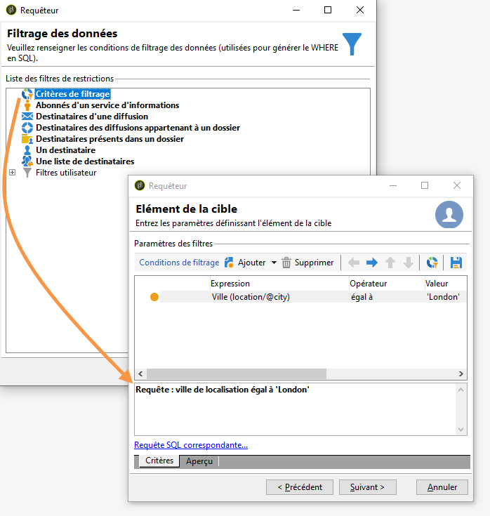

# Réaliser un calcul d&#39;agrégats {#performing-aggregate-computing}

Dans cet exemple, vous allez comptabiliser le nombre de destinataires domiciliés à Paris, en fonction de leur genre.

* Quelle table doit-on sélectionner ?

   La table des destinataires (**nms:recipient**).

* Quels sont les champs à sélectionner en colonne de sortie ?

   Clé primaire (avec comptage) et Genre.

* En fonction de quels critères seront filtrées les informations ?

   En fonction des destinataires domiciliés à Paris.

Pour réaliser cet exemple, les étapes sont les suivantes :

1. Dans **[!UICONTROL Data to extract]**, définissez un nombre pour la clé primaire (comme illustré dans l’exemple précédent). Ajoutez le **[!UICONTROL Gender]** champ dans la colonne de sortie. Cochez l’ **[!UICONTROL Group]** option dans la **[!UICONTROL Gender]** colonne. Ainsi, les bénéficiaires seront regroupés par sexe.

   

1. In the **[!UICONTROL Sorting]** window, click **[!UICONTROL Next]**: no sorting is necessary here.
1. Paramétrez le filtrage des données. Ici, vous allez restreindre la sélection aux contacts domiciliés à Paris.

   

   >[!NOTE]
   >
   >Une valeur est sensible à la casse. Si la valeur &#39;paris&#39; est entrée dans la condition sans majuscule et si la liste des destinataires comporte le terme &quot;Paris&quot; avec une majuscule, la requête ne peut pas aboutir.

1. In the **[!UICONTROL Data formatting]** window, click **[!UICONTROL Next]**: no formatting is required for this example.
1. Dans la fenêtre d’aperçu, cliquez sur **[!UICONTROL Launch data preview]**.

   Il y a trois valeurs distinctes dans un tri par genre : **2** correspond au genre féminin, **1** au genre masculin et la valeur **0** apparaît lorsque le genre est inconnu. Dans cet exemple, la liste comporte 14 femmes, 34 hommes et 2 personnes dont le genre n&#39;est pas renseigné.

   
