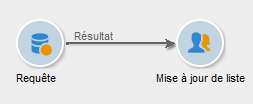
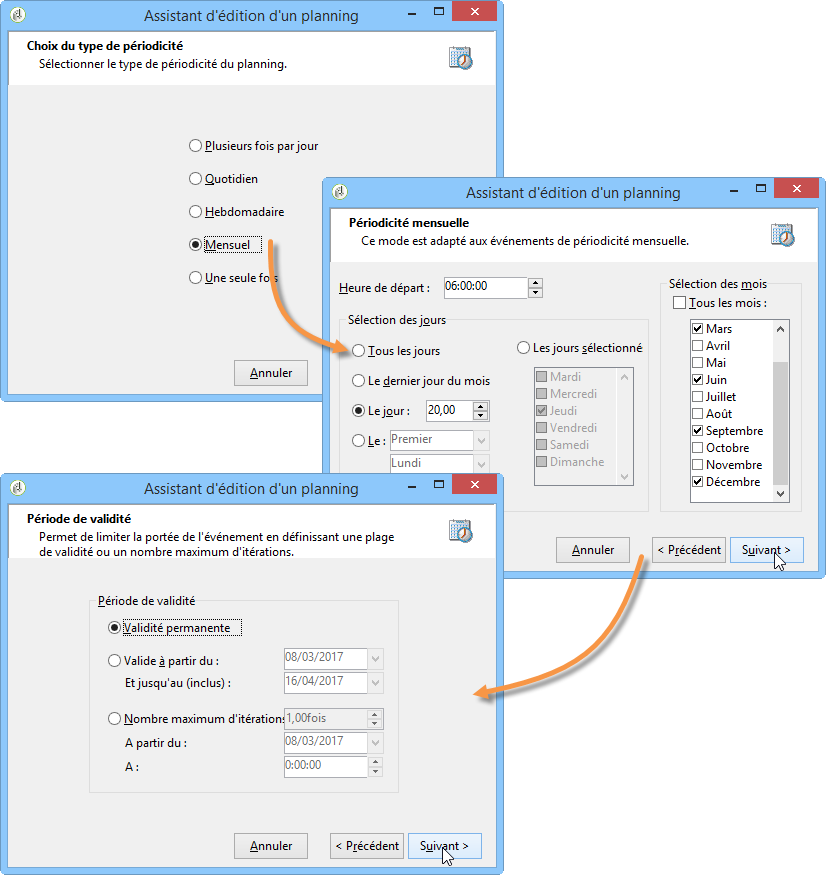

# Mise à jour de la liste trimestrielle à l’aide d’une requête incrémentielle {#quarterly-list-update}

Dans l’exemple suivant, une [requête incrémentale](incremental-query.md) est utilisée pour mettre automatiquement à jour une liste de personnes destinataires.Ces personnes destinataires sont ciblées dans le cadre des campagnes marketing saisonnières.

Comme ces campagnes sont lancées au début de chaque saison afin de proposer des activités sportives pertinentes, ces listes sont mises à jour tous les trimestres.Cependant, une personne destinataire ne doit être ciblée ici qu’une fois tous les 9 mois par cette campagne.Vous pouvez ainsi espacer la fréquence d’éligibilité de la personne destinataire et proposer des activités selon les saisons au fil des ans.

1. Placez une activité de requête incrémentale ainsi qu&#39;une activité de mise à jour de liste dans un nouveau workflow.
1. Paramétrez l’onglet **[!UICONTROL Requête incrémentale]** de l’activité comme indiqué à la section [Création dʼune requête](query.md#creating-a-query).
1. Sélectionnez l’onglet **[!UICONTROL Planification et historique]** et indiquez un historique de 270 jours.Une personne destinataire déjà ciblée ne sera plus ciblée pendant une période de 270 jours, soit environ 9 mois.

   Cliquez ensuite sur le bouton **[!UICONTROL Changer...]**.

1. Le but étant de mettre à jour la liste avant chaque début de saison, sélectionnez le type de périodicité **[!UICONTROL Mensuel]**.
1. Dans l’écran suivant, sélectionnez Mars, Juin, Septembre et Décembre.Indiquez comme jour le 20 du mois et choisissez l’heure à laquelle lancer l’exécution du workflow.
1. Sélectionnez ensuite la période de validité de la requête. Par exemple, si vous souhaitez que cette dernière soit active en permanence, sélectionnez **[!UICONTROL Validité permanente]**.

   

1. Après avoir validé le paramétrage de la requête incrémentale, paramétrez l&#39;activité de mise à jour de liste comme décrit à la section [Mise à jour de liste](list-update.md).

Le workflow sera ainsi lancé automatiquement juste avant chaque début de saison.La liste sera mise à jour avec les nouvelles personnes destinataires éligibles pour recevoir les offres.
