# Requête{#query}

## Créer une requête {#creating-a-query}

Une requête permet de sélectionner une cible selon des critères. Vous pouvez associer un code segment au résultat de la requête et y insérer des données additionnelles.
Pour plus d&#39;informations sur les exemples de requêtes, consultez cette [section](../../workflow/using/querying-recipient-table.md).

>[!NOTE]
>
>Les activités de requête ne sont pas compatibles avec les champs CLOB lors de l’utilisation d’Oracle.

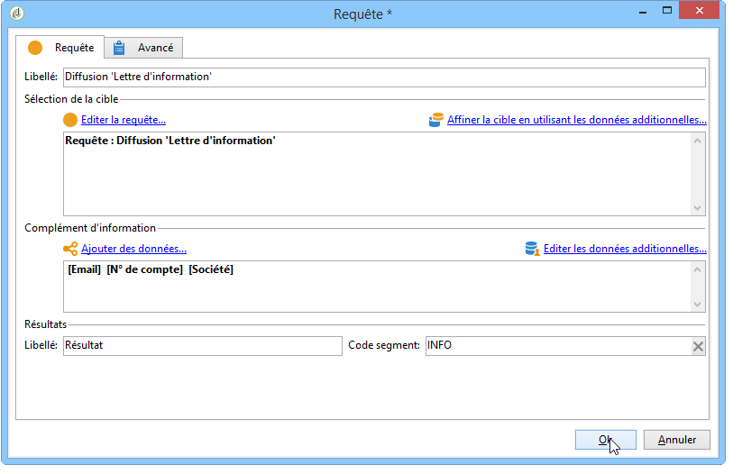

For more on using and managing additional data, refer to [Adding data](#adding-data).

Le lien **[!UICONTROL Editer la requête...]** permet de définir le type de ciblage, les restrictions et les critères de sélection de la population de la manière suivante :

1. Sélectionnez la dimension de ciblage et de filtrage. Par défaut, la cible est sélectionnée parmi les destinataires. La liste des filtres de restriction est la même que celle utilisée lors du ciblage d&#39;une diffusion.

   La dimension de ciblage correspond au type d&#39;élément sur lequel on va travailler, par exemple la population ciblée par l&#39;opération.

   La dimension de filtrage permet d&#39;aller chercher ces éléments, par exemple les informations liées à la personne ciblée (les contrats, les soldes de comptes, etc.).

   For more on this, refer to [Targeting and filtering dimensions](../../workflow/using/building-a-workflow.md#targeting-and-filtering-dimensions).

   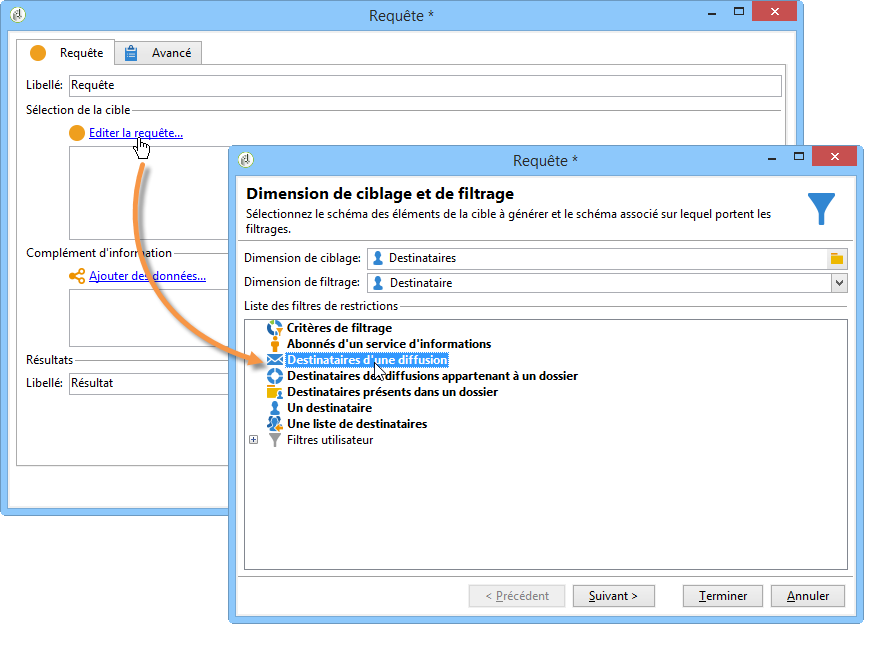

   Une requête peut être basée sur les données de la transition entrante, le cas échéant, en sélectionnant **[!UICONTROL Schéma temporaire]** lors du choix des dimensions de ciblage et de filtrage.

   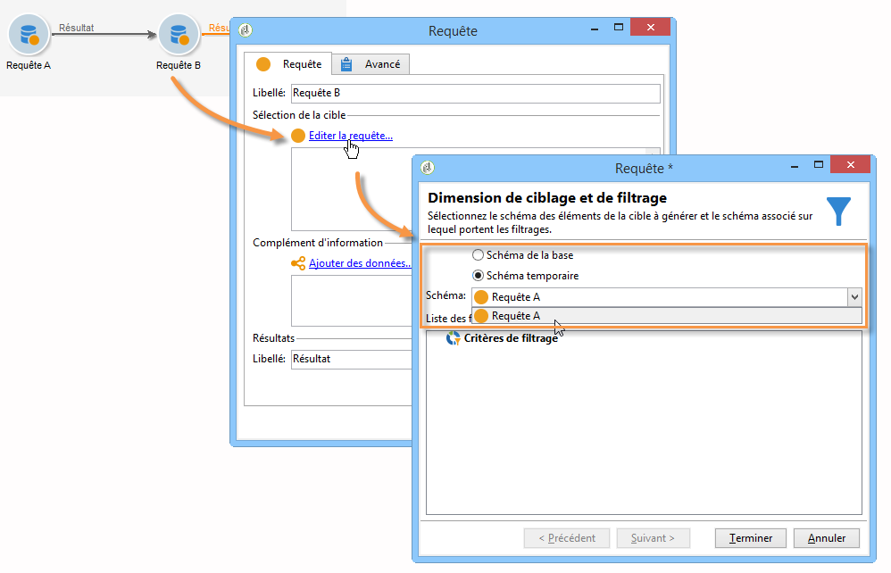

1. Définissez la sélection des populations via l&#39;assistant. Les champs à renseigner peuvent différer en fonction du type de cible. Vous pouvez afficher un aperçu de la population ciblée avec vos critères actuels via l&#39;onglet **[!UICONTROL Aperçu]**.

   La création et l&#39;utilisation des filtres et des requêtes sont présentées dans cette [section](../../platform/using/filtering-options.md).

   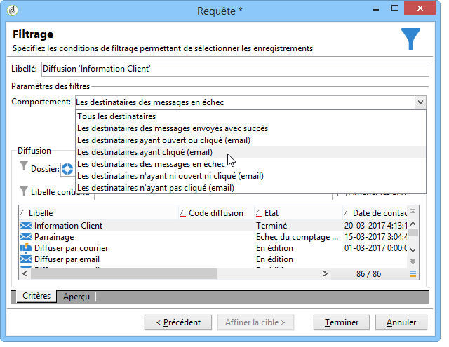

1. Ajoutez éventuellement des critères de filtrage manuellement si vous avez sélectionné **[!UICONTROL Critères de filtrage]** à l&#39;étape 1 ou via l&#39;option **[!UICONTROL Filtres]** > **[!UICONTROL Filtre avancé...]**.

   Vous pouvez également ajouter des conditions de groupement de données en cochant la case correspondante. Pour cela, la dimension de filtrage doit impérativement être différente de la dimension de ciblage de la requête. Pour plus d&#39;informations concernant le groupement, consultez cette [section](../../workflow/using/querying-using-grouping-management.md).

   Vous pouvez ajouter plusieurs critères en vous aidant de l&#39;outil de construction d&#39;expressions et les combiner via les opérateurs logiques ET, OU et SAUF. Vous pouvez ensuite afficher la **[!UICONTROL Requête SQL correspondante...]** à votre combinaison de critères. Voir à ce propos cette [section](../../platform/using/defining-filter-conditions.md#building-expressions).

   Enregistrez votre filtre si vous souhaitez pouvoir le réutiliser ultérieurement.

   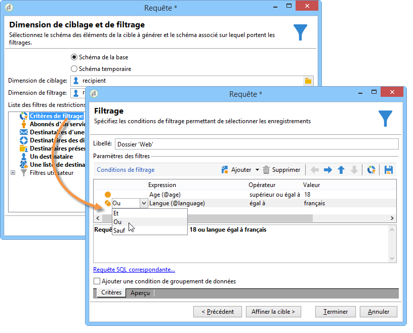

## Ajouter des données {#adding-data}

Les colonnes additionnelles permettent de collecter des informations supplémentaires sur la population ciblée, par exemple ses numéros de contrats, ses abonnements à des newsletters ou son origine. Ces données peuvent être stockées dans la base de données Adobe Campaign ou dans une base externe.

Le lien **[!UICONTROL Ajouter des données...]** permet de sélectionner les données additionnelles à collecter.

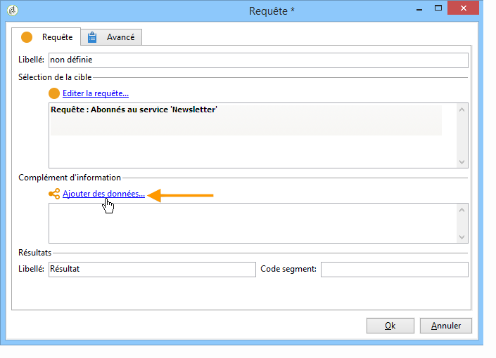

Sélectionnez d&#39;abord le type de données à ajouter :

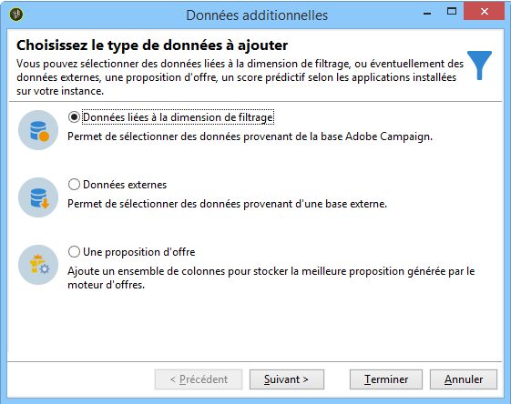

* Sélectionnez **[!UICONTROL Données liées à la dimension de ciblage]** pour sélectionner des données de la base Adobe Campaign.
* Select **[!UICONTROL External data]** to add data from an external database. This option is only available if you have purchased the **Federated Data Access** option. For more on this, refer to [Accessing an external database (FDA)](../../workflow/using/accessing-an-external-database--fda-.md).
* Sélectionnez l&#39;option **[!UICONTROL Une proposition d&#39;offre]** pour ajouter un ensemble de colonnes permettant de stocker la meilleure proposition générée par le moteur d&#39;offres. Cette option n&#39;est disponible que si vous avez acquis le module **Interaction**.

Si aucun module optionnel n&#39;est installé sur la plate-forme, cette étape n&#39;est pas affichée. Vous accédez directement à l&#39;étape suivante.

Pour ajouter des données de la base Adobe Campaign :

1. Sélectionnez le type de données que vous souhaitez ajouter. Il peut s&#39;agir de données appartenant à la dimension de filtrage ou de données stockées dans des tables liées.

   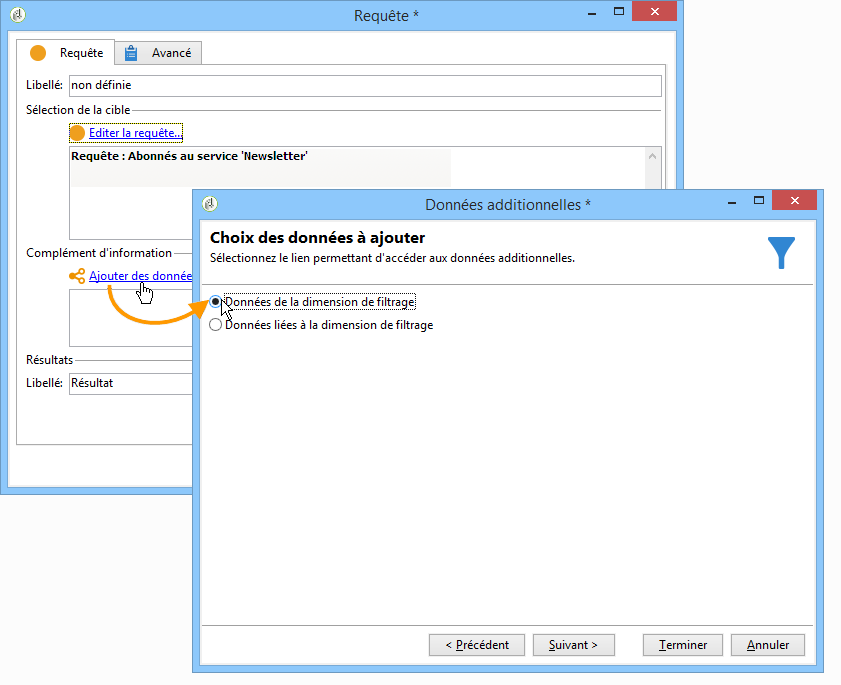

1. Lorsque les données appartiennent à la dimension de filtrage de la requête, il suffit de les sélectionner dans la liste des champs disponibles afin de les faire apparaître parmi les colonnes de sortie.

   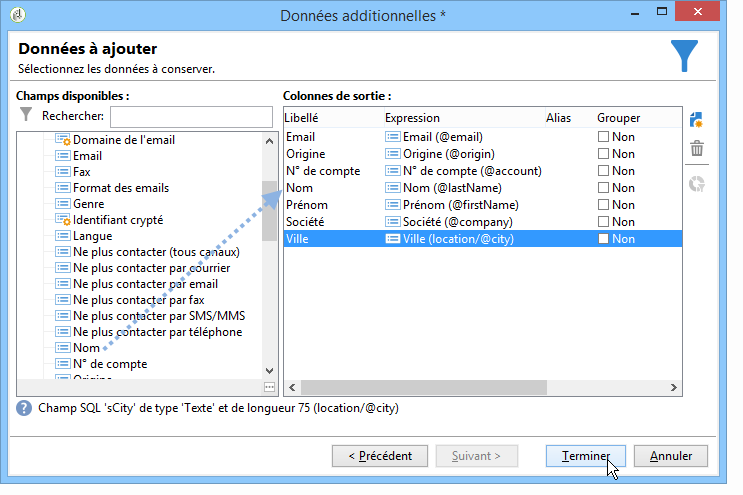

   Vous pouvez ajouter :

   * Champ calculé sur la base de données provenant de la population ciblée ou d’un total (nombre d’achats en attente au cours du dernier mois, montant moyen d’un reçu, etc.). Par exemple, accédez à [Sélection de données](../../workflow/using/targeting-data.md#selecting-data).
   * Un nouveau champ, créé à partir du bouton **[!UICONTROL Ajouter]** situé à droite de la liste des colonnes de sortie.

      Vous pouvez également ajouter une collection d’informations, par exemple une liste de contrats, les 5 dernières livraisons, etc. Les collections coïncident avec des champs pouvant avoir plusieurs valeurs pour le même profil (relation 1-N). Pour plus d’informations, reportez-vous à la section [Modification de données](../../workflow/using/targeting-data.md#editing-additional-data)supplémentaires.

Pour ajouter une collection d&#39;informations liées à une population ciblée :

1. Sélectionnez l&#39;option **[!UICONTROL Données liées à la dimension de filtrage]** à la première étape de l&#39;assistant :
1. Sélectionnez la table contenant les informations à collecter et cliquez sur le bouton **[!UICONTROL Suivant.]**

   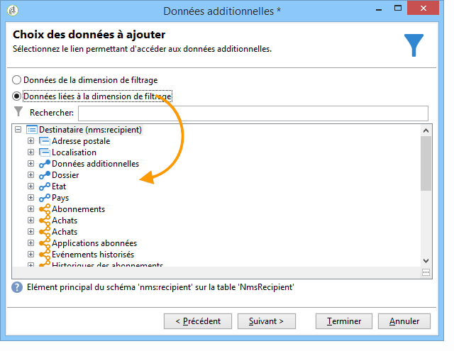

1. Au besoin, indiquez le nombre d&#39;éléments de la collection que vous souhaitez conserver en sélectionnant une des valeurs du champ **[!UICONTROL Données collectées]**. Par défaut, toutes les lignes de la collection sont récupérées, puis filtrées selon les conditions définies à l&#39;étape suivante.

   * Si un seul élément de la collection correspond aux conditions de filtrage définies à l&#39;étape suivante, sélectionnez **[!UICONTROL Ligne unique]** dans le champ **[!UICONTROL Données collectées]**.

      >[!IMPORTANT]
      >
      >Ce mode optimise la requête SQL générée grâce à une jointure directe sur les éléments de la collection.
      >
      >Si la condition initiale n&#39;est pas respectée, le résultat peut être erroné (lignes manquantes ou doublons).

   * Si vous choisissez de récupérer plusieurs lignes (**[!UICONTROL Limiter le nombre de lignes]**), vous pouvez indiquer le nombre de lignes à collecter.
   * Si les colonnes collectées contiennent des agrégats, par exemple le nombre de sinistres déclarés, la moyenne des dépenses sur un site, etc., vous pouvez utiliser la valeur **[!UICONTROL Agrégats]**.
   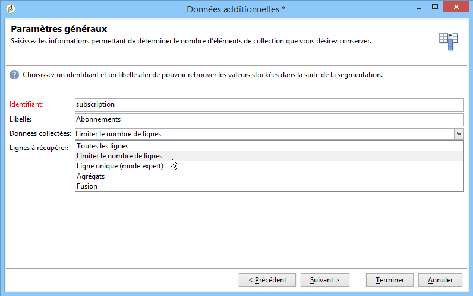

1. Définissez la sous-sélection des éléments de la collection. Par exemple : les achats des 15 derniers jours seulement.

   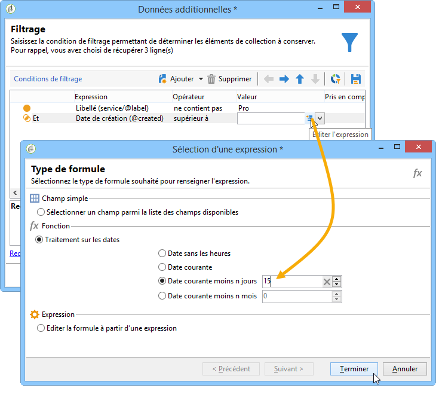

1. Si vous avez sélectionné l&#39;option **[!UICONTROL Limiter le nombre de lignes]**, définissez l&#39;ordre de tri des données collectées. Lorsque le nombre de lignes collectées est supérieur au nombre de lignes à conserver que vous avez indiqué, l&#39;ordre de tri permet de définir quelles sont les lignes à conserver.

## Exemple : ciblage sur des attributs destinataires simples {#example--targeting-on-simple-recipient-attributes}

Dans l&#39;exemple suivant, la requête cherchera à identifier les hommes de 18 à 30 ans et vivant en France. Cette requête pourra par exemple être utilisée dans un workflow visant à leur faire parvenir une offre qui leur est spécialement réservée.

>[!NOTE]
>
>D&#39;autres exemples de requête sont présentés dans [cette section](../../workflow/using/querying-recipient-table.md).

1. Nommez votre requête puis sélectionnez le lien **[!UICONTROL Editer la requête...]**.
1. Sélectionnez **[!UICONTROL Critères de filtrage]** dans la liste des types de filtres disponibles.
1. Renseignez les différents critères correspondant à la cible souhaitée. Ici, les critères sont combinés à l’aide de l’opérateur ET. Pour faire partie de la sélection, ils devront donc réunir les quatre conditions suivantes :

   * Les destinataires dont la civilité est &quot;M.&quot; (également possible en utilisant le champ **Genre** et la valeur **Masculin**).
   * Les destinataires ayant moins de 30 ans.
   * Les destinataires ayant plus de 18 ans.
   * Les destinataires dont le pays de résidence est la France.
   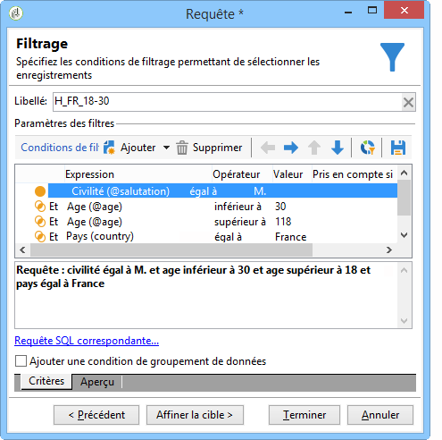

   Vous pouvez visualiser le code SQL correspondant à votre combinaison de critères :

   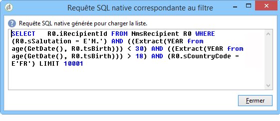

1. Affichez un aperçu des destinataires correspondant à votre requête via l&#39;onglet correspondant afin de vérifier que vos critères sont correctement renseignés :

   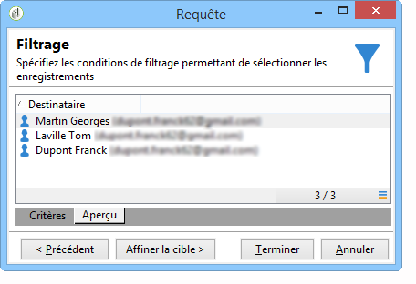

1. Sauvegardez éventuellement vos filtres pour pouvoir les réutiliser ultérieurement puis cliquez sur **[!UICONTROL Terminer]** > **[!UICONTROL Ok]**.
1. Poursuivez l&#39;édition de votre workflow en y ajoutant d&#39;autres activités. Une fois ce dernier lancé et l&#39;étape de la requête précédemment créée terminée, le nombre de destinataires trouvés s&#39;affiche. Vous pouvez en afficher le détail via le menu contextuel de la souris (clic droit sur la transition > **[!UICONTROL Afficher la cible]**).

   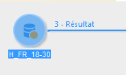

## Paramètres de sortie {#output-parameters}

* tableName
* schema
* recCount

Ce triplet de valeurs identifie la population ciblée par la requête. **[!UICONTROL tableName]** est le nom de la table qui mémorise les identifiants de la cible, **[!UICONTROL schema]** est le schéma de la population (habituellement nms:recipient) et **[!UICONTROL recCount]** est le nombre d&#39;éléments dans la table.

Cette valeur est le schéma de la table de travail. Ce paramètre est valable pour toutes les transitions avec **[!UICONTROL tableName]** et **[!UICONTROL schema]**.

## Optimisation de vos requêtes {#optimizing-queries}

La section ci-dessous présente les meilleures pratiques pour optimiser les requêtes exécutées sur Adobe Campaign afin de limiter la charge de travail sur la base de données et d’améliorer l’expérience utilisateur.

### Jointures et index {#joins-and-indexes}

* Les requêtes efficaces reposent sur des index.
* Utilisez un index pour toutes les jointures.
* La définition de liens sur le schéma détermine les conditions de jointure. La table liée doit avoir un index unique sur la clé primaire et la jointure doit se trouver sur ce champ.
* Effectuez des jointures en définissant des clés sur des champs numériques au lieu de champs de chaîne.
* Evitez d’exécuter des jointures externes. Dans la mesure du possible, utilisez l’enregistrement d’ID zéro pour obtenir la fonctionnalité de jointure externe.
* Utilisez le type de données approprié pour les jointures.

   Assurez-vous que la `where` clause est du même type que le champ.

   Une erreur courante est : `iBlacklist='3'` où `iBlacklist` est un champ numérique et `3` signifie une valeur de texte.

   Assurez-vous de connaître le plan d&#39;exécution de votre requête. Evitez les analyses de table complètes, en particulier pour les requêtes en temps réel ou quasi en temps réel qui s’exécutent toutes les minutes.

Pour plus d’informations, reportez-vous aux[bonnes pratiques](https://helpx.adobe.com/campaign/kb/acc-data-model-best-practices.html) du modèle de données et aux sections de mappage [de](../../configuration/using/database-mapping.md) base de données.

### Fonctions {#functions}

* Attention aux fonctions comme `Lower(...)`. Lorsque la fonction Lower est utilisée, l’index n’est pas utilisé.
* Vérifiez soigneusement les requêtes à l’aide de l’instruction &quot;J’aime&quot; ou des instructions &quot;supérieur&quot; ou &quot;inférieur&quot;. Appliquez &quot;Upper&quot; sur la saisie de l’utilisateur et non sur le champ de base de données.

   For more on functions, refer to [this section](../../platform/using/defining-filter-conditions.md#list-of-functions).

### Filtrage des dimensions {#filtering-dimensions}

Utilisez la dimension de filtrage de la requête au lieu d’utiliser l’opérateur &quot;existe tel que&quot;.

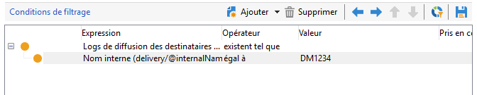

Dans les requêtes, les conditions &quot;existe tel que&quot; dans les filtres ne sont pas efficaces. Ils sont l’équivalent d’une sous-requête dans SQL :

`select iRecipientId from nmsRecipient where iRecipientId IN (select iRecipientId from nmsBroadLog where (...))`

Il est recommandé d’utiliser plutôt la dimension de filtrage de la requête :

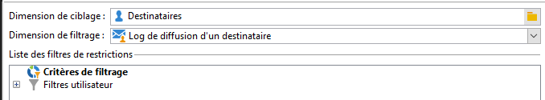

L’équivalent de la dimension de filtrage dans SQL est la jointure interne :

`select iRecipientId from nmsRecipient INNER JOIN nmsBroadLog ON (...)`

For more on filtering dimensions, refer to [this section](../../workflow/using/building-a-workflow.md#targeting-and-filtering-dimensions).

### Architecture {#architecture}

* Créez une plateforme de développement avec des volumes, des paramètres et une architecture similaires à ceux de la plate-forme de production.
* Utilisez les mêmes valeurs pour les environnements de développement et de production. Dans la mesure du possible, utilisez la même méthode :

   * Système d&#39;exploitation,
   * Version,
   * Données,
   * Application,
   * Volumes.
   >[!NOTE]
   >
   >Une fonctionnalité qui fonctionne dans un environnement de développement peut ne pas fonctionner dans un environnement de production où les données peuvent être différentes. Essayer d&#39;identifier les principales différences afin d&#39;anticiper les risques et de préparer des solutions.

* Effectuez des configurations qui correspondent aux volumes cible. Les gros volumes nécessitent des configurations spécifiques. Une configuration qui fonctionnait pour 100 000 destinataires peut ne pas fonctionner pour 10 000 000 destinataires.

   Pensez à la façon dont le système va évoluer lorsqu&#39;il sera en service. Le simple fait que quelque chose fonctionne à petite échelle ne signifie pas qu&#39;il sera adapté à de plus grands volumes. Les essais doivent être effectués avec des volumes similaires au volume en production. Vous devez également évaluer l’effet des modifications des volumes (nombre d’appels, taille de la base de données) aux heures de pointe, aux jours de pointe et pendant toute la durée du projet.
