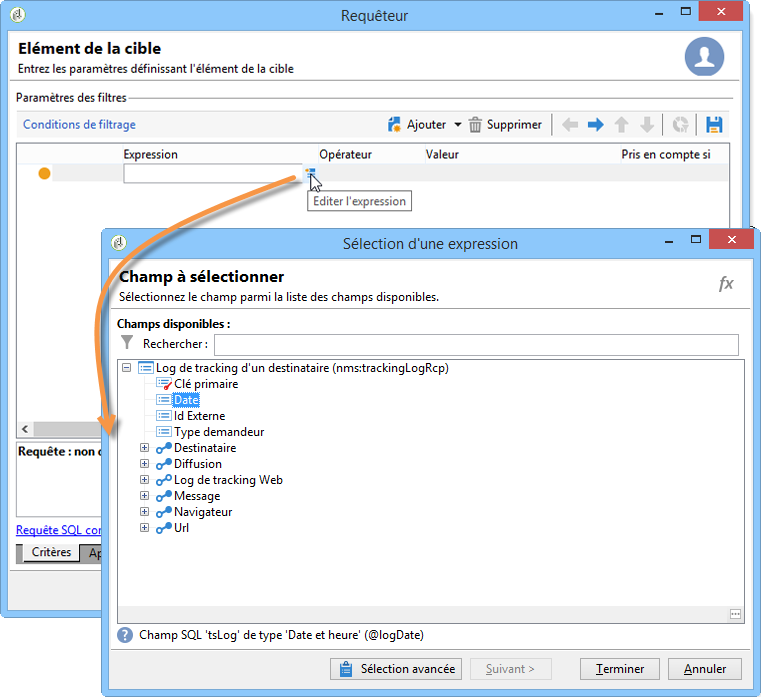
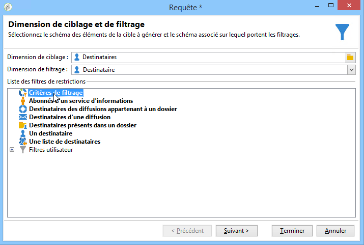
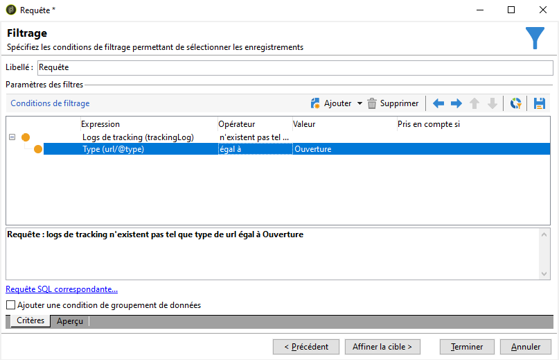
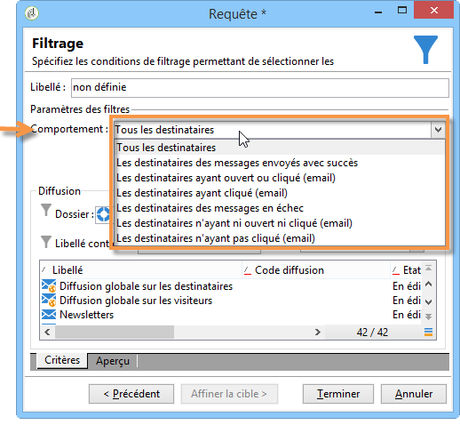

# Requête sur les informations de diffusion {#querying-delivery-information}

## Nombre de clics pour une diffusion spécifique {#number-of-clicks-for-a-specific-delivery}

Dans cet exemple, nous cherchons à récupérer le nombre de clics pour une diffusion spécifique. Ces clics sont enregistrés grâce aux journaux de suivi des destinataires pris sur une période donnée. Le destinataire est identifié par son adresse électronique. Cette requête utilise la **[!UICONTROL Recipient tracking logs]** table.

* Quelle table doit-on sélectionner ?

   The recipient log tracking table (**[!UICONTROL nms:trackingLogRcp]**)

* Quels sont les champs à sélectionner en colonne de sortie ?

   Clé primaire (avec comptage) et Email.

* En fonction de quels critères seront filtrées les informations ?

   En fonction d&#39;une période précise et en fonction d&#39;un élément du libellé de diffusion.

Pour réaliser cet exemple, les étapes sont les suivantes :

1. Ouvrez le schéma **[!UICONTROL Generic query editor]** et sélectionnez-le **[!UICONTROL Recipient tracking logs]** .

   

1. Dans la **[!UICONTROL Data to extract]** fenêtre, nous voulons créer un agrégat pour collecter des informations. Pour ce faire, ajoutez la clé primaire (située au-dessus de l’ **[!UICONTROL Recipient tracking logs]** élément principal) : Le nombre de journaux de suivi est effectué sur ce **[!UICONTROL Primary key]** champ. L’expression modifiée sera **[!UICONTROL x=count(primary key)]**. Il relie la somme de divers journaux de suivi à une seule adresse électronique.

   Pour cela :

   * Cliquez sur l’ **[!UICONTROL Add]** icône à droite du **[!UICONTROL Output columns]** champ. Dans la **[!UICONTROL Formula type]** fenêtre, sélectionnez l’ **[!UICONTROL Edit the formula using an expression]** option et cliquez sur **[!UICONTROL Next]**. Dans la **[!UICONTROL Field to select]** fenêtre, cliquez sur **[!UICONTROL Advanced selection]**.

      

   * Dans la **[!UICONTROL Formula type]** fenêtre, exécutez un processus sur la fonction d’agrégation. Ce processus sera un décompte des clés principales.

      Sélectionnez **[!UICONTROL Process on an aggregate function]** dans la **[!UICONTROL Aggregate]** section et cliquez sur **[!UICONTROL Count]**.

      

      Clics **[!UICONTROL Next]**.

   * Sélectionnez le **[!UICONTROL Primary key (@id)]** champ. La colonne **[!UICONTROL count (primary key)]** de sortie est configurée.

      

1. Sélectionnez l’autre champ à afficher dans la colonne de sortie. Dans la **[!UICONTROL Available fields]** colonne, ouvrez le **[!UICONTROL Recipient]** noeud et choisissez **[!UICONTROL Email]**. Cochez la **[!UICONTROL Group]** case **[!UICONTROL Yes]** pour regrouper les journaux de suivi par adresse électronique : ce groupe lie chaque journal à son destinataire.

   

1. Configurez le tri des colonnes de sorte que les destinataires les plus actifs (avec le plus de journaux de suivi) s’affichent en premier. Vérifiez **[!UICONTROL Yes]** la **[!UICONTROL Descending sort]** colonne.

   

1. Vous devez ensuite filtrer sur les logs qui vous intéressent, c&#39;est-à-dire ceux récents de moins de 15 jours et relatifs à des diffusions portant sur les Soldes.

   Pour cela :

   * Configurez le filtrage des données. Pour ce faire, sélectionnez **[!UICONTROL Filter conditions]** puis cliquez sur **[!UICONTROL Next]**.

      

   * Récupérez les logs de tracking d&#39;une diffusion spécifique et sur une période donnée. Pour cela, utilisez trois conditions de filtrage : deux conditions de date pour situer la période recherchée entre 15 jours avant la date courante et la veille de la date courante, et une autre condition pour restreindre la recherche à une diffusion particulière.

      Dans la **[!UICONTROL Target element]** fenêtre, configurez la date à partir de laquelle les journaux de suivi seront pris en compte. Clics **[!UICONTROL Add]**. Une ligne de condition s’affiche. Modifiez la **[!UICONTROL Expression]** colonne en cliquant sur la **[!UICONTROL Edit expression]** fonction. Dans la **[!UICONTROL Field to select]** fenêtre, choisissez **[!UICONTROL Date (@logDate)]**.

      

      Sélectionnez l’ **[!UICONTROL greater than]** opérateur. Dans la **[!UICONTROL Value]** colonne, cliquez sur **[!UICONTROL Edit expression]**, puis dans la **[!UICONTROL Formula type]** fenêtre, sélectionnez **[!UICONTROL Process on dates]**. Enfin, dans **[!UICONTROL Current date minus n days]**, saisissez &quot;15&quot;.

      Clics **[!UICONTROL Finish]**.

      

   * Pour sélectionner la date de fin de la recherche dans le journal de suivi, créez une seconde condition en cliquant sur **[!UICONTROL Add]**. Dans la **[!UICONTROL Expression]** colonne, choisissez **[!UICONTROL Date (@logDate)]** à nouveau.

      Sélectionnez l’ **[!UICONTROL less than]** opérateur. Dans la **[!UICONTROL Value]** colonne, cliquez sur **[!UICONTROL Edit expression]**. Pour le traitement de la date, accédez à la **[!UICONTROL Formula type]** fenêtre, saisissez &quot;1&quot; dans **[!UICONTROL Current date minus n days]**.

      Clics **[!UICONTROL Finish]**.

      

      L&#39;intervalle de temps est configuré. La troisième condition de filtrage est à paramétrer : elle permettra d&#39;identifier la diffusion sur laquelle porte la recherche.

   * Cliquez sur la **[!UICONTROL Add]** fonction pour créer une autre condition de filtrage. Dans la **[!UICONTROL Expression]** colonne, cliquez sur **[!UICONTROL Edit expression]**. Dans la **[!UICONTROL Field to select]** fenêtre, sélectionnez **[!UICONTROL Label]** dans le **[!UICONTROL Delivery]** noeud.

      Clics **[!UICONTROL Finish]**.

      

      Recherchez une livraison contenant le mot &quot;ventes&quot;. Comme vous ne vous souvenez pas exactement de son libellé, vous pouvez choisir l’ **[!UICONTROL contains]** opérateur et entrer &quot;ventes&quot; dans la **[!UICONTROL Value]** colonne.

      

1. Click **[!UICONTROL Next]** until you get to the **[!UICONTROL Data preview]** window: no formatting is necessary here.
1. Dans la **[!UICONTROL Data preview]** fenêtre, cliquez sur **[!UICONTROL Start the preview of the data]** pour afficher le nombre de journaux de suivi pour chaque destinataire.

   Le résultat des logs de tracking est présenté dans un ordre descendant.

   

   Le nombre de logs le plus élevé pour un utilisateur est de 11 sur cette diffusion. 6 utilisateurs différents ont ouvert l&#39;email de diffusion ou cliqué sur un lien de l&#39;email.

## Destinataires n&#39;ayant ouvert aucune diffusion {#recipients-who-did-not-open-any-delivery}

Dans cet exemple, nous voulons filtrer les destinataires n&#39;ayant pas ouvert d&#39;email au cours des 7 derniers jours.

Pour réaliser cet exemple, les étapes sont les suivantes :

1. Drag and drop a **[!UICONTROL Query]** activity in a workflow and open the activity.
1. Cliquez sur **[!UICONTROL Edit query]** et définissez les dimensions cible et de filtrage sur **[!UICONTROL Recipients]**.

   

1. Sélectionnez **[!UICONTROL Filtering conditions]** puis cliquez **[!UICONTROL Next]**.
1. Cliquez sur le **[!UICONTROL Add]** bouton et sélectionnez **[!UICONTROL Tracking logs]**.
1. Définissez la valeur **[!UICONTROL Operator]** de l’ **[!UICONTROL Tracking logs]** expression sur **[!UICONTROL Do not exist such as]**.

   

1. Ajoutez une autre expression. Sélectionnez **[!UICONTROL Type]** dans la **[!UICONTROL URL]** catégorie.
1. Ensuite, définissez sa **[!UICONTROL Operator]** valeur **[!UICONTROL equal to]** et sa **[!UICONTROL Value]** valeur **[!UICONTROL Open]**.

   

1. Ajoutez une autre expression et sélectionnez **[!UICONTROL Date]**. **[!UICONTROL Operator]** doit être définie sur **[!UICONTROL on or after]**.

   

1. To set the value last 7 days, click the **[!UICONTROL Edit expression]** button in the **[!UICONTROL Value]** field.
1. Dans la **[!UICONTROL Function]** catégorie, sélectionnez **[!UICONTROL Current date minus n days]** et ajoutez le nombre de jours que vous souhaitez cibler. Ici, nous voulons cibler les 7 derniers jours.

   

Votre transition sortante contiendra les destinataires n&#39;ayant pas ouvert d&#39;email au cours des 7 derniers jours.

Si, au contraire, vous souhaitez filtrer les destinataires qui ont ouvert au moins un courrier électronique, votre requête doit se présenter comme suit. Veuillez noter que, dans ce cas, le **[!UICONTROL Filtering dimension]** paramètre doit être défini sur **[!UICONTROL Tracking logs (Recipients)]**.

## Destinataires ayant ouvert une diffusion {#recipients-who-have-opened-a-delivery}

L&#39;exemple suivant montre comment cibler les profils ayant ouvert une diffusion au cours des 2 dernières semaines :

1. Pour cibler les profils ayant ouvert une diffusion, vous devez utiliser des journaux de suivi. ils sont stockés dans une table liée : commencez par sélectionner ce tableau dans la liste déroulante du **[!UICONTROL Filtering dimension]** champ, comme illustré ci-dessous :

   

1. Concerning filtering conditions, click the **[!UICONTROL Edit expression]** icon of the criteria shown in the sub-tree structure of the tracking logs. Sélectionnez le **[!UICONTROL Date]** champ.

   

   Click **[!UICONTROL Finish]** to confirm selection.

   In order to recover only the tracking logs less than two weeks old, select the **[!UICONTROL Greater than]** operator.

   

   Cliquez ensuite sur l’ **[!UICONTROL Edit expression]** icône de la **[!UICONTROL Value]** colonne pour définir la formule de calcul à appliquer. Sélectionnez la **[!UICONTROL Current date minus n days]** formule et saisissez 15 dans le champ associé.

   

   Cliquez sur le **[!UICONTROL Finish]** bouton de la fenêtre de formule. Dans la fenêtre de filtrage, cliquez sur l’ **[!UICONTROL Preview]** onglet pour vérifier les critères de ciblage.

   

## Filtrer le comportement des destinataires après une diffusion {#filtering-recipients--behavior-folllowing-a-delivery}

Dans un flux de travail, les **[!UICONTROL Query]** zones et **[!UICONTROL Split]** les zones permettent de sélectionner un comportement suite à une livraison précédente. Cette sélection est effectuée via le **[!UICONTROL Delivery recipient]** filtre.

* But de l&#39;exemple

   Dans un processus de remise, il existe plusieurs manières de suivre une première communication par courrier électronique. Ce type d’opération implique l’utilisation de la **[!UICONTROL Split]** boîte.

* Contexte

   Une diffusion &quot;Offre sports d&#39;été&quot; est envoyée. Quatre jours après l&#39;envoi, deux autres diffusions sont renvoyées. L&#39;une est &quot;Offre sports nautiques&quot;, l&#39;autre est une relance de la première diffusion &quot;Offre sports d&#39;été&quot;.

   La diffusion &quot;Offre sports nautiques&quot; est envoyée aux destinataires qui ont cliqué sur la thématique &quot;sports nautiques&quot; dans la première diffusion. Ces clics montrent l&#39;intérêt des destinataires. Ils peuvent donc être orientés vers des offres similaires. En revanche, les destinataires qui n&#39;ont pas cliqué dans l&#39;email &quot;Offre sports d&#39;été&quot; sont relancés avec le même contenu.

The following steps show you how to configure the **[!UICONTROL Split]** box by integrating two different behaviors:

1. Insérez la **[!UICONTROL Split]** zone dans le processus. Cette zone va ventiler les destinataires de la première livraison dans les deux prochaines. La ventilation se produit en fonction des conditions de filtrage liées au comportement du destinataire au cours de la première remise.

   

1. Ouvrez la **[!UICONTROL Split]** boîte. Dans l’ **[!UICONTROL General]** onglet, saisissez une étiquette : **Fractionner en fonction du comportement** , par exemple.

   

1. Dans l’ **[!UICONTROL Subsets]** onglet, définissez la première branche de division. Par exemple, saisissez le libellé **Cliqué** pour cette branche.
1. Select the **[!UICONTROL Add a filtering condition on the incoming population]** option. Clics **[!UICONTROL Edit]**.
1. Dans la **[!UICONTROL Targeting and filtering dimension]** fenêtre, double-cliquez sur le **[!UICONTROL Recipients of a delivery]** filtre.

   

1. Dans la **[!UICONTROL Target element]** fenêtre, sélectionnez le comportement à appliquer à cette branche : **[!UICONTROL Recipients having clicked (email)]**.

   Sélectionnez l’ **[!UICONTROL Delivery specified by the transition]** option ci-dessous. Cette fonctionnalité récupère automatiquement les personnes ciblées lors de la première diffusion.

   Il s&#39;agira donc de la diffusion &quot;Offre sports nautiques&quot;.

   

1. Définissez la deuxième branche. Cette branche inclura le courrier électronique de suivi avec le même contenu que pour la première livraison. Accédez à l’ **[!UICONTROL Subsets]** onglet et cliquez sur **[!UICONTROL Add]** pour le créer.

   

1. Un sous-onglet supplémentaire s&#39;affiche. Nommez-le &quot;**N&#39;ayant pas cliqué**&quot;.
1. Clics **[!UICONTROL Add a filtering condition for the incoming population]**. Cliquez ensuite sur **[!UICONTROL Edit...]**.

   

1. Cliquez sur **[!UICONTROL Delivery recipients]** dans la **[!UICONTROL Targeting and filtering dimension]** fenêtre.
1. Dans la **[!UICONTROL Target element]** fenêtre, sélectionnez le **[!UICONTROL Recipients who did not click (email)]** comportement. Sélectionnez l&#39; **[!UICONTROL Delivery specified by the transition]** option comme illustré pour la dernière branche.

   The **[!UICONTROL Split]** box is now fully configured.

   

Voici la liste des différents comportements proposés par défaut :

* **[!UICONTROL All recipients]**
* **[!UICONTROL Recipients of successfully sent messages,]**
* **[!UICONTROL Recipients who opened or clicked (email),]**
* **[!UICONTROL Recipients who clicked (email),]**
* **[!UICONTROL Recipients of a failed message,]**
* **[!UICONTROL Recipients who didn't open or click (email),]**
* **[!UICONTROL Recipients who didn't click (email).]**

   
