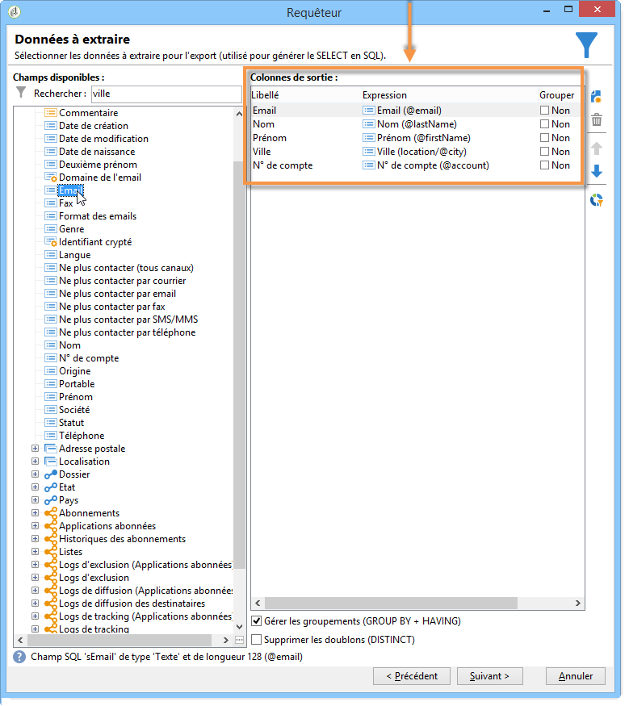
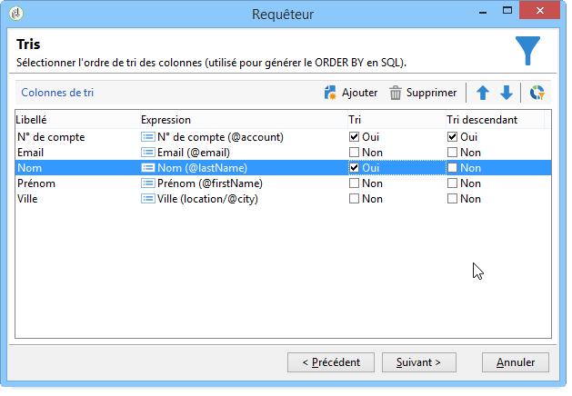
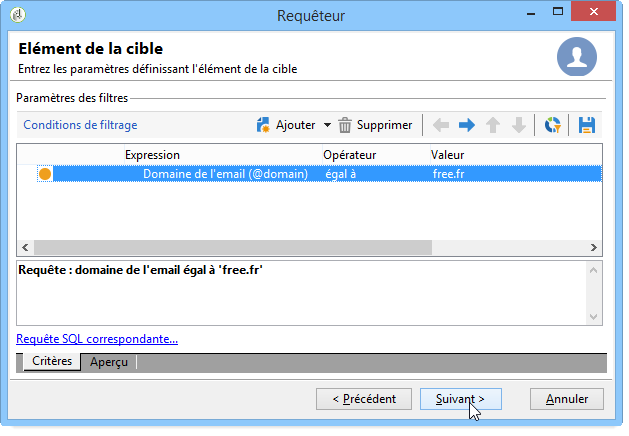
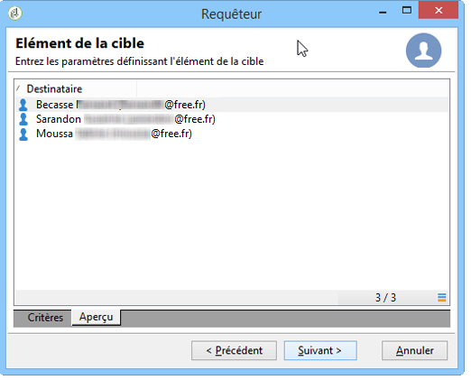
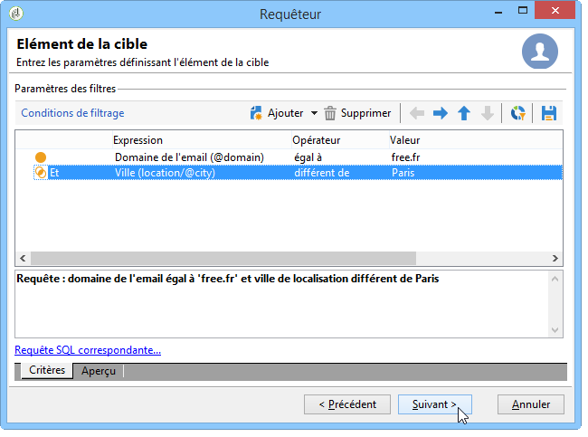
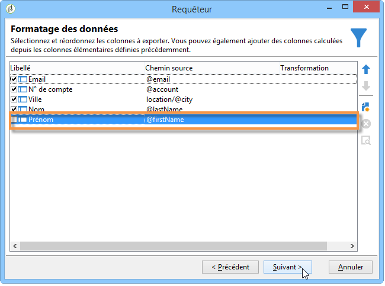
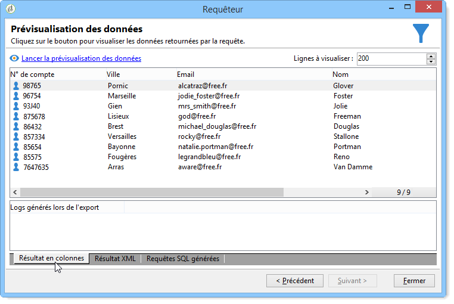
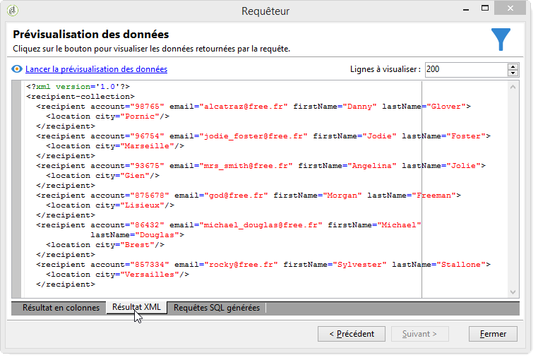
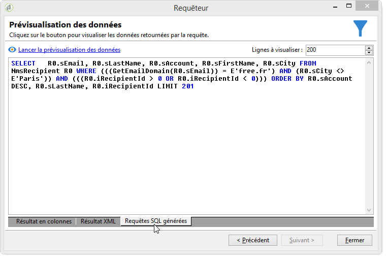

# Requête sur la table des destinataires {#querying-recipient-table}

Dans cet exemple, vous allez récupérer les noms et emails des destinataires dont le domaine d&#39;email est &quot;free.fr&quot; et non domiciliés à Paris.

* Quelle table doit-on sélectionner ?

   La table des destinataires (nms:recipient).

* Champs à sélectionner en colonnes de sortie.

   Email, Nom, Ville et Numéro de compte.

* En fonction de quels critères seront filtrés les destinataires ?

   En fonction de la ville de résidence et du domaine d&#39;email.

* Y a-t-il tri ?

   Oui, en fonction de **[!UICONTROL Account number]** et **[!UICONTROL Last name]**

Pour réaliser cet exemple, les étapes sont les suivantes :

1. Cliquez sur **[!UICONTROL Tools > Generic query editor...]** puis sélectionnez le tableau **Destinataires** (**nms:Recipient**). Cliquez ensuite sur **[!UICONTROL Next]**.
1. Choisissez : **[!UICONTROL Last name]**, **[!UICONTROL First name]**, **[!UICONTROL Email]**, **[!UICONTROL City]** et **[!UICONTROL Account number]**. Ces champs sont ajoutés à **[!UICONTROL Output columns]**. Cliquez ensuite sur **[!UICONTROL Next]**.

   

1. Sort the columns to display them in the right order. Here we want to sort account numbers in descending order and names in alphabetical order. Then click **[!UICONTROL Next]**.

   

1. Dans la **[!UICONTROL Data filtering]** fenêtre, affinez votre recherche : choisissez **[!UICONTROL Filtering conditions]** , puis cliquez sur **[!UICONTROL Next]**.
1. The **[!UICONTROL Target element]** window lets you enter the filter settings.

   Définissez la condition de filtre suivante : destinataires avec un domaine de courriel égal à &quot;orange.co.uk&quot;. Pour ce faire, choisissez Domaine **de courriel (@email)** dans la **[!UICONTROL Expression]** colonne, sélectionnez **égal à** dans la **[!UICONTROL Operator]** colonne et saisissez &quot;orange.co.uk&quot; dans la **[!UICONTROL Value]** colonne.

   

1. Si nécessaire, cliquez sur le **[!UICONTROL Distribution of values]** bouton pour afficher une distribution basée sur le domaine de courriel des prospects. Un pourcentage est disponible pour chaque domaine de courriel dans la base de données. Les domaines autres que &quot;orange.co.uk&quot; sont affichés jusqu’à ce que le filtre soit appliqué.

   Le résumé de la requête s&#39;affiche au bas de la fenêtre, soit : **Domaine de l&#39;email égal à &#39;free.fr&#39;**.

1. Click the **[!UICONTROL Preview]** to get an idea of the query result: only &quot;orange.co.uk&quot; email domains are displayed.

   

1. Modifiez la requête pour obtenir des contacts non domiciliés à Paris.

   Sélectionnez **[!UICONTROL City (location/@city)]** dans la **[!UICONTROL Expression]** colonne, **[!UICONTROL different from]** en tant qu’opérateur, puis saisissez **[!UICONTROL London]** dans la **[!UICONTROL Value]** colonne.

   

1. Cela vous mènera à la **[!UICONTROL Data formatting]** fenêtre. Vérifiez l’ordre des colonnes. Déplacez la colonne &quot;Ville&quot; vers le haut sous la colonne &quot;Numéro de compte&quot;.

   Décochez la ligne &quot;Prénom&quot; pour ne plus l&#39;afficher en résultat.

   

1. Dans la **[!UICONTROL Data preview]** fenêtre, cliquez sur **[!UICONTROL Start the preview of the data]**. Cette fonction calcule le résultat de la requête.

   The **[!UICONTROL Column results]** tab shows the query result in columns.

   Le résultat ne comporte que les destinataires dont le domaine d&#39;email est &quot;free.fr&quot; et ne vivant pas à Paris. La colonne &quot;Prénom&quot; n&#39;est pas affichée car elle a été décochée à l&#39;étape précédente. Les numéros de compte sont triés de manière descendante.

   

   The **[!UICONTROL XML result]** tab shows the result in XML format.

   

   L&#39; **[!UICONTROL Generated QSL queries]** onglet affiche le résultat de la requête au format SQL.

   
