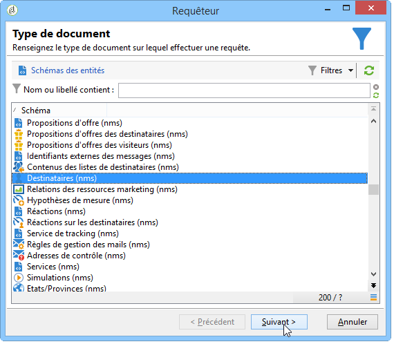
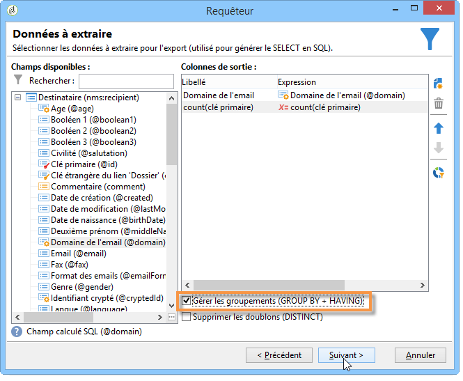
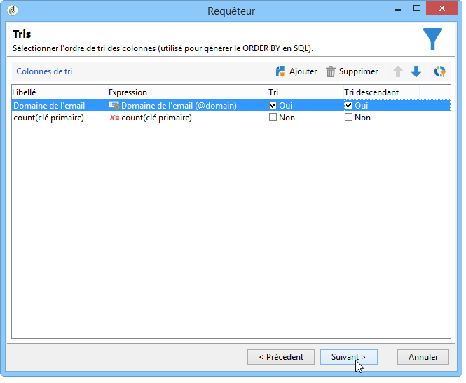
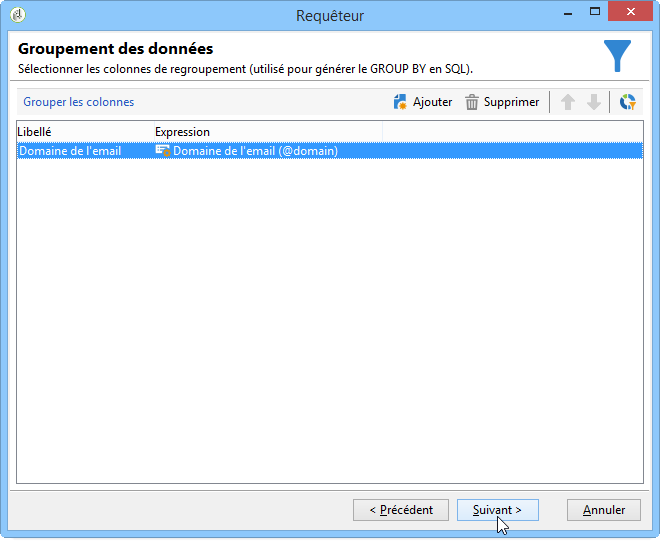
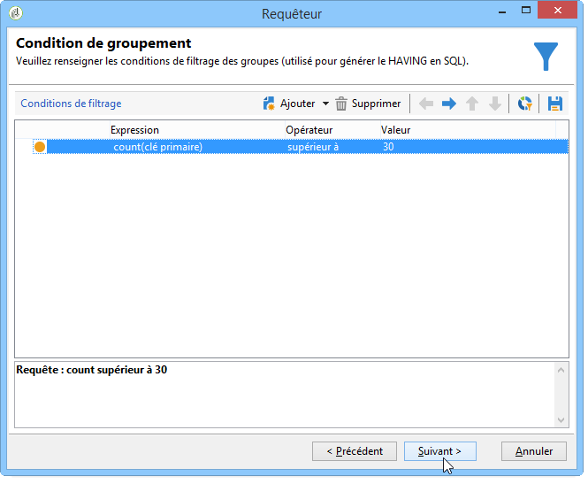
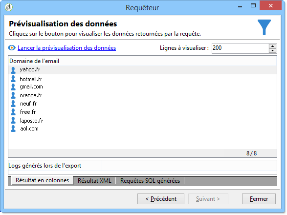

# Requête avec gestion des regroupements {#querying-using-grouping-management}

Vous allez effectuer une requête pour retrouver les domaines d&#39;email ciblés plus de 30 fois au cours de diffusions précédentes.

* Quelle table doit-on sélectionner ?

   La table des destinataires (nms:recipient).

* Quels sont les champs à sélectionner en colonne de sortie ?

   Domaine de l&#39;email et clé primaire (avec un comptage).

* Groupement des données ?

   Basé sur le domaine de courriel avec un nombre de clés primaires supérieur à 30. Cette opération est effectuée avec l&#39; **[!UICONTROL Group by + Having]** option. **[!UICONTROL Group by + Having]** vous permet de grouper des données (&quot;group by&quot;) et de sélectionner ce qui a été regroupé (&quot;have&quot;).

Pour réaliser cet exemple, les étapes sont les suivantes :

1. Open the **[!UICONTROL Generic query editor]** and choose the Recipient table (**nms:recipient**).

   

1. Dans la **[!UICONTROL Data to extract]** fenêtre, sélectionnez les **[!UICONTROL Email domain]** et **[!UICONTROL Primary key]** champs. Exécutez un compte sur le **[!UICONTROL Primary key]** champ.

   Pour plus d&#39;informations sur le comptage d&#39;une clé primaire, consultez [cette section](../../platform/using/defining-filter-conditions.md#building-expressions).

1. Cochez la **[!UICONTROL Handle groupings (GROUP BY + HAVING)]** case.

   

1. Dans la **[!UICONTROL Sorting]** fenêtre, triez les domaines de courriel dans l’ordre décroissant. Pour ce faire, cochez **[!UICONTROL Yes]** la **[!UICONTROL Descending sort]** colonne. Clics **[!UICONTROL Next]**.

   

1. Dans **[!UICONTROL Data filtering]**, sélectionnez **[!UICONTROL Filtering conditions]**. Accédez à la **[!UICONTROL Target elements]** fenêtre et cliquez sur **[!UICONTROL Next]**.
1. Dans la **[!UICONTROL Data grouping]** fenêtre, sélectionnez le **[!UICONTROL Email domain]** en cliquant **[!UICONTROL Add]**.

   Cette fenêtre de regroupement de données ne s’affiche que si la **[!UICONTROL Handle groupings (GROUP BY + HAVING]**) case a été cochée.

   

1. In the **[!UICONTROL Grouping condition]** window, indicate a primary key count greater than 30 since we only want email domains targeted more than 30 times to be returned as results.

   This window appears when the **[!UICONTROL Manage groupings (GROUP BY + HAVING)]** box was checked: this is where the grouping result is filtered (HAVING).

   

1. Dans la **[!UICONTROL Data formatting]** fenêtre, cliquez sur **[!UICONTROL Next]**: aucune mise en forme n&#39;est nécessaire ici.
1. In the data preview window, click **[!UICONTROL Launch data preview]**: here, three different email domains targeted over 30 times are returned.

   
