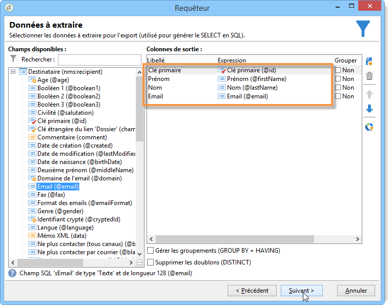
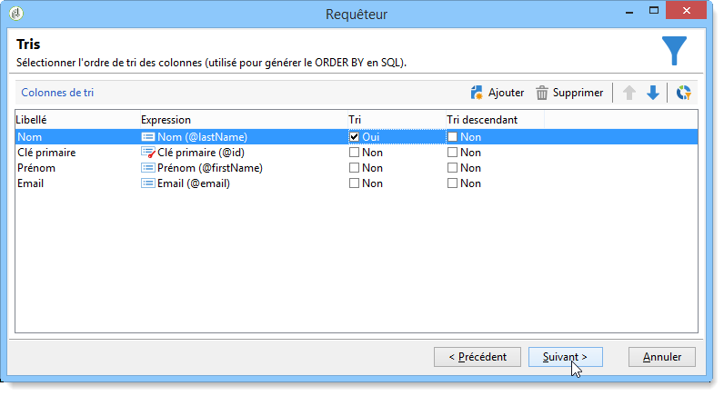
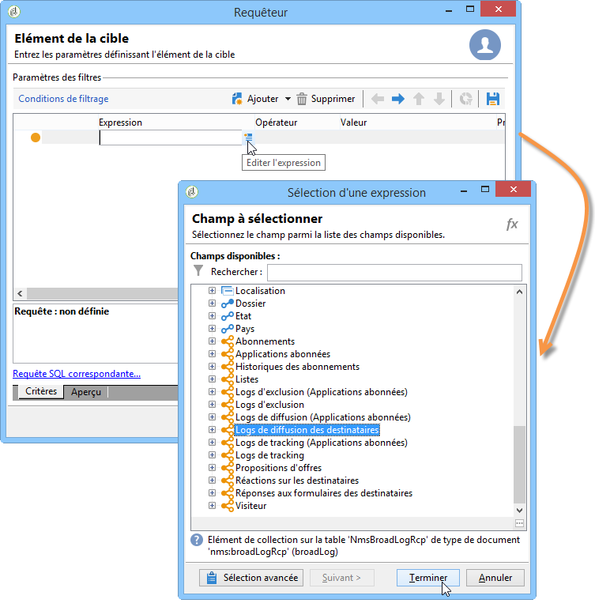
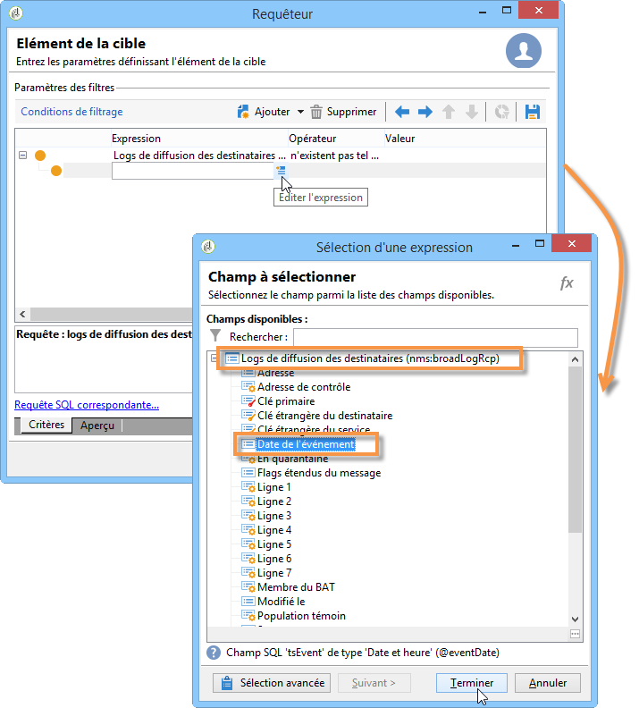
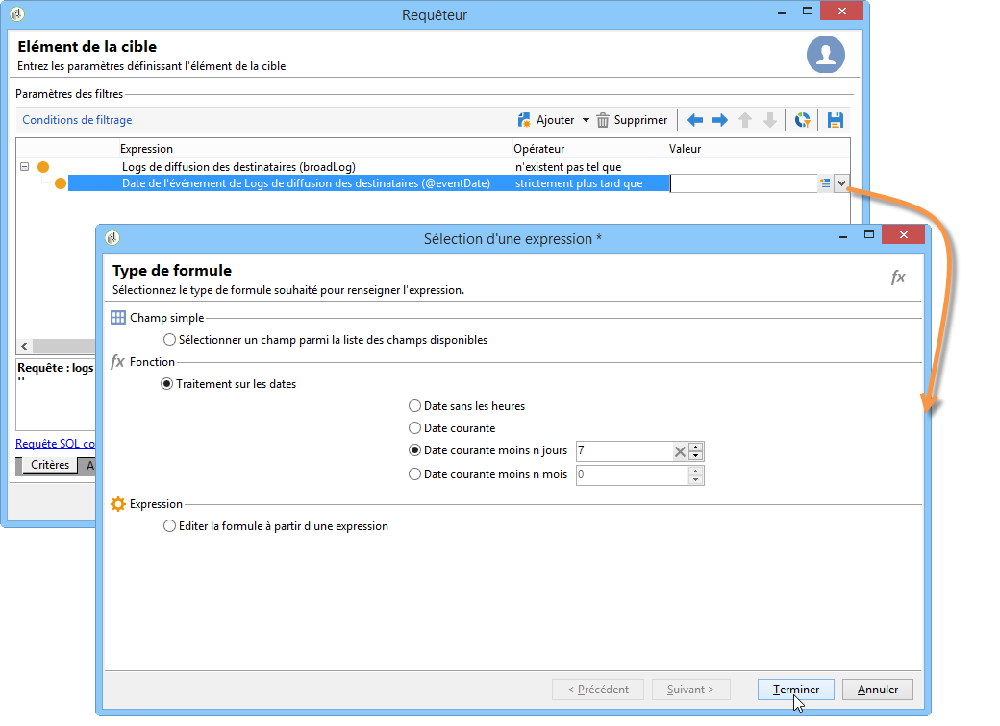
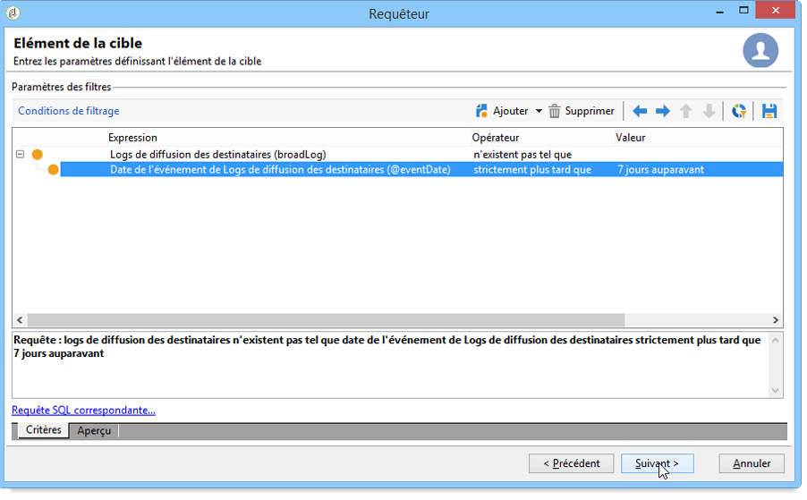
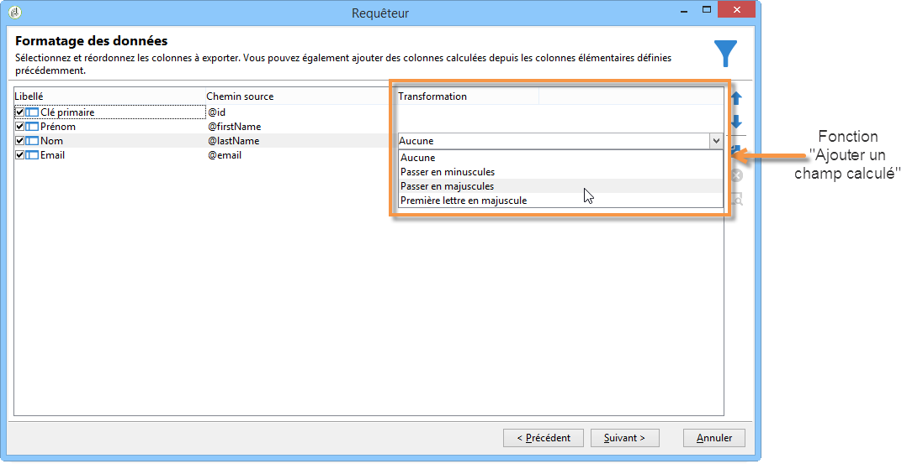
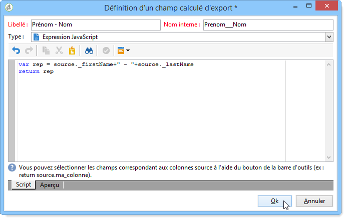
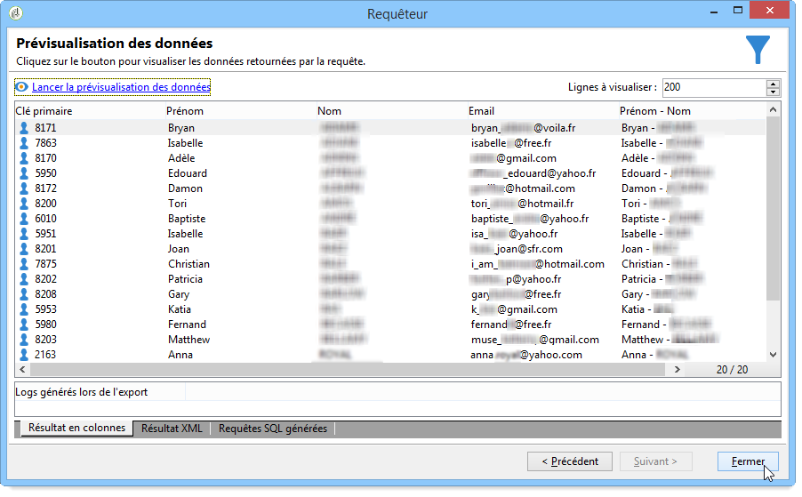

# Requête avec une relation N-N {#querying-using-a-many-to-many-relationship}

Dans cet exemple, vous allez récupérer les destinataires non contactés au cours des 7 derniers jours. Cette requête concerne toutes les diffusions.

Cet exemple montre également comment configurer un filtre lié au choix d&#39;un élément de collection (ou noeud orange). Les éléments Collection sont disponibles dans la **[!UICONTROL Field to select]** fenêtre.

* Quelle table doit-on sélectionner ?

   La table des destinataires (**nms:recipient**).

* Quels sont les champs à sélectionner en colonne de sortie ?

   Clé primaire, Nom, Prénom et Email.

* En fonction de quels critères seront filtrées les informations ?

   En fonction des logs de diffusion des destinataires. Ils remontent jusqu&#39;à 7 jours avant la date du jour.

Les étapes sont les suivantes :

1. Ouvrez le Requêteur générique et sélectionnez la table des Destinataires **[!UICONTROL (nms:recipient)]**.
1. Dans la **[!UICONTROL Data to extract]** fenêtre, sélectionnez **[!UICONTROL Primary key]**, **[!UICONTROL First name]**, **[!UICONTROL Last name]** et **[!UICONTROL Email]**.

   

1. Dans la fenêtre de tri, ordonnez les noms alphabétiquement.

   

1. Dans la **[!UICONTROL Data filtering]** fenêtre, sélectionnez **[!UICONTROL Filtering conditions]**.
1. Dans la **[!UICONTROL Target element]** fenêtre, la condition de filtrage pour l’extraction de profils sans journal de suivi au cours des 7 derniers jours implique deux étapes. L’élément que vous devez sélectionner est un lien de type &quot;plusieurs à plusieurs&quot;.

   * Commencez par sélectionner l’élément **[!UICONTROL Recipient delivery logs (broadlog)]** Collection (noeud orange) pour la première **[!UICONTROL Value]** colonne.

      

      Sélectionnez l’ **[!UICONTROL do not exist as]** opérateur. Il n’est pas nécessaire de sélectionner une seconde valeur dans cette ligne.

   * Le contenu de la seconde condition de filtrage dépend de la première. Ici, le **[!UICONTROL Event date]** champ est offert directement dans le **[!UICONTROL Recipient delivery logs]** tableau puisqu&#39;il existe un lien vers ce tableau.

      

      Sélectionnez **[!UICONTROL Event date]** l’opérateur **[!UICONTROL greater than or equal to]** . Sélectionnez la **[!UICONTROL DaysAgo (7)]** valeur. Pour ce faire, cliquez sur **[!UICONTROL Edit expression]** dans le **[!UICONTROL Value]** champ. Dans la **[!UICONTROL Formula type]** fenêtre, sélectionnez **[!UICONTROL Process on dates]** et **[!UICONTROL Current date minus n days]**, en indiquant &quot;7&quot; comme valeur.

      

      La condition de filtrage est paramétrée.

      

1. Dans la **[!UICONTROL Data formatting]** fenêtre, basculez les noms en majuscules. Cliquez sur la **[!UICONTROL Last name]** ligne dans la **[!UICONTROL Transformation]** colonne et sélectionnez **[!UICONTROL Switch to upper case]** dans le menu déroulant.

   

1. Utilisez la **[!UICONTROL Add a calculated field]** fonction pour insérer une colonne dans la fenêtre d’aperçu des données.

   Dans cet exemple, ajoutez un champ calculé avec les prénoms et les noms des destinataires dans une seule colonne. Cliquez sur la **[!UICONTROL Add a calculated field]** fonction. Dans la **[!UICONTROL Export calculated field definition]** fenêtre, saisissez une étiquette et un nom interne, puis choisissez le **[!UICONTROL JavaScript Expression]** type. Saisissez ensuite l’expression suivante :

   ```
   var rep = source._firstName+" - "+source._lastName
   return rep
   ```

   

   Clics **[!UICONTROL OK]**. La **[!UICONTROL Data formatting]** fenêtre est configurée.

   Pour plus d&#39;informations sur l&#39;ajout de champs calculés, consultez cette section.

1. Le résultat s’affiche dans la **[!UICONTROL Data preview]** fenêtre. Les destinataires qui n’ont pas été contactés au cours des 7 derniers jours sont affichés par ordre alphabétique. Les noms sont affichés en majuscules et la colonne avec les prénoms et les noms de famille a été créée.

   
