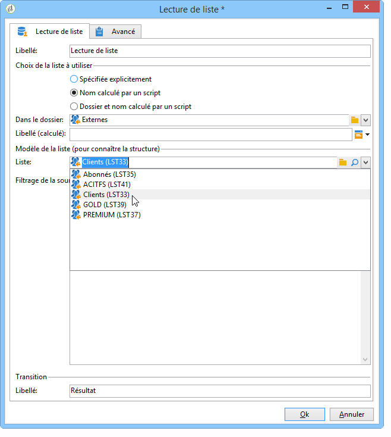

# Lecture de liste{#read-list}

Les données traitées dans un workflow peuvent provenir de listes dont les données ont été préparées et structurées au préalable (lors d&#39;une segmentation antérieure ou d&#39;un chargement de fichier).

L’ **[!UICONTROL Read list]** activité vous permet de copier les données d’une liste dans la table de travail du processus, comme les données d’une requête. Il est ensuite accessible tout au long du processus.

The list to be processed can be specified explicitly, computed by a script or localized dynamically, according to options selected and parameters defined in a **[!UICONTROL Read list]** activity.

Si la liste n&#39;est pas spécifiée explicitement, vous devez indiquer une liste qui sera utilisée comme modèle pour connaître sa structure.

Once the list selection has been configured, you can add a filter using the **[!UICONTROL Edit query]** option to keep one part of the population for the next workflow.

>[!CAUTION]
>
>Pour pouvoir créer un filtre dans une activité de lecture de liste, la liste concernée doit être de type &quot;fichier&quot;.

Les listes peuvent être créées directement dans Adobe Campaign via le **[!UICONTROL Profiles and Targets > Lists]** lien de la page d’accueil. Ils peuvent également être créés dans un processus à l’aide de l’ **[!UICONTROL List update]** activité.

**Exemple : exclure une liste d&#39;adresses d&#39;un envoi**

L&#39;exemple suivant permet d&#39;utiliser une liste d&#39;adresses emails à exclure de la cible d&#39;une diffusion par email.

Les profils contenus dans le dossier **NvxContacts** doivent être ciblés par une action de diffusion. Les adresses emails à exclure de la cible sont stockées dans une liste externe. Dans notre exemple, seule l&#39;information relative aux adresses emails est nécessaire à l&#39;exclusion.

1. La requête de sélection du dossier **NvxContact** doit permettre de charger l&#39;adresse email des profils sélectionnés, ceci afin de permettre le rapprochement avec les informations contenues dans la liste.

   

1. Ici, la liste est stockée dans le dossier **Externes** et son libellé est calculé.

   

1. Afin d&#39;exclure de la cible principale les adresses emails de la liste externe, vous devez paramétrer l&#39;activité d&#39;exclusion et indiquer que le dossier **NvxContacts** contient les données à conserver. Les données communes entre cet ensemble et tout autre ensemble en entrée de l&#39;activité d&#39;exclusion seront supprimées de la cible.

   

   Les règles d’exclusion sont configurées dans la section centrale de l’outil de modification. Cliquez sur le **[!UICONTROL Add]** bouton pour définir le type d’exclusion à appliquer.

   Vous pouvez définir plusieurs exclusions, selon le nombre de transitions en entrée de l&#39;activité.

1. In the **[!UICONTROL Exclusion set]** field, select the **[!UICONTROL Read list]** activity: the data in this activity is to be excluded from the main set.

   Dans notre exemple, nous avons une exclusion sur les jointures : les données contenues dans la liste seront rapprochées des données du jeu principal via le champ contenant l’adresse électronique. Pour configurer la jointure, sélectionnez **[!UICONTROL Joins]** dans le **[!UICONTROL Change dimension]** champ.

   

1. Sélectionnez ensuite le champ correspondant à l&#39;adresse email dans les deux ensembles (Source et Destination). Les colonnes seront alors associées et les destinataires dont l&#39;adresse email figure dans la liste d&#39;adresses importée seront exlcus de la cible.

