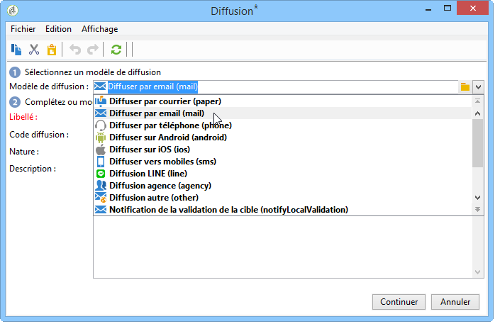
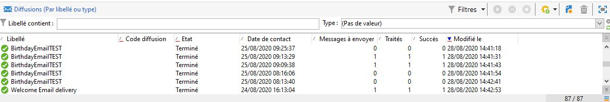

# Diffusion récurrente{#recurring-delivery}

Une activité de **[!UICONTROL Diffusion récurrente]** permet de paramétrer une instance d&#39;un modèle de diffusion spécifique à une opération.

 [Découvrez cette fonctionnalité en vidéo](#recurring-delivery-video)

Cette activité est uniquement disponible à partir de l&#39;onglet **[!UICONTROL Ciblages et workflows]** d&#39;une opération.

Pour cela :

1. Sélectionnez le modèle de diffusion sur lequel sera basée l&#39;activité.

   

1. Paramétrez le modèle de diffusion.

Le paramétrage de cette activité est semblable à la création d’un modèle de diffusion au niveau des options disponibles. Pour plus d’informations à ce sujet, consultez cette [section](../../delivery/using/about-templates.md).

>[!CAUTION]
>
>Les diffusions récurrentes ne prennent pas en charge la prévisualisation du contenu ou l’envoi de BAT, y compris les éléments de personnalisation des [données de la cible](../../workflow/using/data-life-cycle.md#target-data).

Un exemple d&#39;utilisation de cette activité est proposé dans cette [section](sending-a-birthday-email.md#creating-a-recurring-delivery-in-a-targeting-workflow).

## Configuration d’une diffusion récurrente {#set-up-recurring-delivery}

Une **diffusion récurrente** crée une nouvelle instance de diffusion chaque fois qu’elle s’exécute. Par exemple, si le workflow est planifié pour s’exécuter une fois par semaine, 52 diffusions seront créées en une année. Cela signifie également que le broadlog et les logs de tracking seront séparés par chaque instance de diffusion.

Si vous souhaitez arrêter lʼexécution dʼune diffusion récurrente, vous devez annuler complètement la campagne ou arrêter le workflow qui lʼexécute. Lʼarrêt de la diffusion à partir du tableau de bord de la campagne ne met fin quʼà lʼoccurrence de la diffusion : les instances suivantes de la diffusion récurrente continueront dʼêtre créées à chaque exécution du workflow.

>[!NOTE]
>
>Il n’est pas possible d’envoyer un BAT à partir d’une activité de type **[!UICONTROL Diffusion récurrente]**.
> 
>Pour créer directement une diffusion via un workflow de campagne, utilisez les activités spécifiques à un canal, qui sont pré-configurées (par exemple : **[!UICONTROL Diffusion récurrente]**).

## Tutoriel vidéo {#recurring-delivery-video}

Cette vidéo explique comment configurer une diffusion récurrente et une activité Planificateur.

>[!VIDEO](https://video.tv.adobe.com/v/25040?quality=12)

D’autres vidéos pratiques sur Campaign Classic sont disponibles [ici](https://experienceleague.adobe.com/docs/campaign-classic-learn/tutorials/overview.html?lang=fr).
