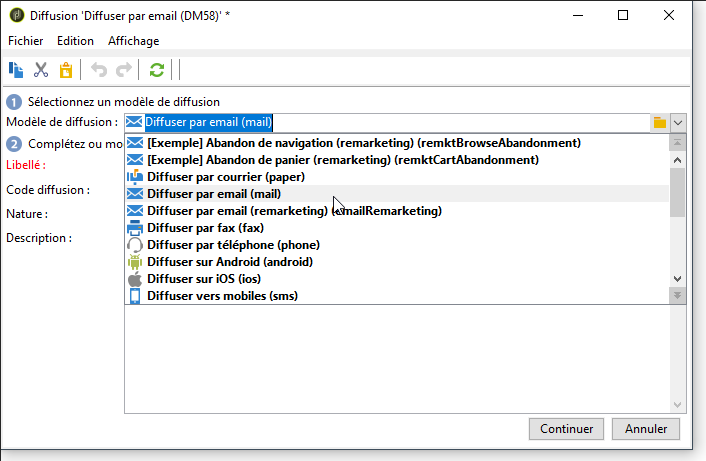

# Diffusion récurrente{#recurring-delivery}

Une activité de **[!UICONTROL Diffusion récurrente]** permet de paramétrer une instance d&#39;un modèle de diffusion spécifique à une opération.

 [Découvrez cette fonctionnalité en vidéo](#recurring-delivery-video)

Cette activité est uniquement disponible à partir de l&#39;onglet **[!UICONTROL Ciblages et workflows]** d&#39;une opération.

Pour cela :

1. Sélectionnez le modèle de diffusion sur lequel sera basée l&#39;activité.

   

1. Paramétrez le modèle de diffusion.

Le paramétrage de cette activité est semblable à la création d&#39;un modèle de diffusion au niveau des options disponibles. Voir à ce sujet cette [section](../../delivery/using/about-templates.md).

Un exemple d&#39;utilisation de cette activité est proposé dans cette [section](../../workflow/using/sending-a-birthday-email.md#creating-a-recurring-delivery-in-a-targeting-workflow).

## Configuration d’une diffusion récurrente

Une **diffusion récurrente** crée une nouvelle instance de diffusion chaque fois qu’elle s’exécute. Par exemple, si le workflow est planifié pour s’exécuter une fois par semaine, 52 diffusions seront créées en une année. Cela signifie également que le broadlog et les logs de tracking seront séparés par chaque instance de diffusion.

>[!NOTE]
>
>Il n&#39;est pas possible d&#39;envoyer un bon à tirer à partir d&#39;une activité de type **[!UICONTROL Diffusion récurrente]**.\
>Pour directement créer une diffusion via un workflow de campagne, utilisez les activités de diffusion spécifiques à un canal, qui sont pré-paramétrées (ex : **[!UICONTROL Diffusion e-mail]**).

## Vidéo didactique (#périoring-diffusion-video)

Cette vidéo explique comment configurer une diffusion récurrente et une activité Planificateur.

>[!VIDEO](https://video.tv.adobe.com/v/25040?quality=12)

D&#39;autres vidéos pratiques des Campaign Classic sont disponibles [ici](https://experienceleague.adobe.com/docs/campaign-classic-learn/tutorials/overview.html?lang=fr).

