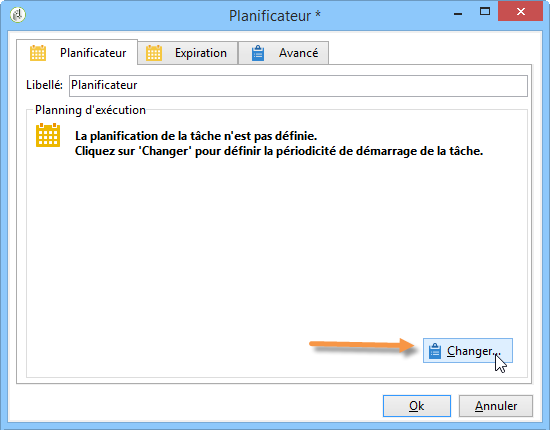
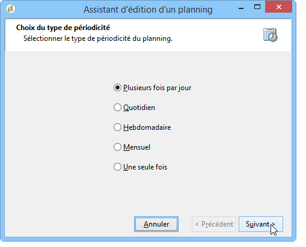
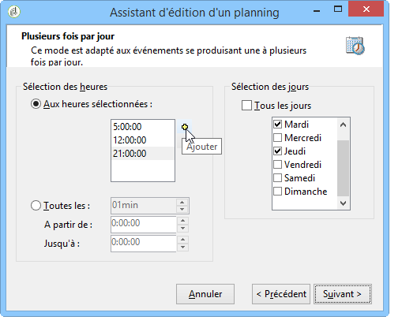
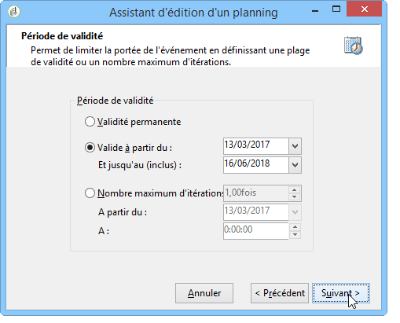
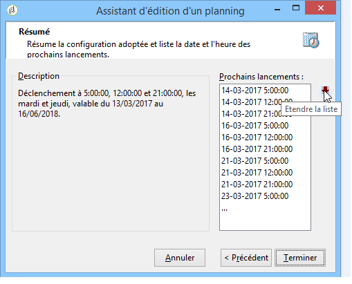

# Planificateur{#scheduler}

Le **Planificateur** est une tâche persistante qui active sa transition aux moments spécifiés par son planning.

L&#39;activité **[!UICONTROL Planificateur]** est à considérer comme un départ planifié. Les règles de positionnement de l&#39;activité dans le diagramme sont les mêmes que pour l&#39;activité **[!UICONTROL Début]**. L&#39;activité ne doit jamais comporter de transition entrante.

Il est recommandé de ne pas planifier l&#39;exécution d&#39;un workflow à une fréquence supérieure à toutes les 15 minutes, afin de ne pas nuire aux performances générales du système et d&#39;éviter la création de blocs dans la base de données.

When building your workflow, never use more than one **[!UICONTROL Scheduler]** activity per branch. For more on this, refer to: [Using activities](../../workflow/using/workflow-best-practices.md#using-activities).

Le planificateur définit le planning d&#39;activation de sa transition. Pour le paramétrer, double-cliquez sur l&#39;objet graphique et cliquez sur le bouton **[!UICONTROL Changer...]**.

Un assistant permet de définir la fréquence et la période de validité de l&#39;activité. Les étapes de paramétrage sont les suivantes :

1. Sélectionnez la fréquence d&#39;activation et cliquez sur **[!UICONTROL Suivant]**.

   

1. Indiquez les heures et jours d&#39;activation. Les paramètres de cette étape dépendent de la périodicité sélectionnée à l&#39;étape précédente. Si vous choisissez de lancer l&#39;activité plusieurs fois par jour, les options de paramétrage seront les suivantes :

   

1. Définissez la période de validité du planning ou indiquez le nombre de fois où il sera exécuté.

   

1. Vérifiez le paramétrage et cliquez sur le bouton **[!UICONTROL Terminer]** pour l&#39;enregistrer.

   

L’utilisation d’une activité de planificateur peut entraîner l’exécution simultanée de plusieurs exécutions d’un flux de travail. Par exemple, il se peut qu&#39;un planificateur déclenche l&#39;exécution du workflow une fois par heure, mais parfois, l&#39;exécution du workflow dans son ensemble dure plus d&#39;une heure. Il peut être préférable de passer l&#39;exécution si le workflow est déjà en cours d&#39;exécution. Pour plus d’informations sur la manière d’empêcher les exécutions simultanées d’un flux de travail, reportez-vous à [cette page](../../workflow/using/monitoring-workflow-execution.md#preventing-simultaneous-multiple-execution).

Il faut également considérer que la transition peut être activée avec plusieurs heures de retard si le workflow effectuait une tâche de longue durée, comme un import, ou si le module wfserver a été arrêté pendant un certain temps. Dans ce cas, il peut être utile de restreindre l&#39;exécution de la tâche activée par le planificateur à une certaine plage horaire.
