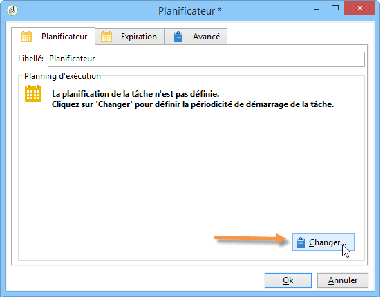
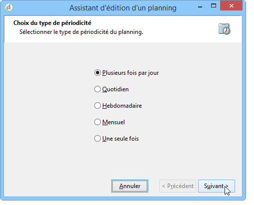
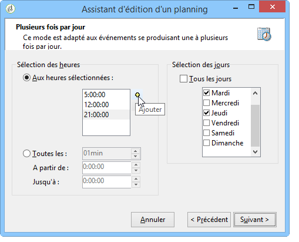
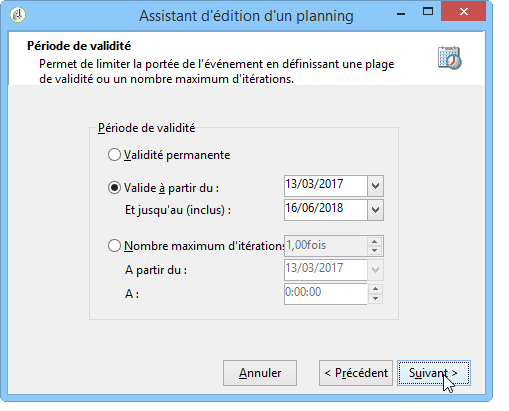
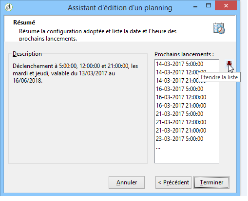

# Planificateur {#scheduler}

Le **Planificateur** est une tâche persistante qui active sa transition aux moments spécifiés par son planning.

L&#39;activité **[!UICONTROL Planificateur]** est à considérer comme un départ planifié. Les règles de positionnement de l&#39;activité dans le diagramme sont les mêmes que pour l&#39;activité **[!UICONTROL Début]**. L&#39;activité ne doit jamais comporter de transition entrante.

## Bonnes pratiques {#best-practices}

* Ne planifiez pas l’exécution d’un workflow à une fréquence supérieure à toutes les 15 minutes, car cela peut nuire aux performances générales du système et créer des blocages dans la base de données.

* N’utilisez jamais plusieurs activités de **[!UICONTROL Planificateur]** par branche dans un workflow. Voir [Utilisation des activités](workflow-best-practices.md#using-activities).

* L’utilisation d’une activité de planificateur peut entraîner plusieurs exécutions simultanées d’un workflow. Par exemple, il se peut qu’un planificateur déclenche l’exécution du workflow une fois par heure, mais parfois, l’exécution du workflow dans son ensemble dure plus d’une heure.

  Vous pouvez ignorer l’exécution si le workflow est déjà en cours d’exécution. Pour plus d’informations sur la manière d’empêcher les exécutions simultanées d’un workflow, consultez [cette page](monitoring-workflow-execution.md#preventing-simultaneous-multiple-executions).

* Notez que la transition peut être activée plusieurs heures plus tard si le workflow exécutait une tâche à long terme, telle qu’un import, ou si le module wfserver a été arrêté pendant un certain temps. Dans ce cas, il peut être nécessaire de limiter l’exécution de la tâche activée par le planificateur à une certaine période.

## Paramétrage de l’activité Planificateur {#configuring-scheduler-activity}

Le planificateur définit le planning d&#39;activation de la transition. Pour le paramétrer, double-cliquez sur l&#39;objet graphique, puis cliquez sur **[!UICONTROL Changer…]**

Un assistant permet de définir la fréquence et la période de validité de l’activité. Les étapes de configuration sont les suivantes :

1. Sélectionnez la fréquence d&#39;activation et cliquez sur **[!UICONTROL Suivant]**.

   

1. Indiquez les heures et jours d’activation.Les paramètres de cette étape dépendent de la fréquence sélectionnée à l’étape précédente.Si vous choisissez de lancer l’activité plusieurs fois par jour, les options de configuration seront les suivantes :

   

1. Définissez la période de validité du planning ou indiquez le nombre de fois où il sera exécuté.

   

1. Vérifiez le paramétrage et cliquez sur le bouton **[!UICONTROL Terminer]** pour l&#39;enregistrer.

   
