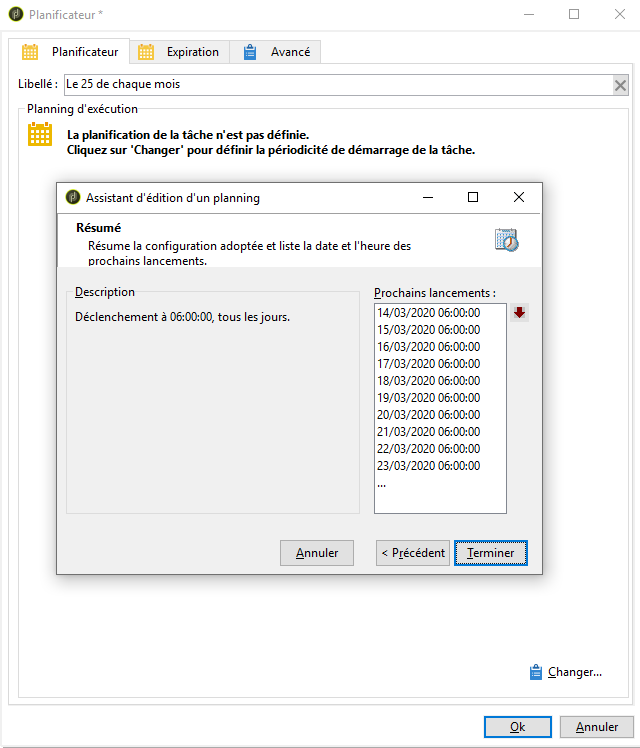
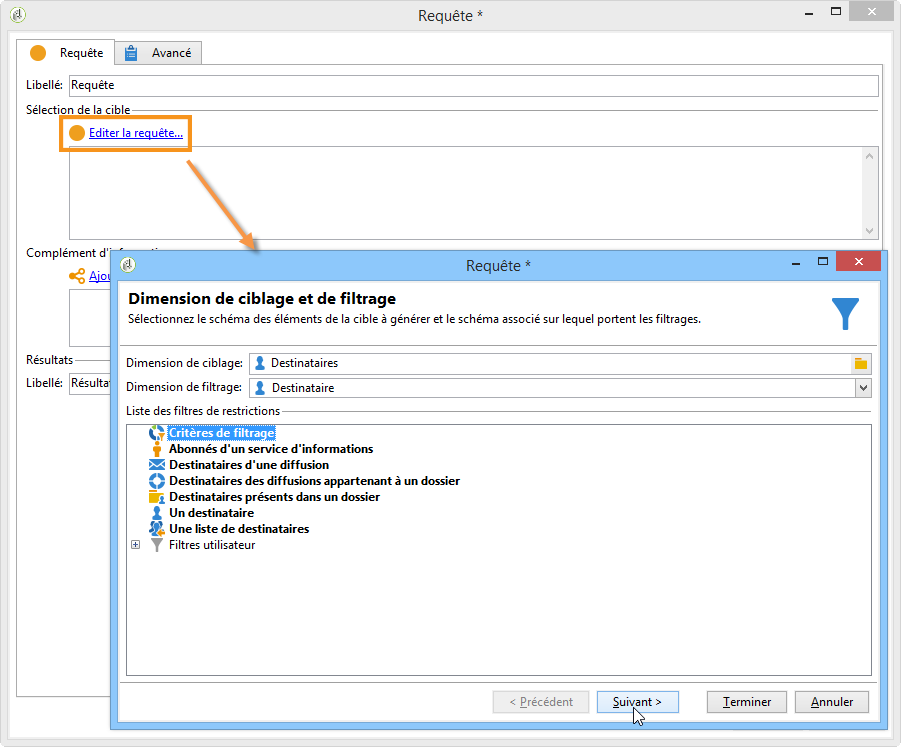
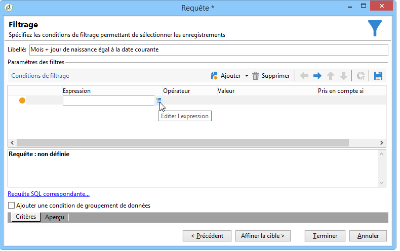
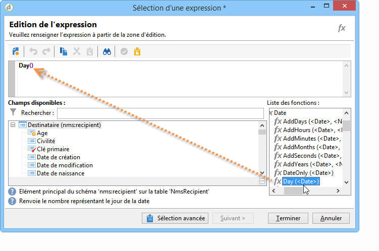
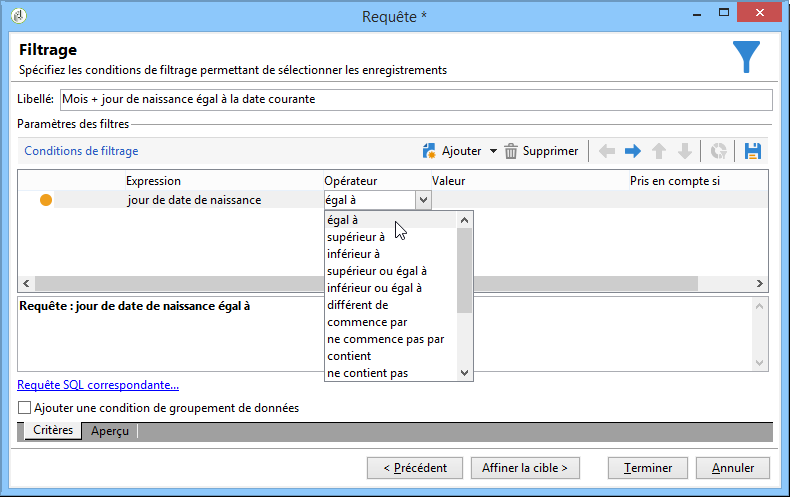
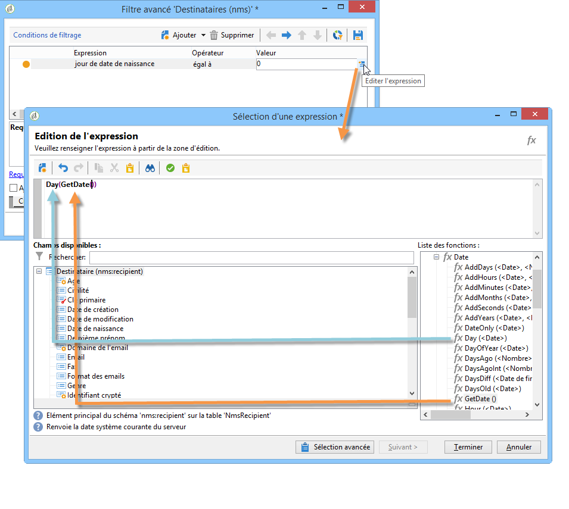
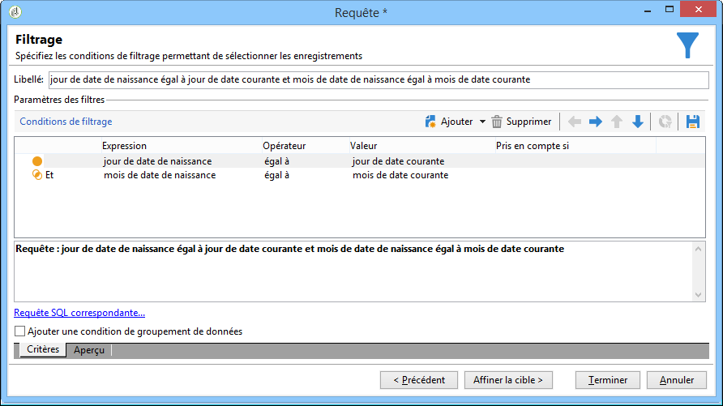
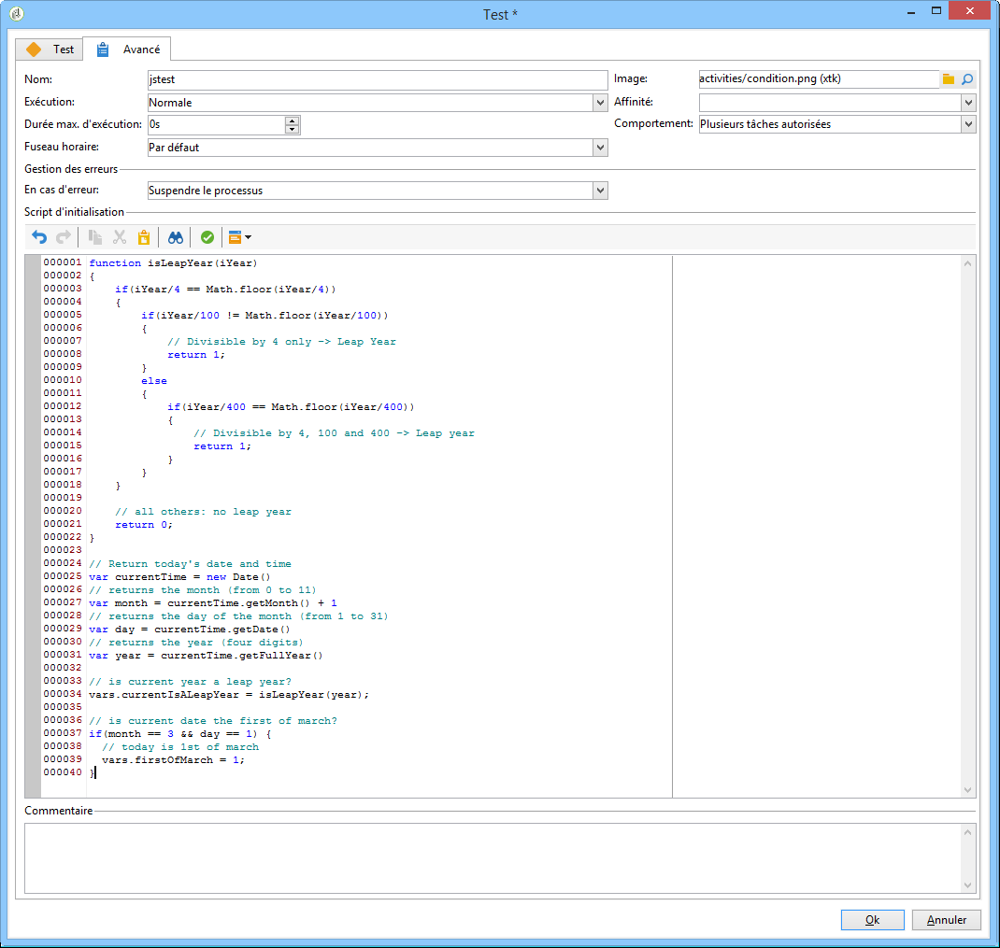
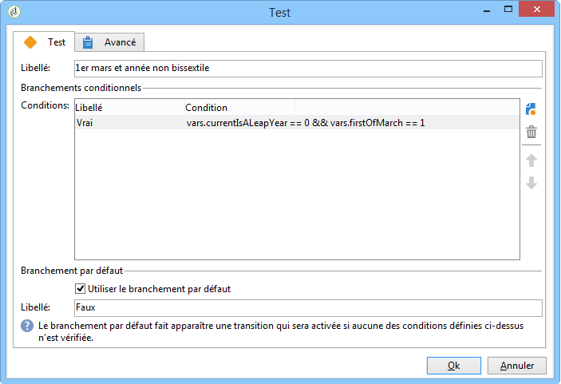
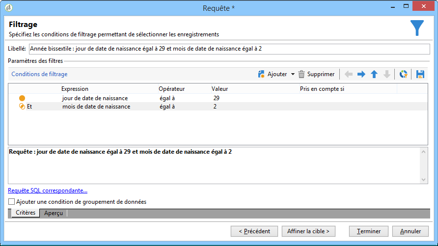

# Envoyer un email d&#39;anniversaire{#sending-a-birthday-email}

## Introduction {#introduction}

Ce cas pratique présente comment planifier l&#39;envoi d&#39;un email récurrent à une liste de destinataires le jour de leur anniversaire.

Pour réaliser ce cas d&#39;utilisation, nous avons créé le workflow de ciblage suivant :


Ce workflow, exécuté quotidiennement, sélectionne tous les destinataires dont la date de naissance correspond à la date courante.

Ce cas pratique est également proposé sous la forme d&#39;une vidéo. Voir à ce propos la vidéo sur la [création d&#39;un workflow](https://docs.adobe.com/content/help/fr-FR/campaign-classic-learn/tutorials/automating-with-workflows/creating-a-workflow.html).

Pour ce faire, créez une campagne et cliquez sur l’onglet **[!UICONTROL Ciblage et workflows]**. Voir à ce propos la section [Construire la cible principale dans un workflow](../../campaign/using/marketing-campaign-deliveries.md#building-the-main-target-in-a-workflow).

Respectez ensuite les étapes suivantes :

## Planification de l’envoi {#configuring-the-scheduler}

1. Tout d’abord, ajoutez un **Planificateur** pour déclencher l’envoi de la diffusion tous les jours. Dans l’exemple ci-dessous, la diffusion est créée tous les jours à 6 h.

   


## Identification des destinataires dont c&#39;est l&#39;anniversaire {#identifying-recipients-whose-birthday-it-is}

Après avoir paramétré l&#39;activité **[!UICONTROL Planificateur]** pour que le workflow se déclenche quotidiennement, identifiez tous les destinataires dont la date de naissance correspond à la date courante.

Pour cela, les étapes sont les suivantes :

1. Positionnez une activité **[!UICONTROL Requête]** dans le workflow et double-cliquez dessus.
1. Cliquez sur lien **Editer la requête** et sélectionnez **[!UICONTROL Critères de filtrage]**.

   

1. Cliquez dans la première cellule de la colonne **[!UICONTROL Expression]** et cliquez sur le bouton **[!UICONTROL Editer l&#39;expression]** pour ouvrir l&#39;éditeur d&#39;expressions.

   

1. Cliquez sur le bouton **[!UICONTROL Sélection avancée]** pour sélectionner le mode de filtrage.

   

1. Choisissez l&#39;option **[!UICONTROL Editer la formule à partir d&#39;une expression]** et cliquez sur le bouton **[!UICONTROL Suivant]** afin d&#39;afficher l&#39;éditeur d&#39;expressions.
1. Dans la liste des fonctions, double-cliquez sur la fonction **[!UICONTROL Day]** accessible depuis le noeud **[!UICONTROL Date]**. Cette fonction renvoie le nombre représentant le jour de la date passée en paramètre.

   

1. Dans la liste des champs disponibles, double-cliquez sur la **[!UICONTROL Date de naissance]**. La section supérieure de l&#39;éditeur d&#39;expression affiche alors la formule suivante :

   ```
   Day(@birthDate)
   ```

   Cliquez sur **[!UICONTROL Terminer]** pour valider.

1. Dans l&#39;éditeur de requêtes, dans la première cellule de la colonne **[!UICONTROL Opérateur]**, choisissez **[!UICONTROL égal à]**.

   

1. Cliquez ensuite dans la première cellule de la colonne **[!UICONTROL Valeur]** et cliquez sur le bouton **[!UICONTROL Editer l&#39;expression]** pour ouvrir l&#39;éditeur d&#39;expressions.
1. Dans la liste des fonctions, double-cliquez sur la fonction **[!UICONTROL Day]** accessible depuis le noeud **[!UICONTROL Date]**.
1. Double-cliquez ensuite la fonction **[!UICONTROL GetDate]** pour récupérer la date courante.

   

   La section supérieure de l&#39;éditeur d&#39;expression affiche alors la formule suivante :

   ```
   Day(GetDate())
   ```

   Cliquez sur **[!UICONTROL Terminer]** pour valider.

1. Répétez l&#39;opération pour récupérer le mois de naissance correspondant au mois courant. Pour cela, cliquez sur le bouton **[!UICONTROL Ajouter]** et répétez les étapes 3 à 10, en remplaçant la fonction **[!UICONTROL Day]** par la fonction **[!UICONTROL Month]**.

   La requête complète est la suivante :

   

Reliez le résultat de l&#39;activité **[!UICONTROL Requête]** à une activité **[!UICONTROL Diffusion e-mail]** pour envoyer un email à la liste de tous vos destinataires le jour de leur anniversaire.

## Inclusion des destinataires nés un 29 février (facultatif) {#including-recipients-born-on-february-29th--optional-}

Si vous souhaitez inclure tous les destinataires nés un 29 février, ce cas pratique présente comment planifier l&#39;envoi d&#39;un email récurrent à une liste de destinataires le jour de leur anniversaire, qu&#39;il s&#39;agisse d&#39;une année bissextile ou non.

Les étapes principales de mise en oeuvre de ce cas pratique sont les suivantes :

* Sélection des destinataires
* Sélection en cas d&#39;année non bissextile
* Sélection des destinataires nés le 29 février

Pour réaliser ce cas d&#39;utilisation, nous avons créé le workflow de ciblage suivant :


Si l&#39;année en cours **n&#39;est pas une année bissextile** et que le workflow est exécuté le 1er mars, il faut sélectionner tous les destinataires dont l&#39;anniversaire était la veille (le 29 février) et les ajouter à la liste des destinataires. Dans tous les autres cas, aucune action supplémentaire n&#39;est requise.

### Etape 1 : sélection des destinataires {#step-1--selecting-the-recipients}

Après avoir paramétré l&#39;activité **[!UICONTROL Planificateur]** pour que le workflow se déclenche quotidiennement, identifiez tous les destinataires dont l&#39;anniversaire correspond à la date courante.

>[!NOTE]
>
>Si l&#39;année en cours est bissextile, tous les destinataires nés le 29 février sont automatiquement inclus.



La sélection des destinataires dont l’anniversaire correspond à la date actuelle est présentée dans la section [Identification des destinataires dont c’est l’anniversaire](#identifying-recipients-whose-birthday-it-is).

### Etape 2 : sélection en cas d&#39;année non bissextile {#step-2--select-whether-or-not-it-is-a-leap-year}

L&#39;activité **[!UICONTROL Test]** permet de vérifier si l&#39;année est bissextile ou non et si la date courante est le 1er mars.

Si le test est vérifié (l&#39;année n&#39;est pas bissextile - il n&#39;y a pas de 29 février - et la date courante est bien le 1er mars), la transition **[!UICONTROL Vrai]** est activée et les destinataires nés un 29 février sont ajoutés à la diffusion du 1er mars. Dans les autres cas, la transition **[!UICONTROL Faux]** est activée et seuls les destinataires nés à la date courante recevront la diffusion.

Copiez et collez le code ci-dessous dans la section **[!UICONTROL Script d&#39;initialisation]** de l&#39;onglet **[!UICONTROL Avancé]**.

```
function isLeapYear(iYear)
{
    if(iYear/4 == Math.floor(iYear/4))
    {
        if(iYear/100 != Math.floor(iYear/100))
        {
            // Divisible by 4 only -> Leap Year
            return 1;
        }
        else
        {
            if(iYear/400 == Math.floor(iYear/400))
            {
                // Divisible by 4, 100 and 400 -> Leap year
                return 1;
            }
        }
    }
    // all others: no leap year
    return 0;
}

// Return today's date and time
var currentTime = new Date()
// returns the month (from 0 to 11)
var month = currentTime.getMonth() + 1
// returns the day of the month (from 1 to 31)
var day = currentTime.getDate()
// returns the year (four digits)
var year = currentTime.getFullYear()

// is current year a leap year?
vars.currentIsALeapYear = isLeapYear(year);

// is current date the first of march?
if(month == 3 && day == 1) {
  // today is 1st of march
vars.firstOfMarch = 1;
}
```



Ajoutez la condition suivante dans la section **[!UICONTROL Branchements conditionnels]** :

```
vars.currentIsALeapYear == 0 && vars.firstOfMarch == 1
```



### Etape 3 : sélection des destinataires nés le 29 février {#step-3--select-any-recipients-born-on-february-29th}

Créez une activité **[!UICONTROL Branchement]** et reliez l&#39;une des transitions sortantes à une activité **[!UICONTROL Requête]**.

Dans cette requête, sélectionnez tous les destinataires dont la date de naissance est le 29 février.



Combinez les résultats par une activité **[!UICONTROL Union]**.

Reliez les résultats des deux branches de l&#39;activité **[!UICONTROL Test]** à une activité **[!UICONTROL Diffusion e-mail]** pour envoyer un email à la liste de tous vos destinataires le jour de leur anniversaire, même ceux qui sont nés un 29 février en cas d&#39;année non bissextile.

## Créer une diffusion récurrente {#creating-a-recurring-delivery-in-a-targeting-workflow}

Ajoutez une activité de type **Diffusion récurrente** basée sur le modèle de mail d&#39;anniversaire que vous souhaitez envoyer.

>[!CAUTION]
>
>Pour que les workflows s’exécutent, les workflows techniques liés au processus de campagne doivent être démarrés. Voir à ce sujet la section [Liste des workflows de processus de campagne](../../workflow/using/campaign.md).
>
>Si les étapes d’approbation sont activées pour la campagne, les diffusions ne sont envoyées qu’une fois ces étapes confirmées. Voir à ce sujet la section [Choix des processus à approuver](../../campaign/using/marketing-campaign-approval.md#choosing-the-processes-to-be-approved).


