# Envoyer un rapport à une liste{#sending-a-report-to-a-list}

Ce cas pratique présente comment générer, chaque mois, le rapport d&#39;usine **[!UICONTROL Indicateurs de tracking]** au format PDF et l&#39;envoyer à une liste de destinataires.

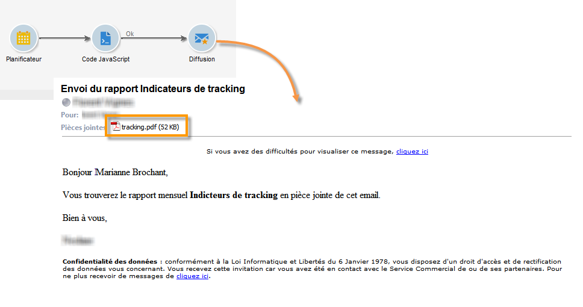

Les étapes principales de mise en oeuvre de ce cas pratique sont les suivantes :

* Création d’une liste de destinataires qui recevront la remise (voir : [Étape 1 : Création de la liste](#step-1--creating-the-recipient-list)des destinataires).
* Creating a delivery template that will let you generate a new delivery each time the workflow is executed (refer to: [Step 2: Creating the delivery template](#step-2--creating-the-delivery-template)).
* Creating a workflow that will let you generate the report in PDF format and send it to the list of recipients (refer to: [Step 3: Creating the workflow](#step-3--creating-the-workflow)).

## Etape 1 : création de la liste de destinataires {#step-1--creating-the-recipient-list}

Positionnez-vous sur l&#39;univers **[!UICONTROL Profils et cibles]**, cliquez sur le lien **[!UICONTROL Listes]** puis sur le bouton **[!UICONTROL Créer]**. Sélectionnez **[!UICONTROL Nouvelle liste]** et créez une nouvelle liste de destinataires à qui le rapport sera envoyé.

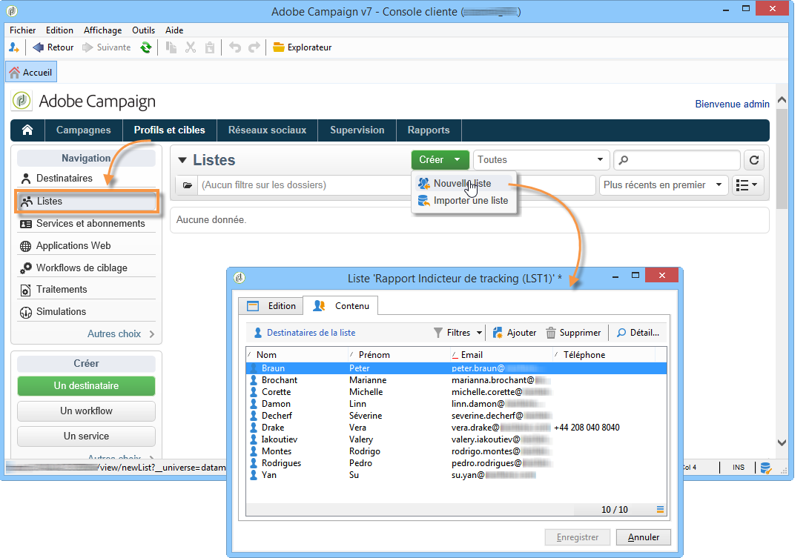

Pour plus d&#39;informations sur la création de listes, reportez-vous à cette [section](../../platform/using/creating-and-managing-lists.md).

## Etape 2 : création du modèle de diffusion {#step-2--creating-the-delivery-template}

1. Dans l&#39;explorateur Adobe Campaign, positionnez-vous sur le noeud **[!UICONTROL Ressources > Modèles > Modèles de diffusion]** et dupliquez le modèle d&#39;usine **[!UICONTROL Diffuser par email]**.

   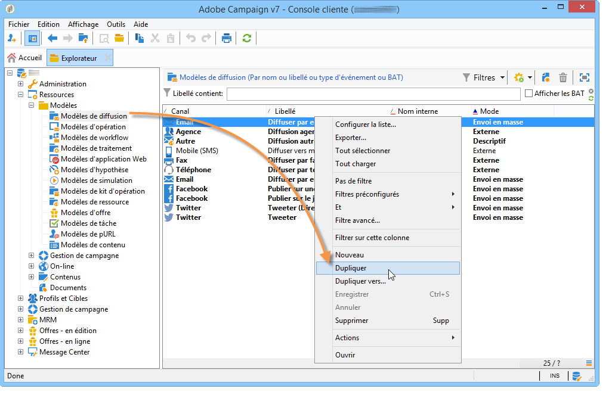

   Pour plus d&#39;informations sur la création d&#39;un modèle de diffusion, reportez-vous à cette [section](../../delivery/using/about-templates.md).

1. Renseignez les différents paramètres du modèle : le libellé, la cible (la liste de destinataires précédemment créée), l&#39;objet et le contenu.

   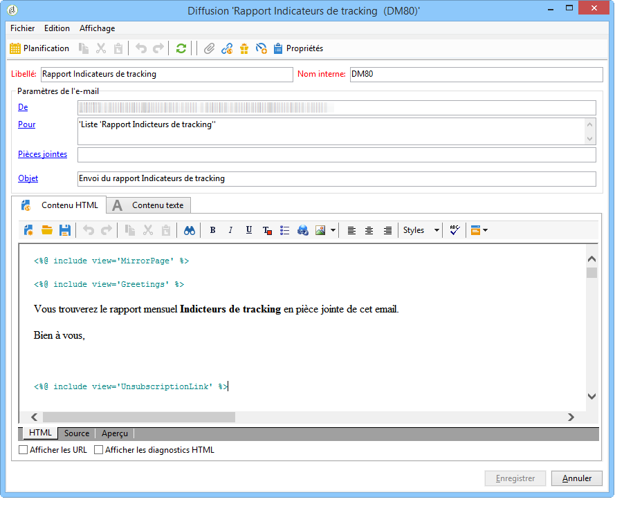

1. Chaque fois que le flux de travail est exécuté, le rapport Indicateurs **[!UICONTROL de]** suivi est mis à jour (voir [Étape 3 : Création du processus](#step-3--creating-the-workflow)). Pour inclure la dernière version du rapport dans la remise, vous devez ajouter une pièce jointe **** calculée :

   Pour plus d&#39;informations sur la création d&#39;un attachement calculé, reportez-vous à cette [section](../../delivery/using/attaching-files.md#creating-a-calculated-attachment).

   * Cliquez sur le lien **[!UICONTROL Pièces jointes]**, cliquez sur **[!UICONTROL Ajouter]** puis sélectionnez **[!UICONTROL Attachement calculé]**.

      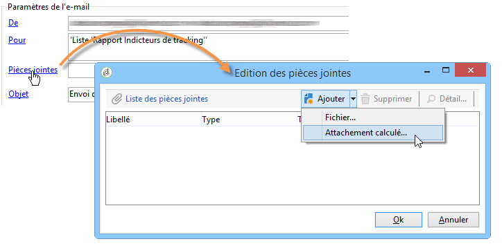

   * Dans le champ **[!UICONTROL Type]**, choisissez la quatrième option : **[!UICONTROL Le nom de fichier est calculé au moment de l&#39;envoi pour chaque message (il peut dépendre du destinataire)]**.

      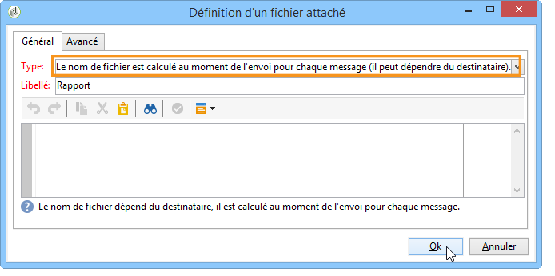

      La valeur renseignée dans le champ **[!UICONTROL Libellé]** n&#39;apparaîtra pas dans la diffusion finale.

   * Dans la zone d&#39;édition, saisissez le chemin d&#39;accès au fichier et son nom exact.

      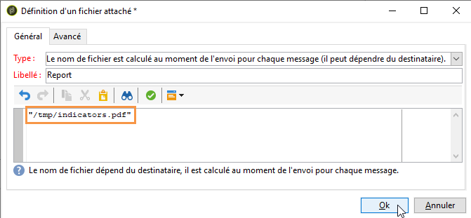

      >[!CAUTION]
      >
      >Le fichier doit être présent sur le serveur. Son chemin d’accès et son nom doivent être identiques à ceux entrés dans l’activité de type de code **** JavaScript du flux de travaux (voir : [Étape 3 : Création du processus](#step-3--creating-the-workflow)).

   * Sélectionnez l&#39;onglet **[!UICONTROL Avancé]** et cochez la case **[!UICONTROL Scripter le nom du fichier qui sera affiché dans la messagerie du destinataire]**. Dans la zone d&#39;édition, saisissez le nom que vous souhaitez donner à la pièce jointe, dans la diffusion finale.

      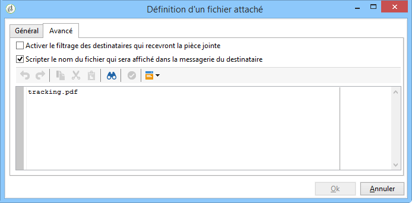

## Etape 3 : création du workflow {#step-3--creating-the-workflow}

Pour réaliser ce cas d&#39;utilisation, le workflow suivant a été créé. Celui-ci comporte trois activités :

* une activité de type **[!UICONTROL Planificateur]** permettant d&#39;exécuter le workflow tous les mois,
* une activité de type **[!UICONTROL Code JavaScript]** permettant de générer le rapport au format PDF,
* une activité de type **[!UICONTROL Diffusion]** utilisant le modèle de diffusion créé précédemment.

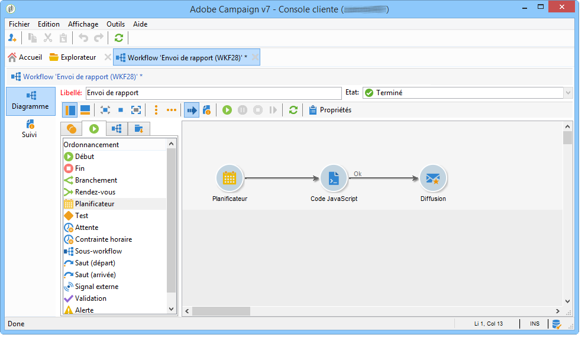

1. Positionnez-vous à présent sur le noeud **[!UICONTROL Administration > Exploitation > Workflows techniques]** et créez un nouveau workflow.

   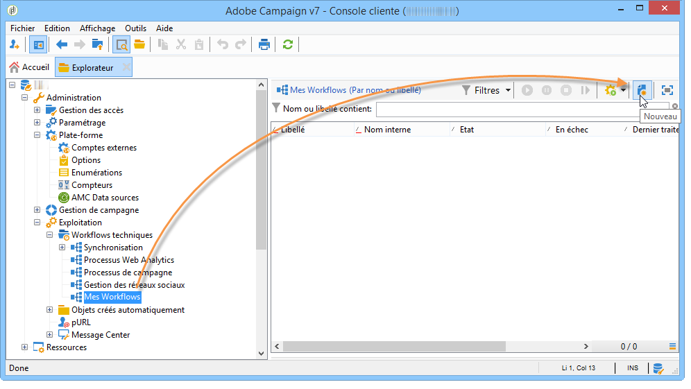

1. Ajoutez tout d&#39;abord une activité de type **[!UICONTROL Planificateur]** et configurez-la pour que le workflow s&#39;exécute le premier lundi de chaque mois.

   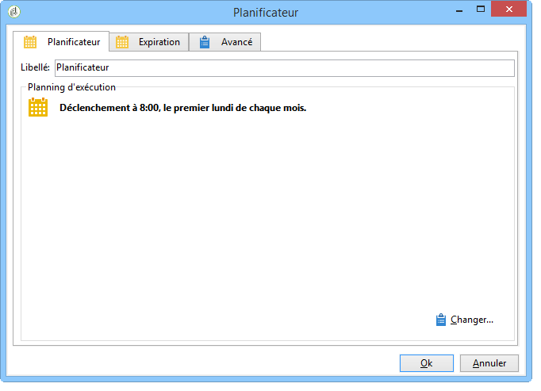

   For more on configuring the scheduler, refer to [Scheduler](../../workflow/using/scheduler.md).

1. Ajoutez ensuite une activité de type **[!UICONTROL Code JavaScript]**.

   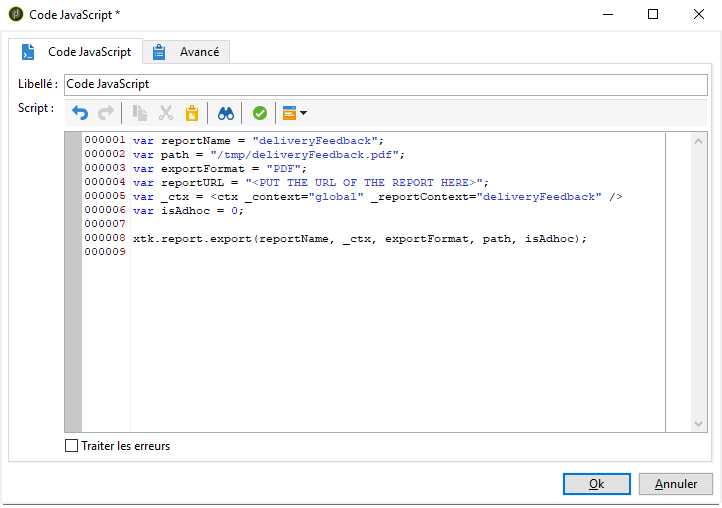

   Dans la zone d&#39;édition, saisissez le code suivant :

   ```
   var reportName = "deliveryFeedback";
   var path = "/tmp/deliveryFeedback.pdf";
   var exportFormat = "PDF";
   var reportURL = "<PUT THE URL OF THE REPORT HERE>";
   var _ctx = <ctx _context="global" _reportContext="deliveryFeedback" />
   var isAdhoc = 0;
   
   xtk.report.export(reportName, _ctx, exportFormat, path, isAdhoc);
   ```

   Les variables utilisées sont les suivantes :

   * **var reportName** : saisissez, entre guillemets, le nom interne du rapport. Dans notre exemple, le nom interne du rapport **Indicateur de tracking** est &quot;deliveryFeedback&quot;.
   * **var path** : saisissez le chemin d’enregistrement du fichier (&quot;tmp/files/&quot;), le nom que vous souhaitez donner au fichier (&quot;deliveryFeedback&quot;) et l’extension du fichier (&quot;.pdf&quot;). Dans notre exemple, nous avons utilisé le nom interne comme nom de fichier. Les valeurs doivent être entre guillemets et séparées par le caractère &quot;+&quot;.

      >[!CAUTION]
      >
      >Le fichier doit être enregistré sur le serveur. Vous devez saisir le même chemin et le même nom dans l’onglet **[!UICONTROL Général]** de la fenêtre de modification de la pièce jointe calculée (voir : [Étape 2 : Création du modèle](#step-2--creating-the-delivery-template)de diffusion).

   * **var exportFormat** : saisissez le format d&#39;export du fichier (&quot;PDF&quot;).
   * **var _ctx** (contexte) : dans notre exemple, nous utilisons le rapport **[!UICONTROL Indicateurs de tracking]** dans son contexte global.

1. Ajoutez enfin une activité de type **[!UICONTROL Diffusion]** et choisissez les options suivantes :

   * **[!UICONTROL Diffusion]** : sélectionnez **[!UICONTROL Nouvelle, créée depuis un modèle]**, et sélectionnez le modèle de diffusion créé précédemment.
   * Pour les champs **[!UICONTROL Destinataires]** et **[!UICONTROL Contenu]**, sélectionnez **[!UICONTROL Spécifiés dans la diffusion]**.
   * **[!UICONTROL Action à effectuer]** : sélectionnez **[!UICONTROL Préparer et démarrer]**.
   * Décochez les options **[!UICONTROL Générer une transition sortante]** et **[!UICONTROL Traiter les erreurs]**.
   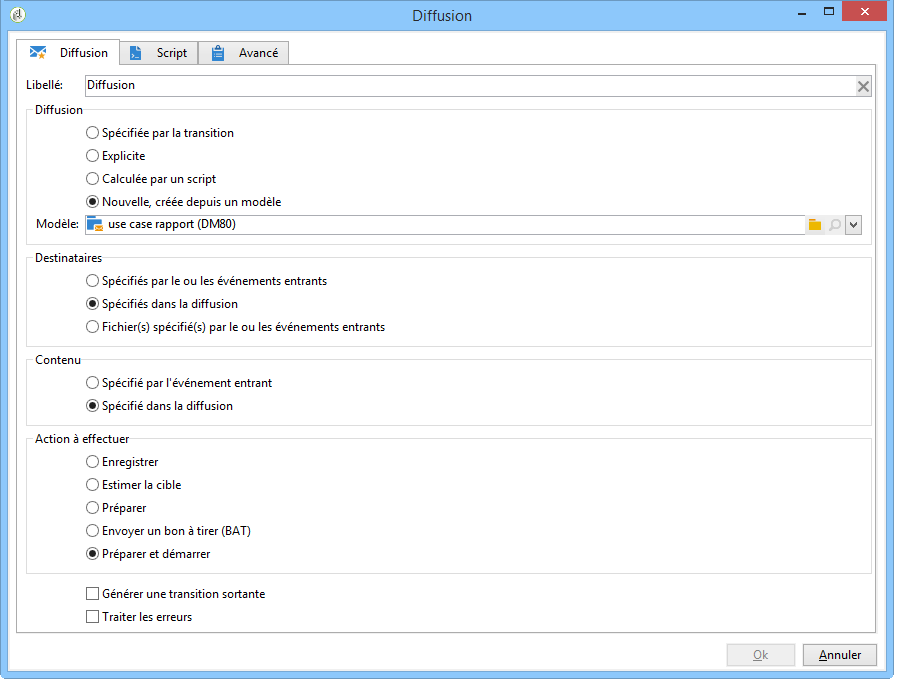

