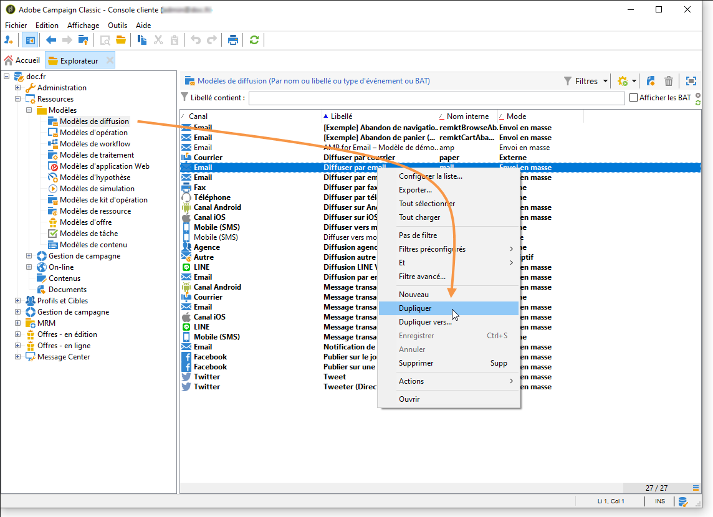
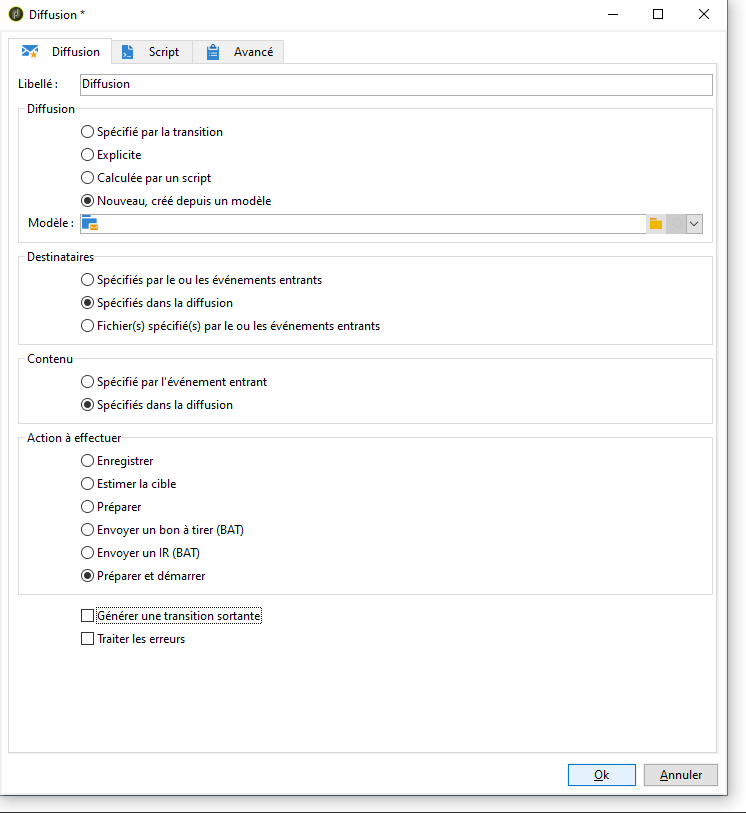

# Envoyer un rapport à une liste{#sending-a-report-to-a-list}

This use case details how to generate a monthly out-of-the-box **[!UICONTROL Tracking indicators]** report in PDF format and how to send it to a list of recipients.


Les étapes principales de mise en oeuvre de ce cas pratique sont les suivantes :

* Création d’une liste de destinataires qui recevront la remise (voir : [Étape 1 : Création de la liste](#step-1--creating-the-recipient-list)des destinataires).
* Creating a delivery template that will let you generate a new delivery each time the workflow is executed (refer to: [Step 2: Creating the delivery template](#step-2--creating-the-delivery-template)).
* Creating a workflow that will let you generate the report in PDF format and send it to the list of recipients (refer to: [Step 3: Creating the workflow](#step-3--creating-the-workflow)).

## Etape 1 : création de la liste de destinataires {#step-1--creating-the-recipient-list}

Allez dans l&#39; **[!UICONTROL Profiles and targets]** univers, cliquez sur le **[!UICONTROL Lists]** lien, puis sur le **[!UICONTROL Create]** bouton. Sélectionnez **[!UICONTROL New list]** et créez une nouvelle liste de destinataires pour le rapport à envoyer.


Pour plus d&#39;informations sur la création de listes, reportez-vous à cette [section](../../platform/using/creating-and-managing-lists.md).

## Etape 2 : création du modèle de diffusion {#step-2--creating-the-delivery-template}

1. Accédez au **[!UICONTROL Resources > Templates > Delivery templates]** noeud de l’explorateur Adobe Campaign et dupliquez le modèle prêt à l’emploi **[!UICONTROL Email delivery]** .

   

   Pour plus d&#39;informations sur la création d&#39;un modèle de diffusion, reportez-vous à cette [section](../../delivery/using/about-templates.md).

1. Renseignez les différents paramètres du modèle : le libellé, la cible (la liste de destinataires précédemment créée), l&#39;objet et le contenu.

   

1. Chaque fois que le processus est exécuté, le **[!UICONTROL Tracking indicators]** rapport est mis à jour (voir [Étape 3 : Création du processus](#step-3--creating-the-workflow)). Pour inclure la dernière version du rapport dans la remise, vous devez ajouter une **[!UICONTROL Calculated attachment]**:

   Pour plus d&#39;informations sur la création d&#39;un attachement calculé, reportez-vous à cette [section](../../delivery/using/attaching-files.md#creating-a-calculated-attachment).

   * Cliquez sur le **[!UICONTROL Attachments]** lien, puis sur **[!UICONTROL Add]**, puis sélectionnez **[!UICONTROL Calculated attachment]**.

      

   * Accédez au **[!UICONTROL Type]** champ et sélectionnez la quatrième option : **[!UICONTROL File name is computed during delivery of each message (it may then depend on the recipient profile)]**.

      

      The value entered in the **[!UICONTROL Label]** field will not appear in the final delivery.

   * Dans la zone d&#39;édition, saisissez le chemin d&#39;accès au fichier et son nom exact.

      

      >[!CAUTION]
      >
      >Le fichier doit être présent sur le serveur. Son chemin et son nom doivent être identiques à ceux entrés dans l’activité de **[!UICONTROL JavaScript code]** type du flux de travaux (voir : [Étape 3 : Création du processus](#step-3--creating-the-workflow)).

   * Sélectionnez l’ **[!UICONTROL Advanced]** onglet et cochez **[!UICONTROL Script the name of the file name displayed in the mails sent]**. Accédez à la zone de modification et saisissez le nom que vous souhaitez donner à la pièce jointe lors de la remise finale.

      

## Etape 3 : création du workflow {#step-3--creating-the-workflow}

Pour réaliser ce cas d&#39;utilisation, le workflow suivant a été créé. Celui-ci comporte trois activités :

* One **[!UICONTROL Scheduler]** type activity that lets you execute the workflow once a month,
* One **[!UICONTROL JavaScript code]** type activity that lets you generate the report in PDF format,
* one **[!UICONTROL Delivery]** type activity that uses the previously created delivery template.


1. Accédez maintenant au **[!UICONTROL Administration > Production > Technical workflows]** noeud et créez un nouveau processus.

   

1. Start by adding a **[!UICONTROL Scheduler]** type activity and configure it so that the workflow executes on the first Monday of the month.

   

   For more on configuring the scheduler, refer to [Scheduler](../../workflow/using/scheduler.md).

1. Ajoutez ensuite une activité de **[!UICONTROL JavaScript code]** type.

   

   Dans la zone d&#39;édition, saisissez le code suivant :

   ```
   var reportName = "deliveryFeedback";
   var path = "/tmp/deliveryFeedback.pdf";
   var exportFormat = "PDF";
   var reportURL = "<PUT THE URL OF THE REPORT HERE>";
   var _ctx = <ctx _context="global" _reportContext="deliveryFeedback" />
   var isAdhoc = 0;
   
   xtk.report.export(reportName, _ctx, exportFormat, path, isAdhoc);
   ```

   Les variables utilisées sont les suivantes :

   * **var reportName** : saisissez, entre guillemets, le nom interne du rapport. Dans notre exemple, le nom interne du rapport **Indicateur de tracking** est &quot;deliveryFeedback&quot;.
   * **var path** : saisissez le chemin d’enregistrement du fichier (&quot;tmp/files/&quot;), le nom que vous souhaitez donner au fichier (&quot;deliveryFeedback&quot;) et l’extension du fichier (&quot;.pdf&quot;). Dans notre exemple, nous avons utilisé le nom interne comme nom de fichier. Les valeurs doivent être entre guillemets et séparées par le caractère &quot;+&quot;.

      >[!CAUTION]
      >
      >Le fichier doit être enregistré sur le serveur. Vous devez saisir le même chemin et le même nom dans l’ **[!UICONTROL General]** onglet de la fenêtre de modification de la pièce jointe calculée (voir : [Étape 2 : Création du modèle](#step-2--creating-the-delivery-template)de diffusion).

   * **var exportFormat** : saisissez le format d&#39;export du fichier (&quot;PDF&quot;).
   * **var _ctx** (contexte) : dans ce cas, nous utilisons le **[!UICONTROL Tracking indicators]** rapport dans son contexte global.

1. Finish by adding a **[!UICONTROL Delivery]** type activity with the following options:

   * **[!UICONTROL Delivery]**: sélectionnez **[!UICONTROL New, created from a template]**, puis sélectionnez le modèle de remise créé précédemment.
   * Pour les champs **[!UICONTROL Recipients]** et **[!UICONTROL Content]** , sélectionnez **[!UICONTROL Specified in the delivery]**.
   * **[!UICONTROL Action to execute]**: sélectionnez **[!UICONTROL Prepare and start]**.
   * Décochez **[!UICONTROL Generate an outbound transition]** et **[!UICONTROL Process errors]**.
   

