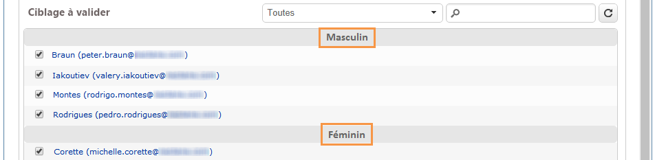

# Partage{#split}

Une activité de type **Partage** permet de partitionner une cible en plusieurs sous-ensembles. La cible est construite avec tous les résultats reçus : toutes les activités antérieures doivent donc être terminées pour que cette activité soit exécutée.

Cette activité ne déclenche pas une union de populations entrantes. Si plusieurs transitions se produisent dans une même activité fractionnée, nous vous recommandons d’insérer une **[!UICONTROL Union]** activité devant.

Pour un exemple de l’activité de division utilisée, reportez-vous à la section [Création de sous-ensembles à l’aide de l’activité](../../workflow/using/targeting-data.md#creating-subsets-using-the-split-activity)de division.

Un exemple d&#39;utilisation de l&#39;activité de Partage pour segmenter la cible en différentes populations à l&#39;aide des conditions de filtrage est présenté dans [cette section](../../workflow/using/cross-channel-delivery-workflow.md).

An example showing how to use an instance variable in a Split activity is available in [this section](../../workflow/using/javascript-scripts-and-templates.md).

To configure this activity, define the subset content and label in the **[!UICONTROL Subsets]** tab, then choose the target dimension in the **[!UICONTROL General]** tab.

## Créer des sous-ensembles {#creating-subsets}

Pour créer un sous-ensemble :

1. Saisissez un libellé dans le champ correspondant et sélectionnez le mode de filtrage à appliquer.
1. Pour filtrer la population entrante, sélectionnez l’ **[!UICONTROL Add a filtering condition]** option et cliquez sur le **[!UICONTROL Edit...]** lien.

   Sélectionnez le type de filtre à appliquer aux données pour qu&#39;elles soient incluses dans cet ensemble.

   Le mode de fonctionnement est le même que pour une activité de type **Requête**.

   >[!NOTE]
   >
   >Vous pouvez filtrer les données contenues dans deux bases externes (FDA) maximum.

1. Vous pouvez spécifier le nombre maximal d’enregistrements à extraire de la cible pour créer le sous-ensemble. Pour ce faire, cochez l’ **[!UICONTROL Limit the selected records]** option et cliquez sur le **[!UICONTROL Edit...]** lien.

   Un assistant vous permet de choisir le mode de sélection des enregistrements de ce sous-ensemble. Vous trouverez les étapes à la section [Limitation du nombre d’enregistrements](#limiting-the-number-of-subset-records)de sous-ensembles.

   

1. If you wish, you can **add other subsets** using the **[!UICONTROL Add]** button.

   

   >[!NOTE]
   >
   >Si l’ **[!UICONTROL Enable overlapping of output populations]** option n’est pas cochée, des sous-ensembles sont créés dans l’ordre des onglets. Utilisez les flèches dans la partie supérieure droite de cette fenêtre pour les déplacer. Si le premier sous-ensemble récupère 70 % de la population initiale, par exemple, le sous-ensemble suivant applique ses critères de sélection uniquement aux 30 % restants, etc.

   Pour chaque sous-ensemble créé, une transition sortante sera ajoutée à l&#39;activité de partage.

   

   You can choose to generate a single outbound transition (and identify sets using the segment code, for example): to do this, select the **[!UICONTROL Generate subsets in the same table]** option in the **[!UICONTROL General]** tab.

   S&#39;il est renseigné, le code segment de chaque sous-ensemble est automatiquement stocké dans une colonne additionnelle. Cette colonne sera accessible parmi les champs de personnalisation, au niveau des diffusions.

## Limiter le nombre d&#39;enregistrements des sous-ensembles {#limiting-the-number-of-subset-records}

Si vous ne souhaitez pas utiliser l&#39;ensemble de la population d&#39;un sous-ensemble, vous avez la possibilité d&#39;en limiter le nombre d&#39;enregistrements.

1. Dans la fenêtre de modification du sous-ensemble, cochez l’ **[!UICONTROL Limit the selected records]** option et cliquez sur le **[!UICONTROL Edit...]** lien.
1. Sélectionnez le type de limitation de votre choix :

   * **[!UICONTROL Activate random sampling]**: cette option prend un échantillon aléatoire des enregistrements. Le type d’échantillonnage aléatoire appliqué dépend du moteur de base de données.
   * **[!UICONTROL Keep only the first records after sorting]**: cette option vous permet de définir une limite en fonction d’un ou de plusieurs ordres de tri. Si vous sélectionnez le **[!UICONTROL Age]** champ comme critère de tri et 100 comme limite, seuls les 100 premiers destinataires seront conservés.
   * **[!UICONTROL Keep the first ones after sorting (criteria, random)]**: Cette option combine les deux options précédentes. Il vous permet de définir une limite basée sur un ou plusieurs ordres de tri, puis d’appliquer une sélection aléatoire sur les premiers enregistrements si certains enregistrements ont les mêmes valeurs que les critères définis.

      Par exemple, si vous choisissez le champ **[!UICONTROL Age]** comme critère de tri, et que vous définissez ensuite une limite de 100, mais que les 2000 destinataires les plus jeunes en base ont tous 18 ans, alors 100 destinataires seront sélectionnés aléatoirement parmi ces 2000.
   

1. Si vous choisissez de définir des critères de tri, une étape supplémentaire vous permet de définir les colonnes et l&#39;ordre de tri.

   

1. Choisissez ensuite la méthode de limitation des données.

   

   Vous avez le choix entre les différentes méthodes suivantes :

   * **[!UICONTROL Size (in %)]**: un pourcentage d’enregistrements. Par exemple, la configuration ci-dessous extrait 10 % de la population totale.

      Le pourcentage porte sur la population initiale, non sur le résultat de l&#39;activité.

   * **[!UICONTROL Size (as a % of the segment)]**: un pourcentage des enregistrements concernant uniquement les sous-ensembles et non la population initiale.
   * **[!UICONTROL Maximum size]**: nombre maximal d’enregistrements.
   * **[!UICONTROL By data grouping]**: vous pouvez définir une limite au nombre d’enregistrements en fonction des valeurs d’un champ spécifique de la population entrante. Pour plus d’informations sur ce sujet, voir [Limitation du nombre d’enregistrements de sous-ensembles par regroupement](#limiting-the-number-of-subset-records-by-data-grouping)de données.
   * **[!UICONTROL By data grouping (in %)]**: vous pouvez définir une limite sur le nombre d’enregistrements en fonction des valeurs d’un champ spécifique de la population entrante à l’aide d’un pourcentage. Pour plus d’informations sur ce sujet, voir [Limitation du nombre d’enregistrements de sous-ensembles par regroupement](#limiting-the-number-of-subset-records-by-data-grouping)de données.
   * **[!UICONTROL By data distribution]**: Si vos champs de regroupement comportent trop de valeurs ou si vous souhaitez éviter de saisir à nouveau les valeurs pour chaque nouvelle activité fractionnée, Adobe Campaign vous permet de configurer une **[!UICONTROL By data distribution]** limite (module marketing distribué facultatif). Pour plus d’informations, voir [Limitation du nombre d’enregistrements de sous-ensembles par distribution](#limiting-the-number-of-subset-records-per-data-distribution)de données.

1. Cliquez sur **[!UICONTROL Finish]** pour approuver les critères de sélection des enregistrements. La configuration définie s’affiche alors dans la fenêtre centrale de l’éditeur.

## Limiter le nombre d&#39;enregistrements des sous-ensembles par groupement de données {#limiting-the-number-of-subset-records-by-data-grouping}

Vous pouvez effectuer une limitation du nombre d&#39;enregistrements par groupement de données. Cette limitation peut être effectuée à l&#39;aide d&#39;une valeur fixe ou d&#39;un pourcentage.

For instance, if you select the **[!UICONTROL Language]** field as a group field, you can define a list of records for each language.

1. Après avoir sélectionné les valeurs de limitation des données, sélectionnez **[!UICONTROL By data grouping]** ou **[!UICONTROL By data grouping (as a %)]** , puis cliquez sur **[!UICONTROL Next]**.

   

1. Then select the grouping field(s) (the **[!UICONTROL Language]** field for instance) and click **[!UICONTROL Next]**.

   

1. Enfin, spécifiez les seuils de regroupement de données (en utilisant les valeurs fixes ou les pourcentages selon la méthode de regroupement précédemment sélectionnée). Pour définir le même seuil pour chaque valeur, par exemple si vous souhaitez définir le nombre d’enregistrements pour chaque langue sur 10, sélectionnez l’ **[!UICONTROL All data groupings are the same size]** option. Pour définir une limite différente pour chaque valeur, sélectionnez l’ **[!UICONTROL Limitations by grouping value]** option. Cela vous permettra de choisir une autre limite pour l&#39;anglais, le français, etc.

   

1. Click **[!UICONTROL Finish]** to approve the limitation and return to editing the split activity.

## Limiter le nombre d&#39;enregistrements des sous-ensembles par répartition de données {#limiting-the-number-of-subset-records-per-data-distribution}

Si vos champs de regroupement contiennent un nombre de valeurs trop important ou si vous souhaitez éviter de réinitialiser les valeurs pour chaque nouvelle activité de division, Adobe Campaign vous permet de créer une limite par distribution de données. Lors de la sélection des valeurs de limitation des données (pour plus d’informations sur ce sujet, voir la section [Création de sous-ensembles](#creating-subsets) ), sélectionnez l’ **[!UICONTROL By data distribution]** option et sélectionnez un modèle dans le menu déroulant. La création d’un modèle de distribution de données est illustrée ci-dessous.

Pour un exemple de l’ **[!UICONTROL Local approval]** activité avec un modèle de distribution, reportez-vous à [Utilisation de l’activité](../../workflow/using/using-the-local-approval-activity.md)d’approbation locale.

>[!IMPORTANT]
>
>Pour utiliser cette fonction, vous devez acquérir le module Distributed Marketing, qui est une option de Campaign. Vérifiez votre contrat de licence.

Le modèle de répartition de données permet de limiter le nombre d&#39;enregistrements à partir d&#39;une liste de valeurs de groupement. Les étapes de création d&#39;un modèle de répartition de données sont les suivantes :

1. Pour créer le modèle de distribution des données, accédez au **[!UICONTROL Resources > Campaign management > Data distribution]** noeud et cliquez sur **[!UICONTROL New]**.

   

1. The **[!UICONTROL General]** tab lets you enter the label and the execution context of the distribution (targeting dimension, distribution field).

   

   Les champs à renseigner sont les suivants :

   * **[!UICONTROL Label]**: libellé du modèle de distribution.
   * **[!UICONTROL Targeting dimension]**: entrez la dimension de ciblage à laquelle la distribution des données sera appliquée, **[!UICONTROL Recipient]** par exemple. Ce schéma doit toujours être compatible avec les données utilisées dans le processus de ciblage.
   * **[!UICONTROL Distribution field]**: sélectionnez un champ au moyen de la dimension de ciblage. Par exemple, si vous sélectionnez le **[!UICONTROL Email domain]** champ, la liste des destinataires est ventilée par domaine.
   * **[!UICONTROL Distribution type]**: sélectionnez la manière dont la valeur limite de la cible sera ventilée dans l’ **[!UICONTROL Distribution]** onglet : **[!UICONTROL Percentage]** ou **[!UICONTROL Set]**.
   * **[!UICONTROL Assignment type]**: sélectionnez le type d’affectation de distribution de données. Vous pouvez choisir entre l’affectation par groupe ou opérateur ou l’affectation par entité locale. L’affectation par entité locale est utilisée dans le marketing **distribué**. Voir à ce sujet cette [section](../../campaign/using/about-distributed-marketing.md).
   * **[!UICONTROL Approval storage]**: si vous utilisez une **[!UICONTROL Local approval]** activité dans votre processus de ciblage (voir Approbation locale), entrez le schéma dans lequel les résultats d’approbation seront stockés. Vous devez spécifier un schéma de stockage par schéma de ciblage. Si vous utilisez le schéma de **[!UICONTROL Recipients]** ciblage, saisissez le schéma de **[!UICONTROL Local approval of recipients]** stockage par défaut.

      In case of a simple limitation by data grouping without local approval, you do not need to enter the **[!UICONTROL Approvals storage]** field.

1. Si vous utilisez une **[!UICONTROL Local approval]** activité (reportez-vous à la section Approbation locale), saisissez le **[!UICONTROL Advanced settings]** modèle de distribution :

   

   Les champs à renseigner sont les suivants :

   * **[!UICONTROL Approve targeted messages]**: cochez cette option si vous souhaitez que tous les destinataires soient présélectionnés dans la liste des destinataires à approuver. Si cette option est désactivée, aucun destinataire n’est présélectionné.

      >[!NOTE]
      >
      >Cette option est cochée par défaut.

      

   * **[!UICONTROL Delivery label]**: vous permet de définir une expression pour afficher le libellé de remise dans la notification de retour. L’expression par défaut fournit des informations sur le libellé standard de la diffusion (chaîne de calcul). Vous pouvez modifier cette expression.

      

   * **[!UICONTROL Grouping field]**: ce champ vous permet de définir le regroupement utilisé pour afficher les destinataires dans les notifications d’approbation et de retour.

      

   * **[!UICONTROL Web Interface]**: vous permet de lier une application Web à la liste des destinataires. Dans la notification d’approbation et de retour, chaque destinataire peut cliquer et créer un lien vers l’application Web sélectionnée. Le **[!UICONTROL Parameters]** champ (par exemple **[!UICONTROL recipientId]**) vous permet de configurer le paramètre supplémentaire à utiliser dans l’URL et l’application Web.

      

1. The **[!UICONTROL Breakdown]** tab lets you define the list of distribution values.

   

   * **[!UICONTROL Value]**: entrez les valeurs de distribution.
   * **[!UICONTROL Percentage / Set]**: entrez la limite d’enregistrement (fixe ou pourcentage) liée à chaque valeur.

      This column is defined by the **[!UICONTROL Distribution type]** field within the **[!UICONTROL General]** tab.

   * **[!UICONTROL Label]**: saisissez le libellé lié à chaque valeur.
   * **[!UICONTROL Group or operator]**: si vous utilisez une **[!UICONTROL Local approval]** activité (reportez-vous à la section Approbation locale), sélectionnez l’opérateur ou le groupe d’opérateurs affectés à chaque valeur de distribution.

      In case of a simple limitation by data grouping without local approval, you do not need to enter the **[!UICONTROL Group or operator]** field.

      >[!IMPORTANT]
      >
      >Vérifiez que les opérateurs disposent des droits adéquats.

   * **[!UICONTROL Local entity]**: sélectionnez l&#39;entité locale affectée à chaque valeur de distribution. Les entités locales sont utilisées dans le marketing **distribué**. Voir à ce sujet cette [section](../../campaign/using/about-distributed-marketing.md).

## Paramètres de filtrage {#filtering-parameters}

Cliquez sur l’ **[!UICONTROL General]** onglet pour entrer le libellé de l’activité. Sélectionnez la cible et filtrez les dimensions pour cette division. Si nécessaire, vous pouvez modifier ces dimensions pour un jeu partiel donné.

Cochez cette **[!UICONTROL Generate complement]** option si vous souhaitez exploiter la population restante. Le complément est la cible entrante moins l&#39;union des sous-ensembles. Une transition sortante supplémentaire sera alors ajoutée à l’activité, comme suit :

Pour que cette option fonctionne correctement, les données en entrée doivent posséder une clé primaire.

For example, if the data is read directly from an external database such as Netezza (which does not support the notion of an index) via a **[!UICONTROL Data loading (RDBMS)]** activity, the complement generated by the **[!UICONTROL Split]** activity will be incorrect.

Pour éviter cela, vous pouvez faire glisser une **[!UICONTROL Enrichment]** activité juste avant l’ **[!UICONTROL Split]** activité. Dans l’ **[!UICONTROL Enrichment]** activité, vérifiez **[!UICONTROL Keep all additional data from the main set]** et spécifiez dans les données supplémentaires les colonnes que vous souhaitez utiliser pour configurer les filtres de l’ **[!UICONTROL Split]** activité. Les données de la transition entrante de l’ **[!UICONTROL Split]** activité sont ensuite stockées localement dans une table temporaire sur le serveur Adobe Campaign et le complément peut être généré correctement.

L’ **[!UICONTROL Enable overlapping of output populations]** option permet de gérer les populations appartenant à plusieurs sous-ensembles :

* Lorsque la case est décochée, l&#39;activité de partage assure qu&#39;un destinataire ne sera pas présent dans plusieurs transitions en sortie, même s&#39;il vérifie les critères de plusieurs sous-ensembles. Il sera dans la cible du premier onglet dont les critères sont vérifiés.
* Lorsque la case est cochée, les destinataires peuvent être présents dans plusieurs sous-ensembles s&#39;ils vérifient leurs critères de filtrage. Adobe Campaign vous recommande d&#39;utiliser des critères exclusifs.

## Paramètres d&#39;entrée {#input-parameters}

* tableName
* schema

Chacun des événements entrants doit spécifier une cible définie par ces paramètres.

## Paramètres de sortie {#output-parameters}

* tableName
* schema
* recCount

Cet ensemble de trois valeurs identifie la cible résultant de l’exclusion. **[!UICONTROL tableName]** est le nom de la table qui enregistre les identificateurs cible, **[!UICONTROL schema]** est le schéma de la population (généralement nms:destinataire) et **[!UICONTROL recCount]** est le nombre d’éléments de la table.

La transition associée au complémentaire possède les mêmes paramètres.
