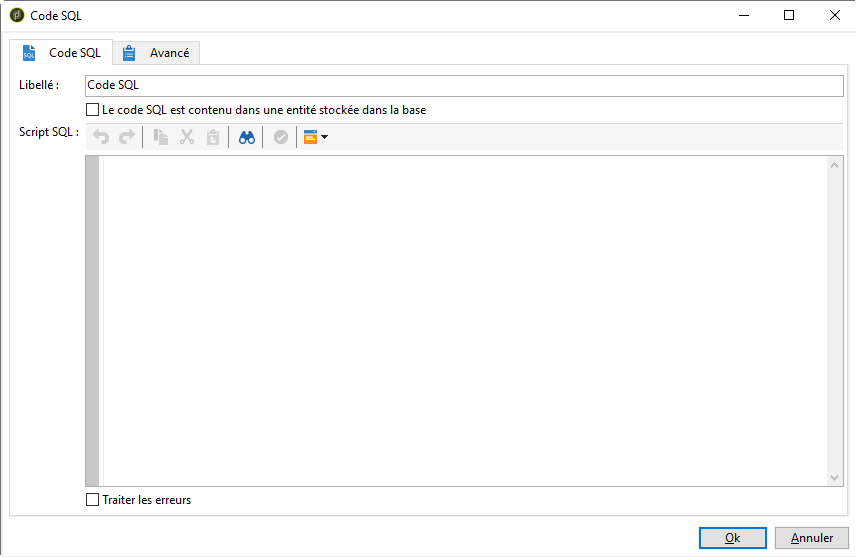
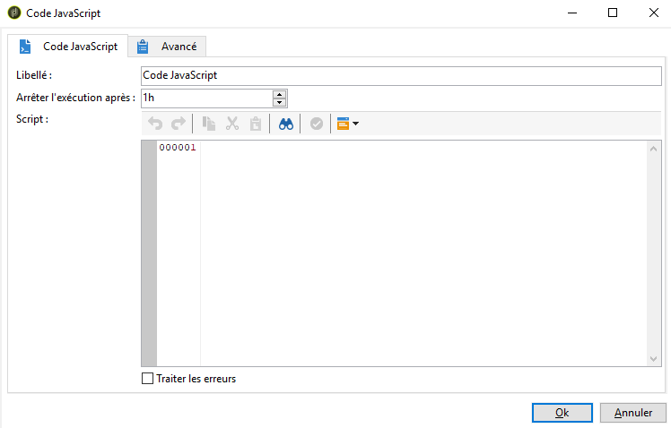
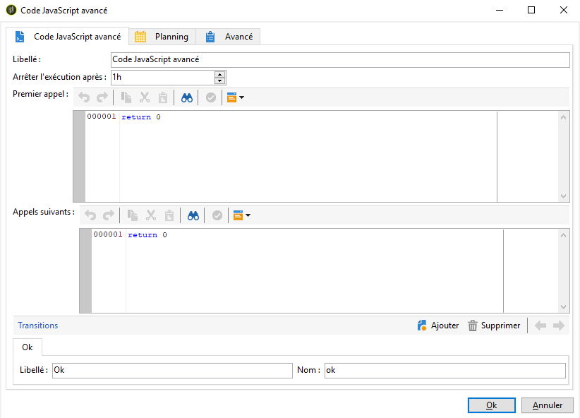

# Code SQL et code JavaScript{#sql-code-and-javascript-code}

## Code SQL {#sql-code}

Une **[!UICONTROL SQL code*]* activité exécute un script SQL. Le script est un modèle JST.

* **[!UICONTROL Script]**

   La zone centrale de l&#39;éditeur contient le script à exécuter. Ce script est un template JST et peut donc être paramétré en fonction du contexte du workflow.

* **[!UICONTROL Processing errors]**

   Reportez-vous à la section Erreurs [de](../../workflow/using/monitoring-workflow-execution.md#processing-errors)traitement.

## Code JavaScript et code JavaScript avancé {#javascript-code}

**[!UICONTROL JavaScript code]** et **[!UICONTROL Advanced JavaScript code]** les activités exécutent un script JavaScript dans le contexte d’un flux de travail. Pour plus d’informations sur les scripts, reportez-vous à la section Scripts [JavaScript et modèles](../../workflow/using/javascript-scripts-and-templates.md) .

>[!NOTE]
>
>Par défaut, la phase d’exécution des activités **[!UICONTROL JavaScript code]** et **[!UICONTROL Advanced JavaScript code]** des activités ne peut pas dépasser 1 heure. Après ce délai, le processus sera abandonné avec un message d’erreur et l’exécution de l’activité échouera.
>
>Vous pouvez modifier ce délai dans le **[!UICONTROL Stop execution after]** champ disponible dans les propriétés des activités.

* **[!UICONTROL JavaScript code]**

   

   * **[!UICONTROL Script]**: La zone centrale de l&#39;éditeur contient le script à exécuter.
   * **[!UICONTROL Processing errors]**:Reportez-vous à la section Erreurs [de](../../workflow/using/monitoring-workflow-execution.md#processing-errors)traitement.

* **[!UICONTROL Advanced JavaScript code]**

   

   * **[!UICONTROL First call]**: La première zone de l&#39;éditeur contient le script à exécuter lors du premier appel.
   * **[!UICONTROL Next calls]**: La seconde zone de l&#39;éditeur contient le script à exécuter lors des appels suivants.
   * **[!UICONTROL Transitions]**: Vous pouvez définir plusieurs transitions en sortie de l&#39;activité.
   * **[!UICONTROL Schedule]**:L’ **[!UICONTROL Schedule]** onglet vous permet de programmer le moment où déclencher l’activité.
