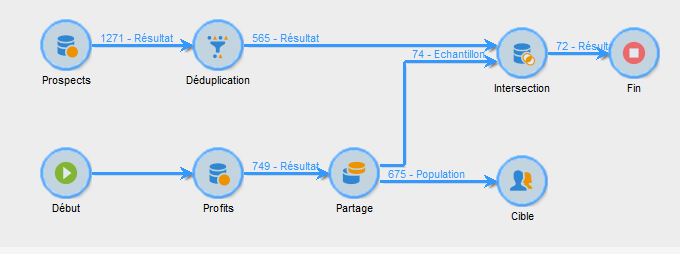
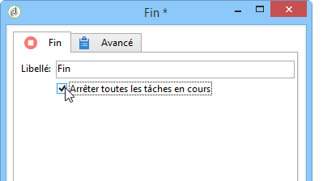
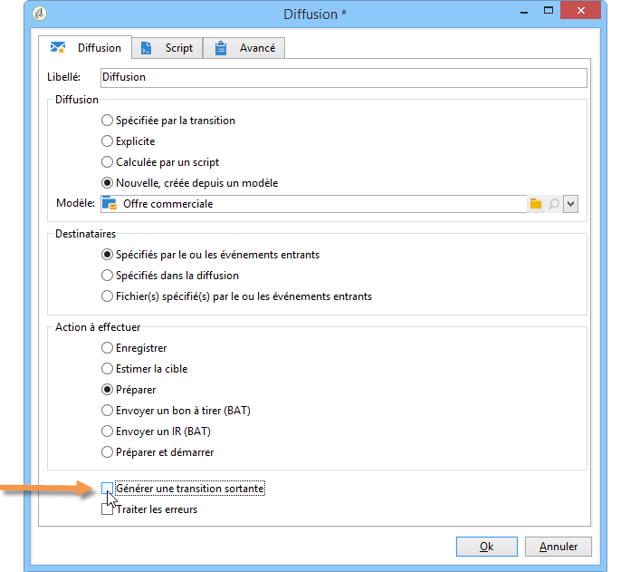

# Début et Fin{#start-and-end}

Les activités **[!UICONTROL Début]** et **[!UICONTROL Fin]** permettent de marquer graphiquement le début et la fin d&#39;un workflow. Elles n&#39;ont pas d&#39;impact fonctionnel et sont donc facultatives.

* **[!UICONTROL Début]**

   L&#39;exécution d&#39;un workflow démarre par les activités sans transition entrante et les activités de type Début.

   

* **[!UICONTROL Fin]**

   Vous pouvez paramétrer l&#39;activité **[!UICONTROL Fin]** pour qu&#39;elle interrompe toutes les tâches en cours. Pour cela, double-cliquez sur l&#39;activité pour afficher ses propriétés et cochez l&#39;option correspondante.

   

   Les données de la table de travail sont automatiquement supprimées à l&#39;activation de l&#39;activité de fin. Si cela n&#39;est pas nécessaire, et afin d&#39;éviter toute charge inutile, vous pouvez choisir de désactiver la transition en sortie de la dernière activité. Par exemple, en sortie d&#39;une diffusion, si aucun traitement n&#39;est prévu, décochez l&#39;option correspondante comme ci-dessous :

   
