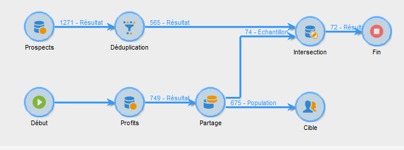
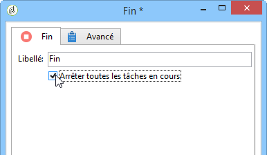

# Début et Fin{#start-and-end}

Les activités **[!UICONTROL Début]** et **[!UICONTROL Fin]** vous permettent de marquer graphiquement le début et la fin d’un workflow. Ces activités n’ont aucun impact fonctionnel et sont donc facultatives.

* **[!UICONTROL Début]**

  L&#39;exécution d&#39;un workflow démarre par les activités sans transition entrante et les activités de type Début.

  

* **[!UICONTROL Fin]**

  Vous pouvez paramétrer l&#39;activité **[!UICONTROL Fin]** pour interrompre toutes les tâches en cours. Pour ce faire, double-cliquez sur l’activité pour afficher ses propriétés, puis cochez l’option appropriée.

  

  Les données de la table de travail sont automatiquement supprimées lorsque l&#39;activité de fin est activée. Si cela n’est pas nécessaire, et pour éviter des charges inutiles, vous pouvez choisir de désactiver la transition à la sortie de la dernière activité. Par exemple, au niveau d&#39;une sortie de diffusion, si aucun traitement n&#39;est planifié, désélectionnez l&#39;option correspondante comme dans l&#39;exemple ci-dessous :

  
