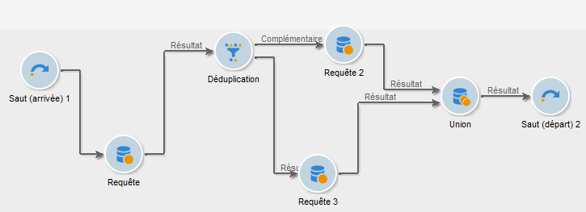
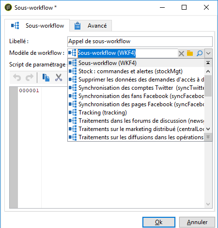
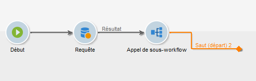

# Sous-workflow{#sub-workflow}

L’ **[!UICONTROL Sub-workflow]** activité vous permet de déclencher l’exécution d’un autre processus et de récupérer le résultat. Cette activité vous permet d’utiliser des processus complexes lors de l’utilisation d’une interface simplifiée.

Vous pouvez appeler plusieurs sous-workflows au sein d’un même workflow. Les sous-workflows sont exécutés de manière synchrone.

>[!NOTE]
>
>Pour que le sous-workflow s’exécute correctement, vous devez disposer d’un seul saut de type « arrivée » avec le numéro le plus petit, et d’un seul saut de type « départ » avec le numéro le plus élevé. Par exemple, si vous avez des sauts de type « départ » avec une priorité de 1, 2 et 3, vous ne devriez avoir qu’un seul saut de type « départ » avec une priorité de 3.

1. Créez un workflow que vous allez utiliser en tant que sous-workflow dans un autre workflow.
1. Insérez une **[!UICONTROL Jump (end point)]** activité avec une priorité de 1 au début du processus. Si vous avez plusieurs sauts de type &quot;arrivée&quot;, Adobe Campaign utilisera le saut &quot;arrivée&quot; avec le nombre le plus faible.

   Insérez une **[!UICONTROL Jump (start point)]** activité avec une priorité de 2 à la fin du flux de travail. Si vous avez plusieurs sauts de type &quot;start&quot;, Adobe Campaign utilisera le saut &quot;starting&quot; avec le plus grand nombre.

   

   >[!NOTE]
   >
   >If the sub-workflow activity references a workflow with several **[!UICONTROL Jump]** activities, the sub-workflow is executed between the &quot;arrival&quot; type jump with the lowest number and the &quot;start&quot; type jump with the highest number.

1. Finalisez et enregistrez ce « sous-workflow ».
1. Créez un workflow « maître ».
1. Insert a **[!UICONTROL Sub-workflow]** activity and open it.
1. Select the workflow that you want to use from the **[!UICONTROL Workflow template]** drop-down list.

   

1. Vous pouvez également ajouter un script de paramétrage pour modifier le fonctionnement du workflow référencé.
1. Clics **[!UICONTROL Ok]**. It will automatically create an outbound transition with the label of the **[!UICONTROL Jump (start point)]** activity from the selected workflow.

   

1. Exécutez le workflow.

Once run, the workflow that was called as a sub-workflow is still in **[!UICONTROL Being edited]** status, which means the following:

* Vous ne pouvez pas cliquer avec le bouton droit sur les transitions pour afficher la cible.
* Le nombre de populations intermédiaires ne peut pas être affiché.
* Les logs sont agrégés dans le workflow « maître » et sont libellés uniquement comme « sous-workflow ».

En effet, ce workflow n’est qu’un modèle. Un sous-workflow est créé sur la base de ce modèle lorsqu’il est appelé à partir du workflow « maître ».

## Paramètres d&#39;entrée (optionnel) {#input-parameters--optional-}

* tableName
* schema

Chacun des événements entrants doit spécifier une cible définie par ces paramètres.

## Paramètres de sortie {#output-parameters}

* tableName
* schema
* recCount

Cet ensemble de trois valeurs identifie la population ciblée par la requête. **[!UICONTROL tableName]** est le nom de la table qui enregistre les identificateurs cible, **[!UICONTROL schema]** est le schéma de la population (généralement nms:destinataire) et **[!UICONTROL recCount]** est le nombre d’éléments de la table.

* targetSchema

Cette valeur correspond au schéma de la table de travail. Ce paramètre est valide pour toutes les transitions avec **[!UICONTROL tableName]** et **[!UICONTROL schema]**.
