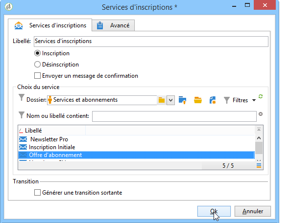
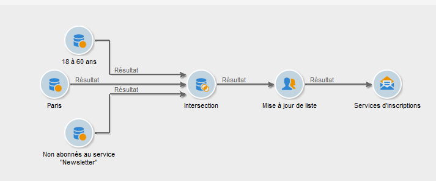

# Services d&#39;inscriptions{#subscription-services}

Une activité de type **Service d&#39;inscriptions** permet d&#39;abonner ou désabonner la population spécifiée par la transition à un service d&#39;information.

Pour la paramétrer, éditez l&#39;activité et saisissez son libellé, puis choisissez l&#39;action à effectuer (Inscription ou Désinscription) et le service concerné, comme dans l&#39;exemple ci-dessous :

1. Saisissez le libellé de l&#39;activité.
1. Sélectionnez **[!UICONTROL Générer une transition sortante]** si vous voulez créer une transition à la fin de l&#39;exécution.

   Généralement, l&#39;inscription d&#39;une cible à un service d&#39;information marque la fin du workflow de ciblage c&#39;est pourquoi l&#39;option n&#39;est pas activée par défaut.

1. Cliquez sur **[!UICONTROL Inscription]** ou **[!UICONTROL Désinscription]** si vous souhaitez abonner ou désabonner la population spécifiée au service d&#39;information sélectionné.
1. Sélectionnez **[!UICONTROL Envoyer un message de confirmation]** pour prévenir un destinataire lorsqu&#39;il est abonné ou désabonné à un service.

   Le contenu de ce message est précisé dans un modèle de diffusion attaché au service d&#39;information. Voir à ce sujet cette [section](../../delivery/using/managing-subscriptions.md).

## Exemple : inscrire une liste de destinataires à une newsletter {#example--subscribe-a-list-of-recipients-to-a-newsletter}

Le workflow suivant a pour but de recenser les destinataires éligibles afin de les inscrire, en une seule opération, à une newsletter destinée aux personnes dans la vie active résidant à Paris.

Pour cela, il faut également exclure les destinataires déjà abonnés.

>[!CAUTION]
>
>Avant d&#39;abonner manuellement des destinataires à un service, vérifiez que ces derniers acceptent de recevoir des communications de votre part.

1. Placez les trois requêtes suivantes :

   * Une première ciblant les destinataires âgés de 18 à 60 ans.
   * Une seconde ciblant les destinataires résidant à Paris.
   * Une troisième ciblant les destinataires n&#39;étant pas actuellement pas abonnés à la newsletter.

1. Placez une activité d&#39;intersection afin de croiser les différents résultats.
1. Si vous le souhaitez, insérez une mise à jour de liste afin de maintenir à jour la liste des derniers abonnés.
1. Insérez une activité de services d&#39;inscriptions, puis double-cliquez sur cette dernière afin de la paramétrer.
1. Saisissez le libellé de l&#39;activité et sélectionnez **[!UICONTROL Inscription]**.

   Vous pouvez, si vous le souhaitez, prévenir les destinataires de leur inscription à la newsletter en cochant la case **[!UICONTROL Envoyer un message de confirmation]**.

1. Sélectionnez le dossier dans lequel se trouve la newsletter puis sélectionnez cette dernière dans la liste qui apparaît.
1. Laissez la case **[!UICONTROL Générer une transition sortante]** décochée afin que cette activité marque la fin du workflow puis cliquez sur **[!UICONTROL Ok]**.

Lors de l&#39;exécution du workflow, les destinataires répondant à la fois aux trois requêtes sont ajoutés à la liste et abonnés à la newsletter.

Vous avez la possibilité de vérifier que l&#39;abonnement a bien été effectué en vous rendant dans l&#39;onglet **[!UICONTROL Abonnements]** de ces destinataires.

## Paramètres d&#39;entrée {#input-parameters}

* tableName
* schema

Chacun des événements entrants doit spécifier une cible définie par ces paramètres.
