# Données de la cible{#targeting-data}

## Création de requêtes {#creating-queries}

### Choix des données {#selecting-data}

Une activité **[!UICONTROL Requête]** permet de sélectionner des données de base pour créer la population cible. Voir à ce sujet la section [Créer une requête](query.md#creating-a-query).

Les activités suivantes peuvent également servir à lancer des requêtes et à affiner les données de la base de données : [Requête incrémentale](incremental-query.md), [Lecture de liste](read-list.md).

Il est possible de collecter des données supplémentaires pour les transférer et les traiter tout au long du cycle de vie du workflow. Voir à ce sujet les sections [Ajouter des données](query.md#adding-data) et [Editer les données additionnelles](#editing-additional-data).

### Modification des données additionnelles {#editing-additional-data}

Une fois que des données additionnelles ont été ajoutées, vous pouvez les éditer ou les utiliser pour affiner la cible définie dans l&#39;activité de requête.

Le lien **[!UICONTROL Editer les données additionnelles...]** permet de visualiser les données qui ont été ajoutées et éventuellement de les modifier ou d&#39;en ajouter de nouvelles.

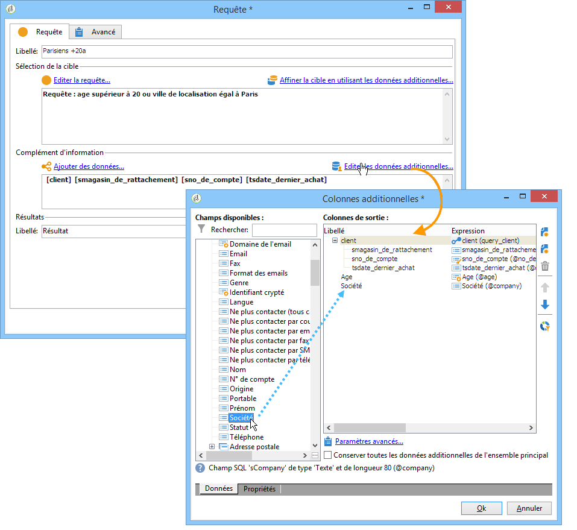

Pour ajouter des données aux colonnes de sorties déjà définies, sélectionnez-les dans la liste des champs disponibles. Pour créer une nouvelle colonne de sortie, cliquez sur l&#39;icône **[!UICONTROL Ajouter]** puis sélectionnez le champ et cliquez sur **[!UICONTROL Editer l&#39;expression]**.

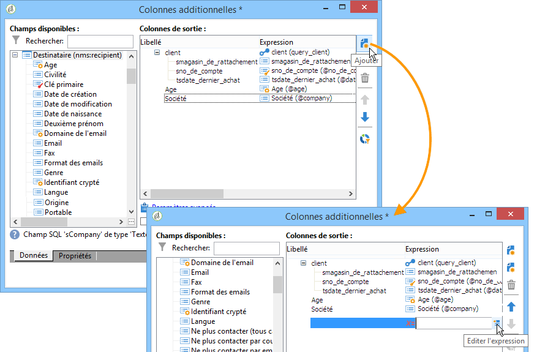

Indiquez le mode de calcul du champ à ajouter, par exemple un agrégat.

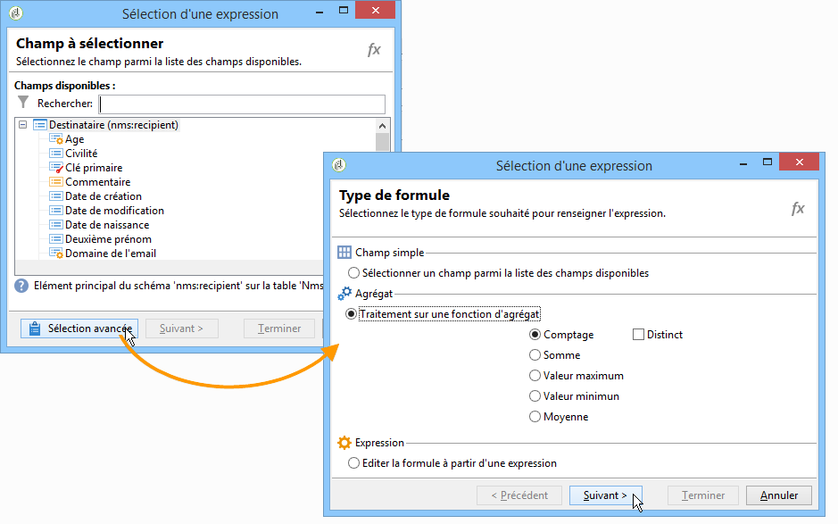

L&#39;option **[!UICONTROL Ajouter un sous-élément]** permet d&#39;adjoindre des données calculées à la collection. Vous pouvez ainsi sélectionner des données additionnelles issues de la collection ou définir des calculs d&#39;agrégats sur les éléments de la collection.

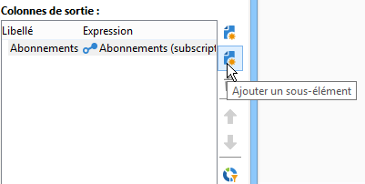

Les sous-éléments seront représentés en sous-arborescence de la collection à laquelle ils sont associés.

Les collections sont affichées dans le sous-onglet **[!UICONTROL Collections]**. Vous pouvez filtrer les éléments récupérés en cliquant sur l&#39;icône **[!UICONTROL Détail]** de la collection sélectionnée. L&#39;assistant de filtrage permet de sélectionner les données collectées et indiquer les critères de filtrage à appliquer aux données de la collection.

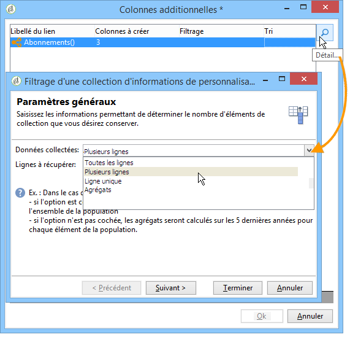

### Affinage de la cible en utilisant les données additionnelles {#refining-the-target-using-additional-data}

Les données additionnelles collectées peuvent permettre dʼaffiner le filtrage des données de la base. Pour cela, cliquez sur le lien **[!UICONTROL Affinage de la cible en utilisant les données additionnelles...]** : vous pouvez ainsi sur-filtrer sur les données qui ont été ajoutées.

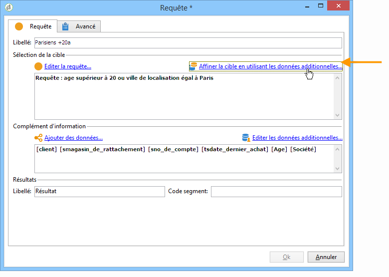

### Homogénéisation des données {#homogenizing-data}

Dans les activités de type **[!UICONTROL Union]** ou **[!UICONTROL Intersection]**, vous pouvez choisir de ne conserver que les données additionnelles communes afin d&#39;homogénéiser les données. Dans ce cas, la table de travail temporaire en sortie de cette activité ne contiendra que les données additionnelles présentes dans tous les ensembles en entrée.

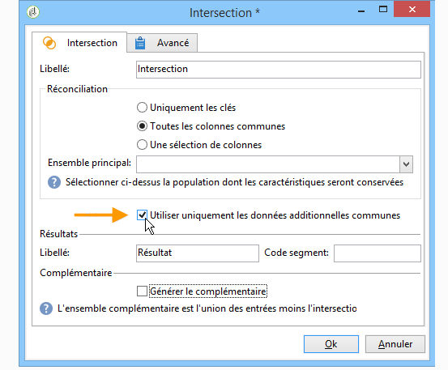

### Réconcilier avec les données additionnelles {#reconciliation-with-additional-data}

Lors des phases de réconciliation des données (dans les activités **[!UICONTROL Union]**, **[!UICONTROL Intersection]**, etc.), il est possible de sélectionner les colonnes à utiliser pour la réconciliation des données parmi les colonnes additionnelles. Pour cela, paramétrez une réconciliation sur une sélection de colonnes et indiquez l&#39;ensemble principal. Sélectionnez ensuite les colonnes dans la section inférieure de la fenêtre, comme dans l&#39;exemple ci-dessous :

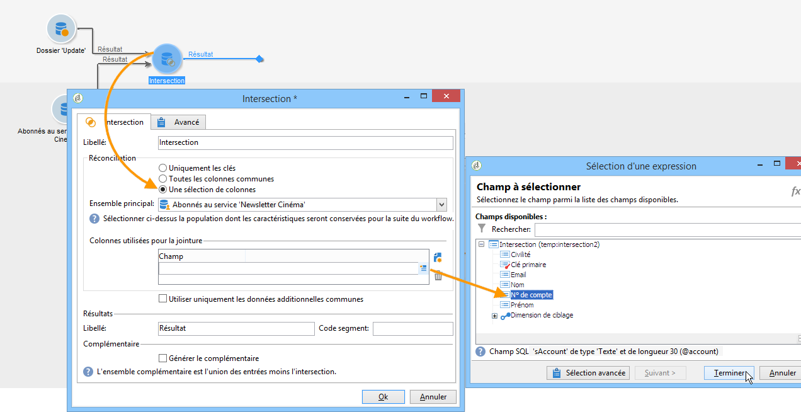

### Création de sous-ensembles {#creating-subsets}

L&#39;activité de **[!UICONTROL Partage]** permet de créer des sous-ensembles sur des critères définis au travers de requêtes d&#39;extraction. Pour chaque sous-ensemble, lorsque vous éditez une condition de filtrage sur la population, vous accédez à l&#39;activité de requête standard et pouvez ainsi définir les conditions de segmentation de la cible.

Vous pouvez partager une cible en plusieurs sous-ensembles en utilisant uniquement les données additionnelles comme critère de filtrage, ou en complément des données de la cible. Vous pouvez également utiliser des données externes, sous réserve que vous ayez acquis l&#39;option **Federated Data Access**.

Pour plus d’informations, voir la section [Création de sous-ensembles à l’aide de l’activité Partage](#creating-subsets-using-the-split-activity).

## Données de segment {#segmenting-data}

### Réunion de plusieurs cibles (Union) {#combining-several-targets--union-}

L&#39;activité d&#39;union permet de regrouper le résultat de plusieurs activités dans une même transition. Les ensembles ne doivent pas nécessairement être homogènes.

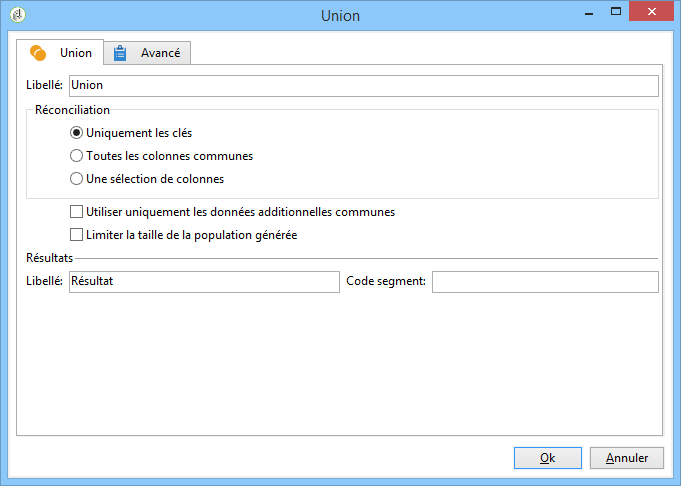

Les options de réconciliation des données sont les suivantes :

* **[!UICONTROL Uniquement les clés]**

   Cette option peut être utilisée si les populations en entrée sont homogènes.

* **[!UICONTROL Toutes les colonnes communes]**

   Cette option permet de réconcilier les données à partir de toutes les colonnes communes aux différentes populations de la cible.

   Adobe Campaign identifie les colonnes d&#39;après leur nom. Un niveau de tolérance minimal est accepté : par exemple, une colonne &#39;Email&#39; pourra être reconnue comme identique à une colonne &#39;@email&#39;.

* **[!UICONTROL Une sélection de colonnes]**

   Sélectionnez cette option pour définir la liste des colonnes sur lesquelles sera appliquée la réconciliation des données.

   Sélectionnez d&#39;abord l&#39;ensemble principal (celui qui contient les données sources), puis les colonnes à utiliser pour la jointure.

   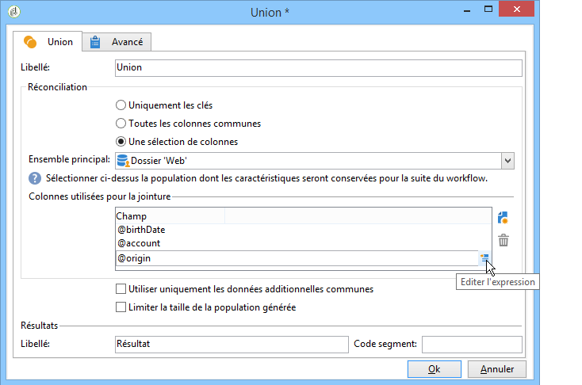

   >[!CAUTION]
   >
   >Lors de la réconciliation des données, les populations ne sont pas dédoublonnées.

   Vous pouvez limiter la taille de la population à un nombre donné d&#39;enregistrements. Pour cela, cochez l&#39;option correspondante et indiquez le nombre d&#39;enregistrements à conserver.

   Indiquez également l&#39;ordre de priorité des populations entrantes : la section inférieure de la fenêtre liste les transitions entrantes de l&#39;activité d&#39;union et vous permet de les ordonner en utilisant les flèches bleues situées à droite de la fenêtre.

   Les enregistrements conservés seront issus d&#39;abord de la population de première transition entrante de la liste, puis, si le nombre maximum n&#39;est pas atteint, ils seront issus de la population de la deuxième transition entrante, etc.

   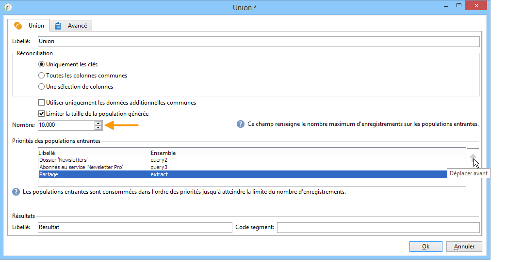

### Extraction des données communes (Intersection) {#extracting-joint-data--intersection-}

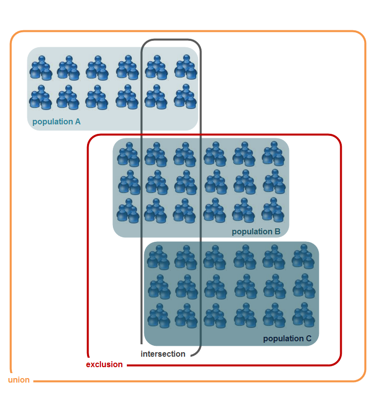

L&#39;intersection permet de ne récupérer que les éléments communs entre les populations des transitions entrantes. Cette activité dispose des mêmes paramètres de réconciliation que l&#39;activité d&#39;union.

Il est par ailleurs possible de ne conserver qu&#39;une sélection de colonnes ou seulement les colonnes communes entre les populations entrantes.

L’activité d’intersection est présentée dans la section [Intersection](intersection.md).

### Exclusion dʼune population (Exclusion) {#excluding-a-population--exclusion-}

L&#39;activité d&#39;exclusion permet d&#39;exclure d&#39;une population cible les éléments d&#39;une autre cible. La dimension de ciblage en sortie de cette activité sera celle de l&#39;ensemble principal.

Au besoin, il est possible de manipuler les tables en entrée. En effet, pour faire l&#39;exclusion d&#39;une cible d&#39;une autre dimension, il faut ramener cette cible dans la même dimension de ciblage que la cible principale. Pour cela, cliquez sur le bouton **[!UICONTROL Ajouter]** et indiquez les conditions de changement de dimension.

La réconciliation entre les données se fait au choix par identifiant, changement d&#39;axe ou jointure. Un exemple est disponible dans la section [Utiliser les données d’une liste : Lecture de Liste](../../platform/using/import-export-workflows.md#using-data-from-a-list--read-list).

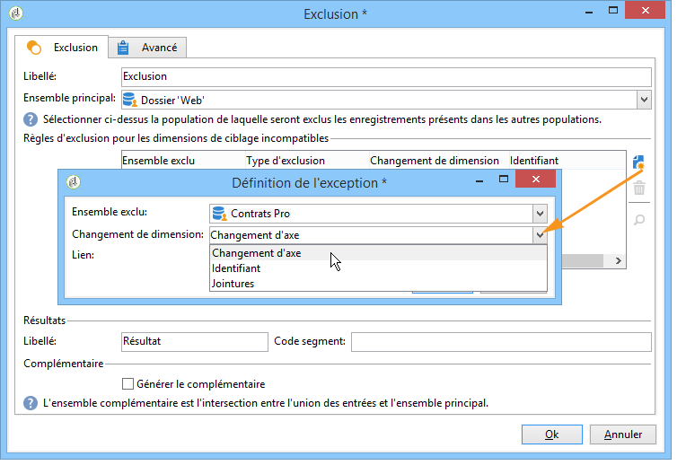

### Création de sous-ensembles à lʼaide de lʼactivité Partage {#creating-subsets-using-the-split-activity}

L&#39;activité **[!UICONTROL Partage]** est une activité standard qui permet de créer autant d&#39;ensembles que nécessaires à partir d&#39;une ou plusieurs dimensions de filtrage et de générer en sortie une transition par sous-ensemble ou une transition unique.

Les données additionnelles véhiculées par la transition entrante peuvent être utilisées dans les critères de filtrage.

Pour la configurer, vous devez d&#39;abord sélectionner des critères :

1. Dans votre workflow, placez une activité de type **[!UICONTROL Partage]**.
1. Dans l&#39;onglet **[!UICONTROL Général]**, sélectionnez l&#39;option souhaitée : **[!UICONTROL Utiliser les données de la cible et les données additionnelles]**, **[!UICONTROL Utiliser les données additionnelles uniquement]** ou **[!UICONTROL Utiliser des données externes]**.
1. Si l&#39;option **[!UICONTROL Utiliser les données de la cible et les données additionnelles]** est sélectionnée, la dimension de ciblage permet d&#39;utiliser toutes les données véhiculées par la transition entrante.

   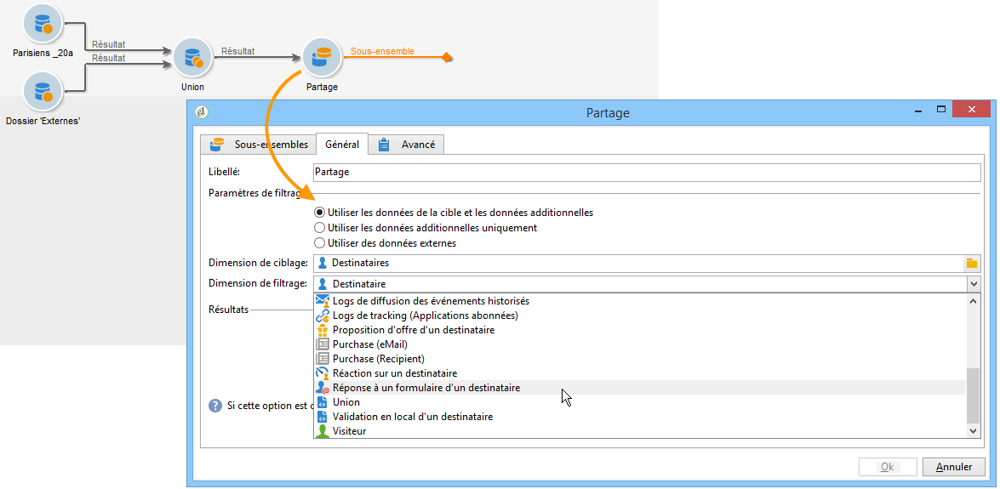

   Lors de la création des sous-ensembles, ce sont les paramètres de filtrage définis ci-avant qui sont utilisés.

   Pour définir les conditions de filtrage, sélectionnez l&#39;option **[!UICONTROL Ajouter une condition de filtrage sur la population entrante]** et cliquez sur le lien **[!UICONTROL Editer...]**. Indiquez ensuite les critères de filtrage pour la création de ce sous-ensemble.

   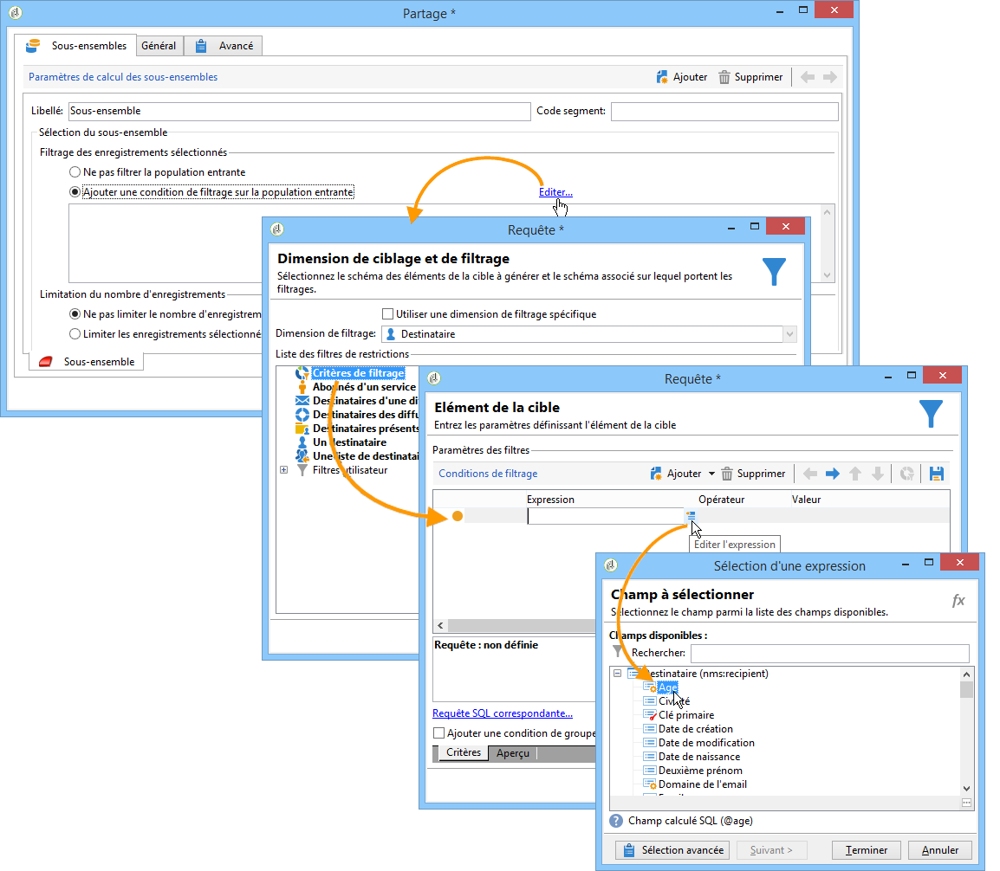

   Un exemple d&#39;utilisation des conditions de filtrage dans l&#39;activité **[!UICONTROL Partage]** pour segmenter la cible en différentes populations est présenté dans [cette section](cross-channel-delivery-workflow.md).

   Le champ **[!UICONTROL Libellé]** permet d&#39;associer un nom au sous-ensemble que vous venez de créer. Ce nom sera celui de la transition sortante correspondante.

   Vous pouvez également associer un code segment au sous-ensemble afin de l&#39;identifier et l&#39;utiliser pour cibler la population de ce sous-ensemble.

   Vous pouvez, au besoin, modifier les dimensions de ciblage et de filtrage individuellement pour chacun des sous-ensembles que vous souhaitez créer. Pour cela, éditez la condition de filtrage du sous-ensemble et cochez l&#39;option **[!UICONTROL Utiliser une dimension de filtrage spécifique]**.

   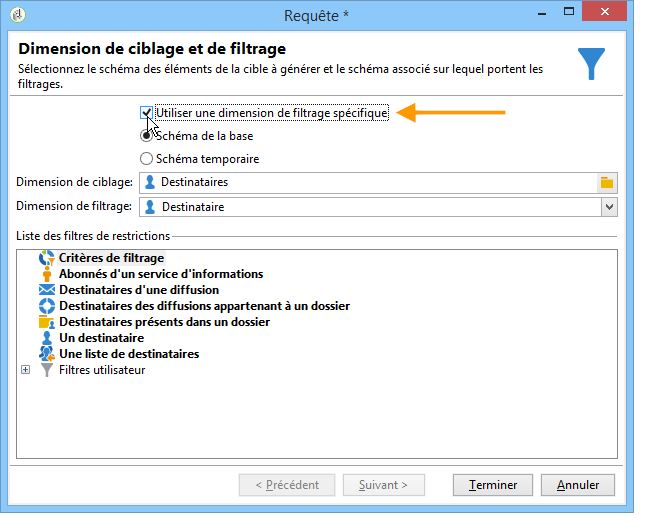

1. Si l&#39;option **[!UICONTROL Utiliser les données additionnelles uniquement]** est sélectionnée, seules les données additionnelles sont proposées pour réaliser le filtrage des sous-ensembles.

   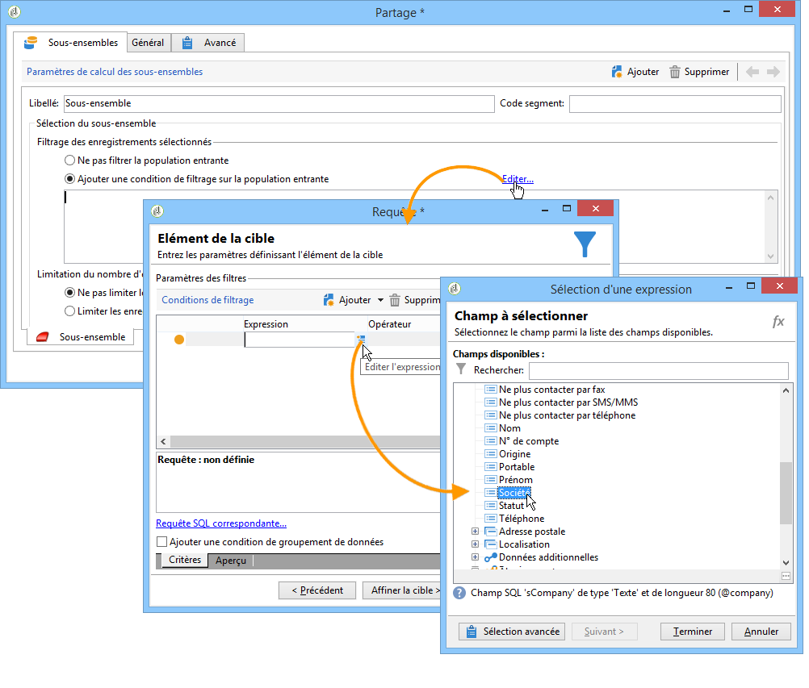

1. Si l&#39;option **Federated Data Access** est activée, l&#39;option **[!UICONTROL Utiliser des données externes]** permet d&#39;exploiter les données d&#39;une base externe déjà paramétrée ou de créer une connexion à une base de données.

   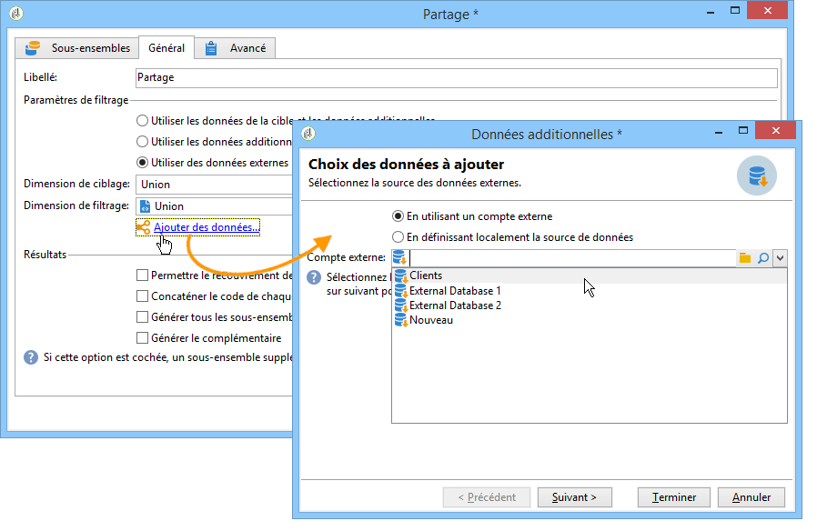

   Pour plus d&#39;informations à ce sujet, en fonction de la version de Campaign, reportez-vous aux sections suivantes :

   [  Documentation Campaign v7](../../installation/using/about-fda.md)

   [  Documentation Campaign v8](https://experienceleague.adobe.com/docs/campaign/campaign-v8/connect/fda.html?lang=fr)

Nous devons ensuite ajouter de nouveaux sous-ensembles :

1. Cliquez sur le bouton **[!UICONTROL Ajouter]** et définissez les critères de filtrage.

   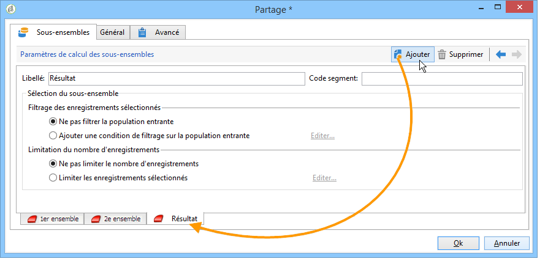

1. Définissez la dimension de filtrage dans l&#39;onglet **[!UICONTROL Général]** de l&#39;activité (voir ci-dessus). Elle est appliquée par défaut à tous les sous-ensembles.

   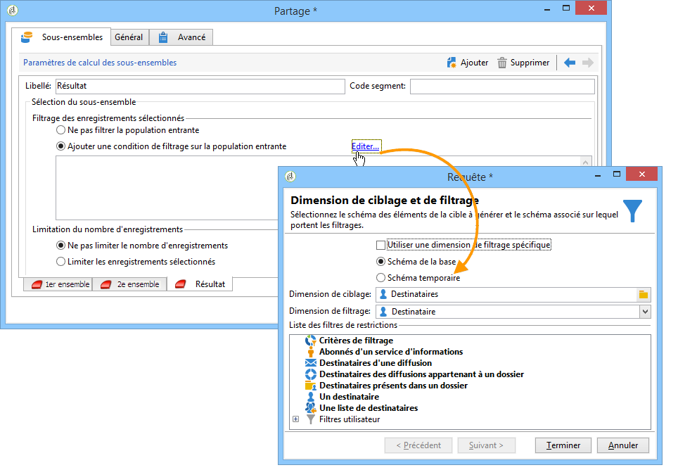

1. Au besoin, vous pouvez modifier la dimension de filtrage unitairement pour chaque sous-ensemble. Ainsi, vous pouvez, à partir de la même activité de partage, construire un ensemble avec tous les titulaires d&#39;un contrat Gold, un autre avec tous les destinataires ayant cliqué dans la dernière newsletter et un troisième regroupant les jeunes de 18 à 25 ans ayant effectué un achat en magasin dans les 30 derniers jours. Pour cela, sélectionnez l&#39;option **[!UICONTROL Utiliser une dimension de filtrage spécifique]** et sélectionnez le contexte de filtrage des données.

   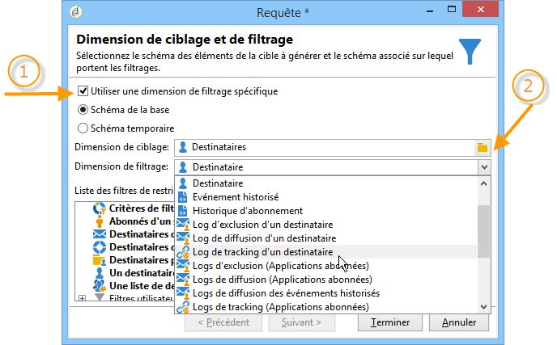

   >[!NOTE]
   >
   >Si vous avez acquis l’option **Federated Data Access**, vous pouvez créer des sous-ensembles selon les informations contenues dans une base externe. Pour cela, sélectionnez le schéma de la table externe visée dans le champ **[!UICONTROL Dimension de ciblage]**. Voir à ce sujet la section [Accéder à une base externe (FDA)](accessing-an-external-database--fda-.md).

Une fois les sous-ensembles créés, par défaut, l&#39;activité de partage propose en sortie autant de transitions que de sous-ensembles :

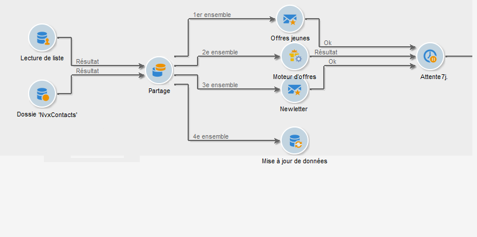

Vous pouvez regrouper tous les sous-ensembles dans une seule transition en sortie. L&#39;appartenance à tel ou tel sous-ensemble sera alors matérialisée par exemple par le code segment. Pour cela, sélectionnez l&#39;option **[!UICONTROL Générer tous les sous-ensembles dans la même table]**.

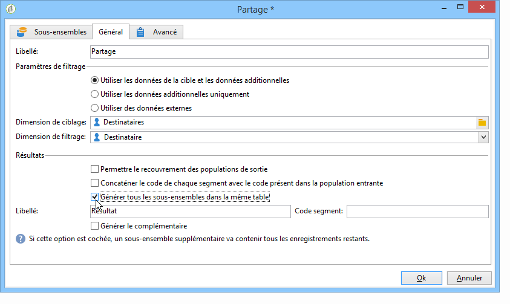

Vous pourrez par exemple positionner une seule activité de diffusion et personnaliser le contenu de cette diffusion en fonction du code segment de chacun des ensembles de destinataires :

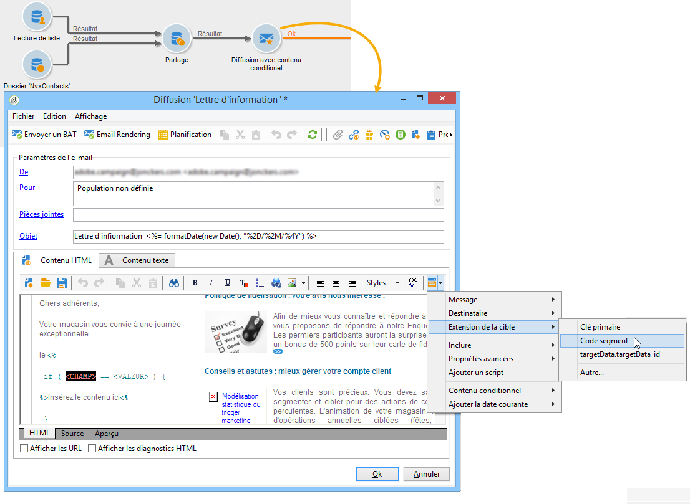

Vous pouvez également créer des sous-ensembles à l’aide de l’activité **[!UICONTROL Cellules]**. Pour plus d&#39;informations, consultez la section [Cellules](cells.md).

### Utilisation des données ciblées {#using-targeted-data}

Une fois les données identifiées et préparées, elles peuvent être utilisées dans les contextes suivants :

* Vous pouvez mettre à jour les données de la base suite à la manipulation des données dans les différentes étapes du workflow.

   Pour plus d&#39;informations, consultez la section [Mise à jour de données](update-data.md).

* Vous pouvez également actualiser le contenu de listes existantes.

   Pour plus d&#39;informations, consultez la section [Mise à jour de liste](list-update.md).

* Vous pouvez préparer ou démarrer des diffusions directement dans le workflow.

   Voir à ce propos les sections [Diffusion](delivery.md), [Agir sur une diffusion](delivery-control.md) et [Diffusion au fil de l’eau](continuous-delivery.md).

## Data Management {#data-management}

Dans Adobe Campaign, le Data Management regroupe un ensemble d&#39;activités qui permettent de répondre à des problématiques complexes de ciblage en proposant des outils plus efficaces et plus souples. Il est ainsi possible de mettre en place une gestion cohérente de toutes les communications vers un contact, en utilisant les informations liées à ses contrats, ses abonnements, sa réactivité aux diffusions, etc. Le Data Management permet de suivre le cycle de vie des données lors des opérations de segmentation, notamment :

* simplifier et optimiser les processus de ciblage, y compris en incluant des données qui n&#39;ont pas été modélisées dans le datamart (création de nouvelles tables : extension locale à chaque workflow de ciblage, en fonction de son paramétrage).
* conserver et véhiculer des calculs intermédiaires, notamment dans les phases de construction des cibles ou pour l&#39;administration des bases de données.
* accéder aux bases externes (optionnel) : prise en compte de bases de données hétérogènes dans le processus de ciblage.

Pour réaliser ces opérations, Adobe Campaign propose :

* Activités de collecte de données : [Transfert de fichier](file-transfer.md), [Chargement (fichier)](data-loading--file-.md), [Chargement (SGBD)](data-loading--rdbms-.md), [Mise à jour de données](update-data.md). Cette première étape de la collecte des données les prépare pour permettre leur traitement dans d’autres activités. Plusieurs paramètres doivent être surveillés afin de s’assurer que le workflow s’exécute correctement et donne les résultats attendus. Par exemple, lorsque vous importez des données, la clé primaire (Pkey) de ces données doit être unique pour chaque enregistrement.
* Les activités de ciblage enrichies avec des options de Data Management : [Requête](query.md), [Union](union.md), [Intersection](intersection.md), [Partage](split.md). Il est ainsi possible de paramétrer une union ou une intersection entre des données de plusieurs dimensions de ciblage différentes, sous réserve qu’une réconciliation des données soit possible.
* Activités de transformation des données : [Enrichissement](enrichment.md), [Changement de dimension](change-dimension.md).

>[!CAUTION]
>
>Dans les workflows, dans le cas où deux tables sont liées, la suppression d&#39;un élément de la table source n&#39;entraîne pas la suppression de ses données liées.
>  
>Par exemple, la suppression d&#39;un destinataire via un workflow n&#39;entraînera pas la suppression de ses historiques de diffusion. En revanche, la suppression d&#39;un destinataire directement dans le dossier &#39;Destinataires&#39; de l&#39;arborescence entraînera bien la suppression de toutes les données liées à ce dernier.

### Enrichissement et modification des données {#enriching-and-modifying-data}

En complément de la dimension de ciblage, la dimension de filtrage permet de préciser la nature des données collectées. Voir à ce sujet la section [Dimension de ciblage et dimension de filtrage](building-a-workflow.md#targeting-and-filtering-dimensions).

Les données identifiées et collectées peuvent être enrichies, regroupées et manipulées afin d&#39;optimiser la construction de la cible. Pour ce faire, en plus des activités de manipulation de données présentées dans la section [Segmenter des données](#segmenting-data), utilisez les méthodes suivantes :

* L’activité **[!UICONTROL Enrichissement]** permet d’ajouter momentanément des colonnes à un schéma et d’ajouter des informations à certains éléments. Elle est présentée dans la section [Enrichissement](enrichment.md) du référentiel des activités.
* L’activité **[!UICONTROL Edition du schéma]** permet de modifier la structure d’un schéma. Elle est présentée dans la section [Edition du schéma](edit-schema.md) du référentiel des activités.
* L’activité **[!UICONTROL Changement de dimension]** permet de modifier la dimension de ciblage pendant le cycle de construction de la cible. Elle est présentée dans la section [Changement de dimension](change-dimension.md).
