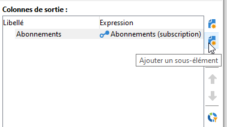

# Cibler les données{#targeting-data}

## Créer une requête {#creating-queries}

### Sélectionner les données {#selecting-data}

Une **[!UICONTROL Query]** activité vous permet de sélectionner des données de base pour créer la population cible. For more on this, refer to [Creating a query](../../workflow/using/query.md#creating-a-query).

You can also use the following activities to query and refine data from the database: [Incremental query](../../workflow/using/incremental-query.md), [Read list](../../workflow/using/read-list.md).

Il est possible de collecter des données supplémentaires à transférer et à traiter tout au long du cycle de vie du processus. Pour plus d’informations, reportez-vous aux sections [Ajout de données](../../workflow/using/query.md#adding-data) et [Modification de données](#editing-additional-data)supplémentaires.

### Editer les données additionnelles {#editing-additional-data}

Une fois que des données additionnelles ont été ajoutées, vous pouvez les éditer ou les utiliser pour affiner la cible définie dans l&#39;activité de requête.

The **[!UICONTROL Edit additional data...]** link lets you view the added data and modify it or add to it.

Pour ajouter des données aux colonnes de sortie définies précédemment, sélectionnez-les dans la liste des champs disponibles. Pour créer une colonne de sortie, cliquez sur l’ **[!UICONTROL Add]** icône, puis sélectionnez le champ et cliquez sur **[!UICONTROL Edit expression]**.

Indiquez le mode de calcul du champ à ajouter, par exemple un agrégat.

Cette **[!UICONTROL Add a sub-item]** option vous permet d’associer des données calculées à la collection. Cela vous permet de sélectionner les données supplémentaires de la collection ou de définir des calculs agrégés sur les éléments de collection.

Les sous-éléments seront représentés en sous-arborescence de la collection à laquelle ils sont associés.

Les collections s’affichent dans le **[!UICONTROL Collections]** sous-onglet. Vous pouvez filtrer les éléments collectés en cliquant sur l’ **[!UICONTROL Detail]** icône de la collection sélectionnée. L’assistant de filtrage vous permet de sélectionner les données collectées et de spécifier les conditions de filtrage à appliquer aux données de la collection.

### Affiner la cible en utilisant les données additionnelles {#refining-the-target-using-additional-data}

Les données supplémentaires collectées peuvent vous permettre d’affiner le filtrage des données dans la base de données. Pour ce faire, cliquez sur le **[!UICONTROL Refine the target using additional data...]** lien suivant : vous pouvez ainsi surfiltrer les données ajoutées.

### Homogénéiser les données {#homogenizing-data}

Dans **[!UICONTROL Union]** ou **[!UICONTROL Intersection]** saisissez des activités, vous pouvez choisir de ne conserver que des données supplémentaires partagées afin de conserver la cohérence des données. Dans ce cas, la table de travail de sortie temporaire de cette activité contiendra uniquement les données supplémentaires trouvées dans tous les jeux entrants.

### Réconcilier avec les données additionnelles {#reconciliation-with-additional-data}

Pendant les phases de rapprochement des données (**[!UICONTROL Union]**, **[!UICONTROL Intersection]**, etc.) activités), vous pouvez sélectionner les colonnes à utiliser pour le rapprochement des données à partir des colonnes supplémentaires. Pour ce faire, configurez un rapprochement sur une sélection de colonnes et spécifiez le jeu principal. Sélectionnez ensuite les colonnes de la colonne inférieure de la fenêtre, comme illustré dans l’exemple suivant :

### Créer des sous-ensembles {#creating-subsets}

L’ **[!UICONTROL Split]** activité vous permet de créer des sous-ensembles sur des critères définis au moyen de requêtes d’extraction. Pour chaque sous-ensemble, lorsque vous modifiez une condition de filtre sur la population, vous accédez alors à l’activité de requête standard qui vous permet de définir les conditions de segmentation cible.

Vous pouvez partager une cible en plusieurs sous-ensembles en utilisant uniquement les données additionnelles comme critère de filtrage, ou en complément des données de la cible. Vous pouvez également utiliser des données externes, sous réserve que vous ayez acquis l&#39;option **Federated Data Access**.

Pour plus d’informations, voir [Création de sous-ensembles à l’aide de l’activité](#creating-subsets-using-the-split-activity)Scinder.

## Segmenter des données {#segmenting-data}

### Réunir plusieurs cibles (Union) {#combining-several-targets--union-}

L&#39;activité d&#39;union permet de regrouper le résultat de plusieurs activités dans une même transition. Les ensembles ne doivent pas nécessairement être homogènes.

Les options de réconciliation des données sont les suivantes :

* **[!UICONTROL Keys only]**

   Cette option peut être utilisée si les populations en entrée sont homogènes.

* **[!UICONTROL All columns in common]**

   Cette option permet de réconcilier les données à partir de toutes les colonnes communes aux différentes populations de la cible.

   Adobe Campaign identifie les colonnes d&#39;après leur nom. Un niveau de tolérance minimal est accepté : par exemple, une colonne &#39;Email&#39; pourra être reconnue comme identique à une colonne &#39;@email&#39;.

* **[!UICONTROL A selection of columns]**

   Sélectionnez cette option pour définir la liste des colonnes sur lesquelles sera appliquée la réconciliation des données.

   Sélectionnez d&#39;abord l&#39;ensemble principal (celui qui contient les données sources), puis les colonnes à utiliser pour la jointure.

   

   >[!CAUTION]
   >
   >Lors de la réconciliation des données, les populations ne sont pas dédoublonnées.

   Vous pouvez limiter la taille de la population à un nombre donné d&#39;enregistrements. Pour cela, cochez l&#39;option correspondante et indiquez le nombre d&#39;enregistrements à conserver.

   Indiquez également l&#39;ordre de priorité des populations entrantes : la section inférieure de la fenêtre liste les transitions entrantes de l&#39;activité d&#39;union et vous permet de les ordonner en utilisant les flèches bleues situées à droite de la fenêtre.

   Les enregistrements conservés seront issus d&#39;abord de la population de première transition entrante de la liste, puis, si le nombre maximum n&#39;est pas atteint, ils seront issus de la population de la deuxième transition entrante, etc.

   

### Extraire les données communes (Intersection) {#extracting-joint-data--intersection-}

L&#39;intersection permet de ne récupérer que les éléments communs entre les populations des transitions entrantes. Cette activité dispose des mêmes paramètres de réconciliation que l&#39;activité d&#39;union.

Il est par ailleurs possible de ne conserver qu&#39;une sélection de colonnes ou seulement les colonnes communes entre les populations entrantes.

The intersection activity is detailed in the [Intersection](../../workflow/using/intersection.md) section.

### Exclure une population (Exclusion) {#excluding-a-population--exclusion-}

L&#39;activité d&#39;exclusion permet d&#39;exclure d&#39;une population cible les éléments d&#39;une autre cible. La dimension de ciblage en sortie de cette activité sera celle de l&#39;ensemble principal.

Si nécessaire, il est possible de manipuler les tables entrantes. En effet, pour exclure une cible d’une autre dimension, cette cible doit être renvoyée à la même dimension de ciblage que la cible principale. Pour ce faire, cliquez sur le **[!UICONTROL Add]** bouton et spécifiez les conditions de changement de dimension.

La réconciliation entre les données se fait au choix par identifiant, changement d&#39;axe ou jointure. Un exemple est disponible dans [Utilisation de données d’une liste : Liste](../../workflow/using/importing-data.md#using-data-from-a-list--read-list)de lecture.

### Création de sous-ensembles à l&#39;aide de l&#39;activité Partage {#creating-subsets-using-the-split-activity}

The **[!UICONTROL Split]** activity is a standard activity which lets you create as many sets as necessary via one or several filtering dimensions, as well as generating either one output transition per subset or a unique transition.

Les données additionnelles véhiculées par la transition entrante peuvent être utilisées dans les critères de filtrage.

Pour la configurer, vous devez d&#39;abord sélectionner des critères :

1. In your workflow, drag and drop a **[!UICONTROL Split]** activity.
1. Dans l’ **[!UICONTROL General]** onglet, sélectionnez une option : **[!UICONTROL Use data from the target and additional data]**, **[!UICONTROL Use the additional data only]** ou **[!UICONTROL Use external data]**.
1. Si l’ **[!UICONTROL Use data from the target and additional data]** option est sélectionnée, la dimension de ciblage vous permet d’utiliser toutes les données transmises par la transition entrante.

   

   Lors de la création des sous-ensembles, ce sont les paramètres de filtrage définis ci-avant qui sont utilisés.

   Pour définir les conditions de filtrage, sélectionnez l’ **[!UICONTROL Add a filtering condition on the inbound population]** option et cliquez sur le **[!UICONTROL Edit...]** lien. Spécifiez ensuite les conditions de filtrage pour créer ce sous-ensemble.

   

   An example showing how to use filtering conditions in the **[!UICONTROL Split]** activity to segment the target into different populations is described in [this section](../../workflow/using/cross-channel-delivery-workflow.md).

   The **[!UICONTROL Label]** field lets you give the newly created subset a name, which will match the outbound transition.

   Vous pouvez également associer un code segment au sous-ensemble afin de l&#39;identifier et l&#39;utiliser pour cibler la population de ce sous-ensemble.

   Si nécessaire, vous pouvez modifier les dimensions de ciblage et de filtrage individuellement pour chaque sous-ensemble que vous souhaitez créer. Pour ce faire, modifiez la condition de filtrage du sous-ensemble et cochez l’ **[!UICONTROL Use a specific filtering dimension]** option.

   

1. Si l’ **[!UICONTROL Use the additional data only]** option est sélectionnée, seules des données supplémentaires sont proposées pour le filtrage des sous-ensembles.

   

1. If the **Federated Data Access** option is enabled, the **[!UICONTROL Use external data]** lets you process data in an external database which is already configured, or create a new connection to a database.

   

   Voir à ce propos cette [section](../../platform/using/accessing-an-external-database.md).

Nous devons ensuite ajouter de nouveaux sous-ensembles :

1. Click the **[!UICONTROL Add]** button and define the filtering conditions.

   

1. Define the filtering dimension in the **[!UICONTROL General]** tab of the activity (see above).It applies to all subsets by default.

   

1. Si nécessaire, vous pouvez modifier individuellement la dimension de filtrage de chaque sous-ensemble. Vous pouvez ainsi créer un ensemble pour tous les détenteurs de cartes Gold, un pour tous les destinataires qui ont cliqué sur la dernière newsletter et un troisième pour les personnes âgées de 18 à 25 ans qui ont effectué un achat en magasin au cours des 30 derniers jours, utilisant tous la même activité fractionnée. Pour ce faire, sélectionnez l’ **[!UICONTROL Use a specific filtering dimension]** option et sélectionnez le contexte de filtrage des données.

   

   >[!NOTE]
   >
   >Si vous avez acquis l’option Accès **aux données** fédérées, vous pouvez créer des sous-ensembles basés sur les informations d’une base externe. Pour ce faire, sélectionnez le schéma de la table externe dans le **[!UICONTROL Targeting dimension]** champ. For more on this, refer to [Accessing an external database (FDA)](../../workflow/using/accessing-an-external-database--fda-.md).

Une fois les sous-ensembles créés, par défaut, l&#39;activité de partage propose en sortie autant de transitions que de sous-ensembles :

Vous pouvez regrouper tous ces sous-ensembles en une seule transition de sortie. Dans ce cas, le lien vers les sous-ensembles respectifs sera visible dans le code de segment, par exemple. To do this, select the **[!UICONTROL Generate all subsets in the same table]** option.

Vous pourrez par exemple positionner une seule activité de diffusion et personnaliser le contenu de cette diffusion en fonction du code segment de chacun des ensembles de destinataires :

Vous pouvez également créer des sous-ensembles à l’aide de l’ **[!UICONTROL Cells]** activité. For more on this, refer to the [Cells](../../workflow/using/cells.md) section.

### Utiliser les données ciblées {#using-targeted-data}

Une fois les données identifiées et préparées, elles peuvent être utilisées dans les contextes suivants :

* Vous pouvez mettre à jour les données de la base suite à la manipulation des données dans les différentes étapes du workflow.

   Pour en savoir plus, [mettez à jour les données](../../workflow/using/update-data.md).

* Vous pouvez également actualiser le contenu de listes existantes.

   For more on this, refer to [List update](../../workflow/using/list-update.md).

* Vous pouvez préparer ou démarrer des diffusions directement dans le workflow.

   Pour plus d&#39;informations sur ce sujet, reportez-vous à [Livraison](../../workflow/using/delivery.md), contrôle [de](../../workflow/using/delivery-control.md) la livraison et livraison continue.

## Data Management {#data-management}

Dans Adobe Campaign, le Data Management regroupe un ensemble d&#39;activités qui permettent de répondre à des problématiques complexes de ciblage en proposant des outils plus efficaces et plus souples. Il est ainsi possible de mettre en place une gestion cohérente de toutes les communications vers un contact, en utilisant les informations liées à ses contrats, ses abonnements, sa réactivité aux diffusions, etc. Le Data Management permet de suivre le cycle de vie des données lors des opérations de segmentation, notamment :

* simplifier et optimiser les processus de ciblage, y compris en incluant des données qui n&#39;ont pas été modélisées dans le datamart (création de nouvelles tables : extension locale à chaque workflow de ciblage, en fonction de son paramétrage).
* conserver et véhiculer des calculs intermédiaires, notamment dans les phases de construction des cibles ou pour l&#39;administration des bases de données.
* accéder aux bases externes (optionnel) : prise en compte de bases de données hétérogènes dans le processus de ciblage.

Pour réaliser ces opérations, Adobe Campaign propose :

* Activités de collecte de données : Transfert [de](../../workflow/using/file-transfer.md)fichiers, chargement de [données (fichier)](../../workflow/using/data-loading--file-.md), chargement de [données (SGBDR)](../../workflow/using/data-loading--rdbms-.md), [Mettre à jour les données. ](../../workflow/using/update-data.md) Cette première étape de la collecte des données prépare les données pour permettre leur traitement dans d’autres activités. Plusieurs paramètres doivent être surveillés afin de s’assurer que le flux de travail s’exécute correctement et donne les résultats attendus. Par exemple, lorsque vous importez des données, la clé primaire (clé primaire) de ces données doit être unique pour chaque enregistrement.
* Targeting activities having been enriched with Data Management options: [Query](../../workflow/using/query.md), [Union](../../workflow/using/union.md), [Intersection](../../workflow/using/intersection.md), [Split](../../workflow/using/split.md). This lets you configure a union or an intersection between data from several different targeting dimensions, as long as data reconciliation is possible.
* Activités de transformation des données : [Enrichissement](../../workflow/using/enrichment.md), [Modifier la dimension](../../workflow/using/change-dimension.md).

>[!CAUTION]
>
>Dans les workflows, dans le cas où deux tables sont liées, la suppression d&#39;un élément de la table source n&#39;entraîne pas la suppression de ses données liées.
>  
>Par exemple, la suppression d&#39;un destinataire via un workflow n&#39;entraînera pas la suppression de ses historiques de diffusion. En revanche, la suppression d&#39;un destinataire directement dans le dossier &#39;Destinataires&#39; de l&#39;arborescence entraînera bien la suppression de toutes les données liées à ce dernier.

### Enrichir/Modifier des données {#enriching-and-modifying-data}

Outre la dimension de ciblage, la dimension de filtrage vous permet de spécifier la nature des données collectées. Reportez-vous à la section [Ciblage et filtrage des dimensions](../../workflow/using/building-a-workflow.md#targeting-and-filtering-dimensions).

Les données identifiées et collectées peuvent être enrichies, regroupées et manipulées afin d&#39;optimiser la construction de la cible. Pour ce faire, en plus des activités de manipulation de données détaillées dans la section [Segmentation des données](#segmenting-data) , utilisez les méthodes suivantes :

* L’ **[!UICONTROL Enrichment]** activité vous permet d’ajouter momentanément des colonnes à un schéma, ainsi que des informations à certains éléments. Il est détaillé dans la section [Enrichissement](../../workflow/using/enrichment.md) du référentiel des activités.
* L’ **[!UICONTROL Edit schema]** activité vous permet de modifier la structure d’un schéma. Il est détaillé dans la section [Modifier le schéma](../../workflow/using/edit-schema.md) du référentiel des activités.
* L’ **[!UICONTROL Change dimension]** activité vous permet de modifier la dimension de ciblage pendant le cycle de construction cible. Elle est détaillée dans la section [Modifier la dimension](../../workflow/using/change-dimension.md) .

