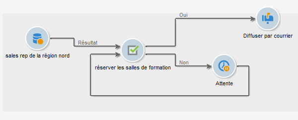
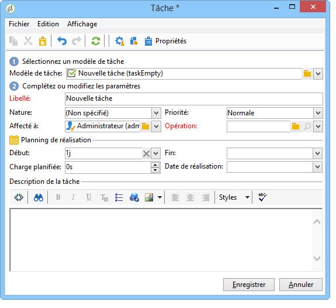

# Tâche{#task}

>[!AVAILABILITY]
>
>`:warning:` Cette fonctionnalité est disponible uniquement dans Campaign Classic v7. [Apprenez-en davantage](../../mrm/using/creating-and-managing-tasks.md)

Dans un workflow de campagne, l&#39;activité **[!UICONTROL Tâche]** permet de définir deux scénarios : un premier si la tâche est complétée et un second si la tâche n&#39;est pas complétée (si elle est manuellement indiquée comme non complétée ou si elle expire).

La configuration et le fonctionnement d’une tâche sont présentés dans la [documentation de Campaign Classic v7](../../mrm/using/creating-and-managing-tasks.md).

L&#39;option **[!UICONTROL Ressources]** permet de définir plusieurs opérateurs ainsi qu&#39;un planning de validation de la tâche. Le rejet par le validant n&#39;entraîne pas le rejet de la tâche elle-même.
