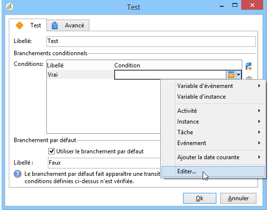

# Test{#test}

A **Test** type activity activates the first transition that satisfies the condition associated with it. If no condition is satisfied and if the **[!UICONTROL Use the default fork]** option is activated, the default transition will be activated.

A condition is a JavaScript expression that must be evaluated to &#39;true&#39; or &#39;false&#39;. To enter the expression, click the icon to the right of the name of the condition, and then select **[!UICONTROL Edit...]**.

Pour plus d’informations sur toutes les autres fonctions JavaScript et méthodes SOAP du serveur applicatif accessibles via workflow, consultez la [documentation JSAPI](http://docs.campaign.adobe.com/doc/AC/en/jsapi/p-1.html).

Vous pouvez insérer directement des variables également depuis cet éditeur.

Les conditions peuvent être ajoutées, supprimées, ordonnées depuis la fenêtre d&#39;édition des propriétés de l&#39;activité, mais aussi modifiées depuis la transition.

Si le résultat d&#39;un calcul doit être réutilisé par différentes conditions, il est possible de le calculer dans le script d&#39;initialisation de l&#39;activité. Le résultat doit être stocké dans une variable de la tâche pour être accessible par les scripts de conditions (task.vars.xxx).
