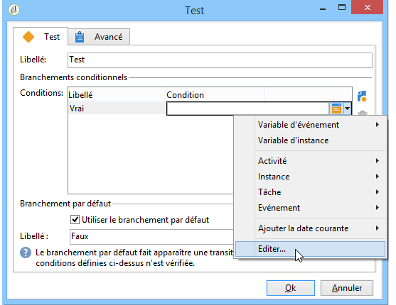

# Test{#test}

Une activité de type **Test** active la première transition satisfaisant la condition qui lui est associée. Si aucune condition n’est remplie et si l’option **[!UICONTROL Utiliser le branchement par défaut]** est activée, la transition par défaut est activée.

Une condition est une expression JavaScript qui doit être déterminée par « true » ou « false ». Pour saisir l’expression, cliquez sur l’icône située à droite du nom de la condition, puis sélectionnez **[!UICONTROL Modifier...]**.

Pour plus d’informations sur toutes les autres fonctions JavaScript et méthodes SOAP du serveur applicatif accessibles via workflow, consultez la [documentation JSAPI](https://experienceleague.adobe.com/developer/campaign-api/api/index.html?lang=fr).

Vous pouvez insérer directement des variables également depuis cet éditeur. Pour plus d’informations sur l’utilisation des variables, consultez [cette section](javascript-scripts-and-templates.md#variables).

Les conditions peuvent être ajoutées, supprimées, ordonnées depuis la fenêtre d&#39;édition des propriétés de l&#39;activité, mais aussi modifiées depuis la transition.

Si le résultat d&#39;un calcul doit être réutilisé par des conditions différentes, il est possible de le calculer dans le script d&#39;initialisation de l&#39;activité. Le résultat doit être stocké dans une variable de la tâche pour être accessible par les scripts de condition (task.vars.xxx).

