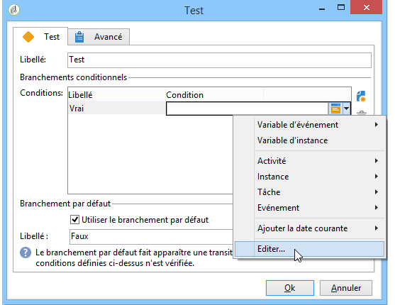

<?xml version="1.0" encoding="UTF-8"?>
<xliff xmlns="urn:oasis:names:tc:xliff:document:1.2" xmlns:okp="okapi-framework:xliff-extensions" xmlns:its="http://www.w3.org/2005/11/its" xmlns:itsxlf="http://www.w3.org/ns/its-xliff/" version="1.2" its:version="2.0">
<file original="help/workflow/using/test.md.mdsc" source-language="en-US" target-language="en-XX" datatype="x-text/markdown">
<body>
<trans-unit id="tu8" xml:space="preserve">
<source xml:lang="en-US">https://experienceleague.adobe.com/en/tools/campaign-api</source>
<target xml:lang="en-XX">https://experienceleague.adobe.com/fr/tools/campaign-api</target>
</trans-unit>
<trans-unit id="tu1" restype="x-YAML_METADATA_HEADER_VALUE" xml:space="preserve">
<source xml:lang="en-US">Test</source>
<target xml:lang="en-XX">Test</target>
</trans-unit>
<trans-unit id="tu2" restype="x-YAML_METADATA_HEADER_VALUE" xml:space="preserve">
<source xml:lang="en-US">Learn more about the Test workflow activity</source>
<target xml:lang="en-XX">En savoir plus sur l’activité de workflow de test</target>
</trans-unit>
<trans-unit id="tu3" xml:space="preserve">
<source xml:lang="en-US">Test</source>
<target xml:lang="en-XX">Test</target>
</trans-unit>
<trans-unit id="tu4" xml:space="preserve">
<source xml:lang="en-US">A <ph id="1" ctype="x-STRONG_EMPHASIS">**</ph>Test<ph id="2" ctype="x-STRONG_EMPHASIS">**</ph> type activity activates the first transition that satisfies the condition associated with it. If no condition is satisfied and if the <ph id="3" ctype="x-STRONG_EMPHASIS">**[!UICONTROL </ph>Use the default fork<ph id="5" ctype="x-LINK_REF">]**</ph> option is activated, the default transition will be activated.</source>
<target xml:lang="en-XX">Une activité de type <ph id="1" ctype="x-STRONG_EMPHASIS">**</ph>Test<ph id="2" ctype="x-STRONG_EMPHASIS">**</ph> active la première transition qui satisfait la condition qui lui est associée. Si aucune condition n’est satisfaite et que l’option <ph id="3" ctype="x-STRONG_EMPHASIS">**[!UICONTROL </ph>Utiliser le branchement par défaut<ph id="5" ctype="x-LINK_REF">]**</ph> est activée, la transition par défaut sera activée.</target>
</trans-unit>
<trans-unit id="tu5" xml:space="preserve">
<source xml:lang="en-US">A condition is a JavaScript expression that must be evaluated to 'true' or 'false'. To enter the expression, click the icon to the right of the name of the condition, and then select <ph id="1" ctype="x-STRONG_EMPHASIS">**[!UICONTROL </ph>Edit...<ph id="3" ctype="x-LINK_REF">]**</ph>.</source>
<target xml:lang="en-XX">Une condition est une expression JavaScript qui doit être déterminée par « true » ou « false ». Pour saisir l’expression, cliquez sur l’icône située à droite du nom de la condition, puis sélectionnez <ph id="1" ctype="x-STRONG_EMPHASIS">**[!UICONTROL </ph>Modifier...<ph id="3" ctype="x-LINK_REF">]**</ph>.</target>
</trans-unit>
<trans-unit id="tu6" xml:space="preserve">
<source xml:lang="en-US"><ph id="1" ctype="x-IMAGE"></ph></source>
<target xml:lang="en-XX"><ph id="1" ctype="x-IMAGE"></ph></target>
</trans-unit>
<trans-unit id="tu7" xml:space="preserve">
<source xml:lang="en-US">For more information on all the additional JavaScript functions and SOAP methods of the applicative server accessible via workflow JavaScript, refer to <ph id="1" ctype="x-LINK">[</ph>JSAPI documentation<ph id="2" ctype="x-LINK">[#$tu8]</ph>.</source>
<target xml:lang="en-XX">Pour plus d’informations sur toutes les autres fonctions JavaScript et méthodes SOAP du serveur applicatif accessibles via workflow, consultez la <ph id="1" ctype="x-LINK">[</ph>documentation JSAPI<ph id="2" ctype="x-LINK">[#$tu8]</ph>.</target>
</trans-unit>
<trans-unit id="tu9" xml:space="preserve">
<source xml:lang="en-US">You can also insert variables directly from this editor. For more  information on how to work with variables, refer to <ph id="1" ctype="x-LINK">[</ph>this section<ph id="2" ctype="x-LINK">](javascript-scripts-and-templates.md#variables)</ph>.</source>
<target xml:lang="en-XX">Vous pouvez insérer directement des variables également depuis cet éditeur. Pour plus d’informations sur l’utilisation des variables, consultez <ph id="1" ctype="x-LINK">[</ph>cette section<ph id="2" ctype="x-LINK">](javascript-scripts-and-templates.md#variables)</ph>.</target>
</trans-unit>
<trans-unit id="tu10" xml:space="preserve">
<source xml:lang="en-US">Conditions can be added, deleted, or ordered from the activity property edit window, but can also be modified from the transition.</source>
<target xml:lang="en-XX">Les conditions peuvent être ajoutées, supprimées, ordonnées depuis la fenêtre d'édition des propriétés de l'activité, mais aussi modifiées depuis la transition.</target>
</trans-unit>
<trans-unit id="tu11" xml:space="preserve">
<source xml:lang="en-US">If the result of a calculation is to be reused by different conditions, it is possible to calculate it in the initialization script of the activity. The result must be stored in a variable of the task to be accessed by the condition scripts (task.vars.xxx).</source>
<target xml:lang="en-XX">Si le résultat d’un calcul doit être réutilisé par différentes conditions, il est possible de le calculer dans le script d’initialisation de l’activité. Le résultat doit être stocké dans une variable de la tâche pour être accessible par les scripts de conditions (task.vars.xxx).</target>
</trans-unit>
</body>
</file>
</xliff>