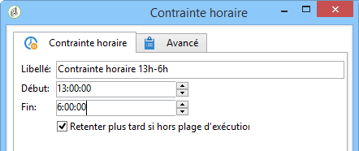

# Contrainte horaire{#time-constraint}

Une activité **Contrainte horaire** permet de reporter l’exécution d’une tâche ou de l’abandonner.

Saisissez le libellé de l&#39;activité et indiquez la plage horaire pendant laquelle la tâche du workflow doit être suspendue.

Lorsque l&#39;option **[!UICONTROL Retenter plus tard si hors plage d&#39;exécution]** est sélectionnée, elle permet de relancer la tâche en dehors de la plage d&#39;exécution. Si vous souhaitez que l&#39;action du workflow soit définitivement abandonnée après sa suspension, désélectionnez cette option.

