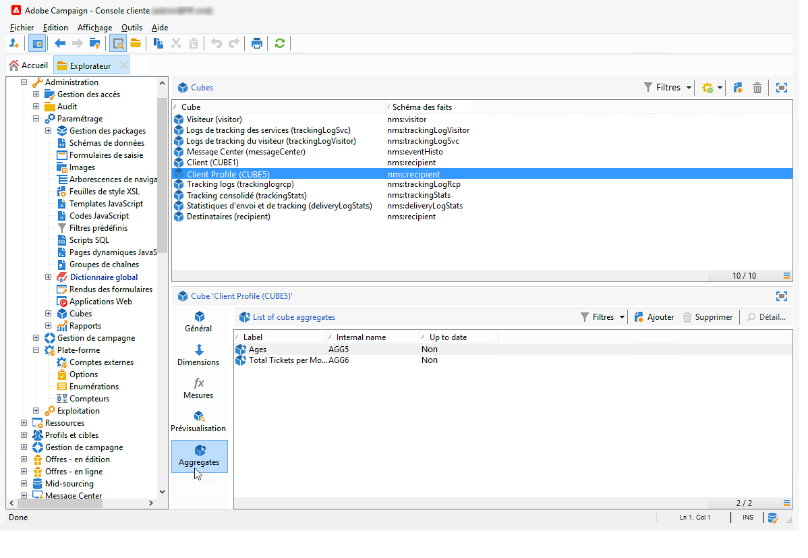
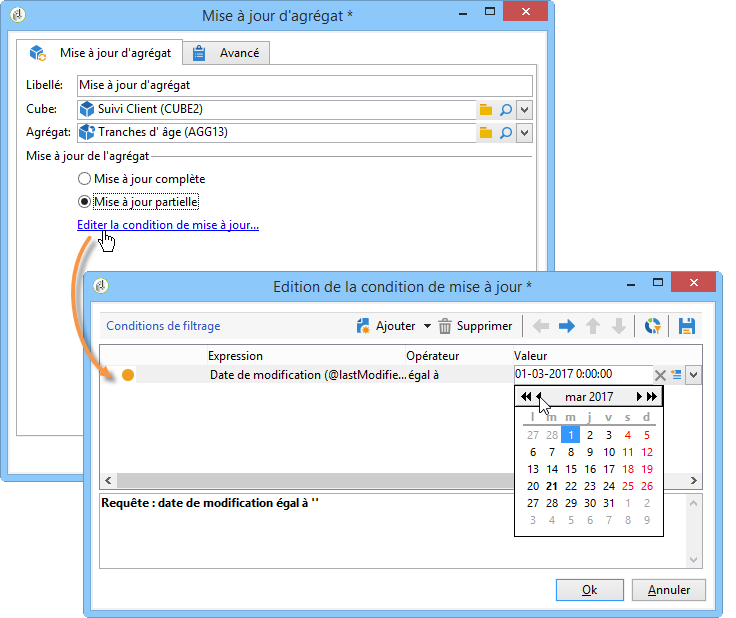
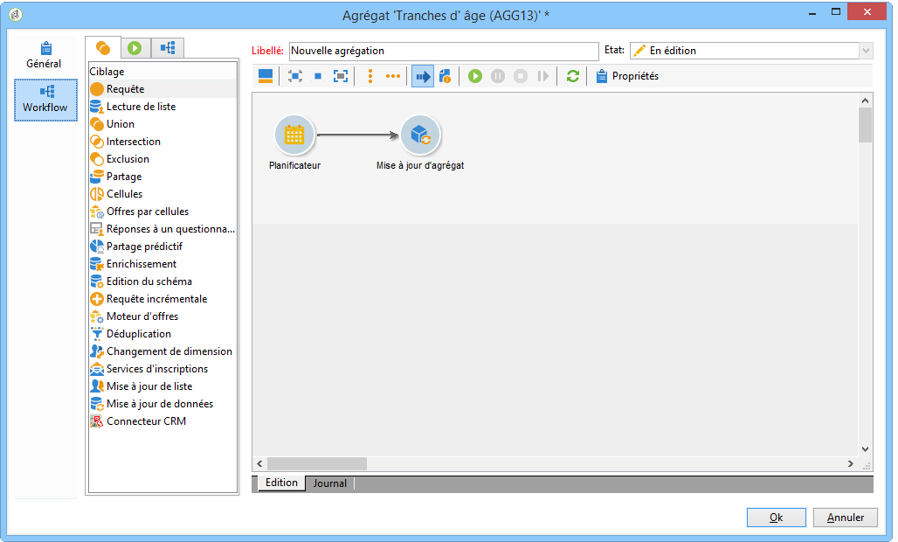

# Mettre à jour l’agrégat{#update-aggregate}

Les agrégats sont définis au niveau d&#39;un cube, à des fins de reporting. Un onglet **[!UICONTROL Workflow]** est disponible lors du paramétrage d&#39;un agrégat.

Les agrégats sont pertinents lorsque vous manipulez un gros volume de données. Ils sont mis à jour automatiquement selon les paramètres définis dans la boîte de workflow dédiée, afin d&#39;intégrer les dernières données collectées dans les indicateurs.

Les agrégats sont définis au niveau du cube, dans l&#39;onglet correspondant.

L&#39;activité **[!UICONTROL Mise à jour d&#39;agrégat]** permet de choisir le mode de mise à jour à appliquer : complète ou partielle.

Par défaut, une mise à jour complète est réalisée à chaque calcul. Pour permettre une mise à jour partielle des données, sélectionnez l&#39;option correspondante puis définissez les conditions de mise à jour.

**Bonne pratique** : une activité **[!UICONTROL Planificateur]** peut être utilisée pour définir la fréquence de mise à jour des calculs.

