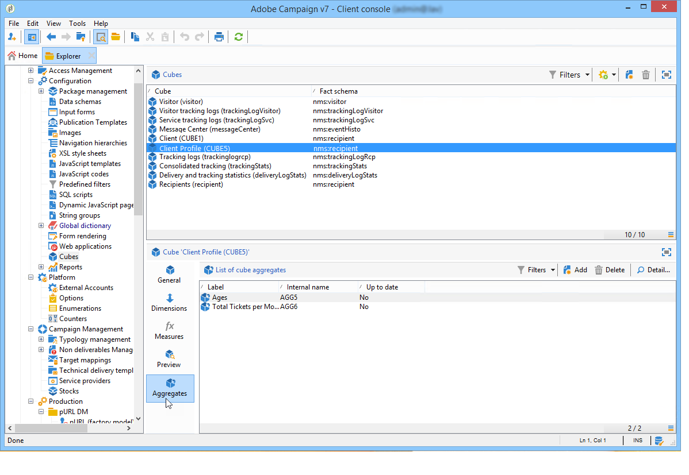
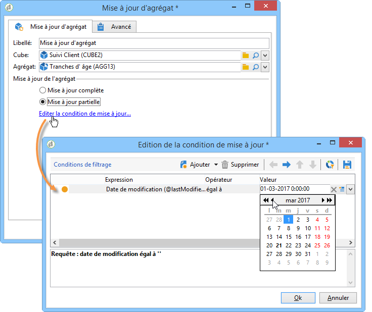
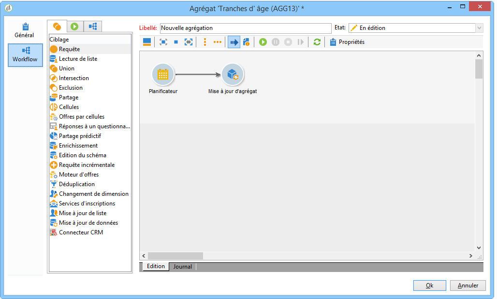

# Mettre à jour l’agrégat{#update-aggregate}

Les agrégats sont définis au niveau d&#39;un cube, à des fins de reporting. Un onglet **[!UICONTROL Workflow]** est disponible lors de la configuration d’un agrégat.

Les agrégats sont utiles pour manipuler de grands volumes de données. Elles sont mises à jour automatiquement en fonction des paramètres définis dans la zone de workflow dédiée, afin d’intégrer les données collectées le plus récemment dans les indicateurs

Les agrégats sont définis au niveau du cube, dans l&#39;onglet correspondant.

L&#39;activité **[!UICONTROL Mise à jour d&#39;agrégat]** permet de choisir le mode de mise à jour à appliquer : complète ou partielle.

Par défaut, une mise à jour complète est effectuée lors de chaque calcul. Pour activer une mise à jour partielle, sélectionnez l&#39;option correspondante et définissez les conditions de mise à jour.

**Bonne pratique** : une activité **[!UICONTROL Planificateur]** peut être utilisée pour définir la fréquence de mise à jour des calculs.

