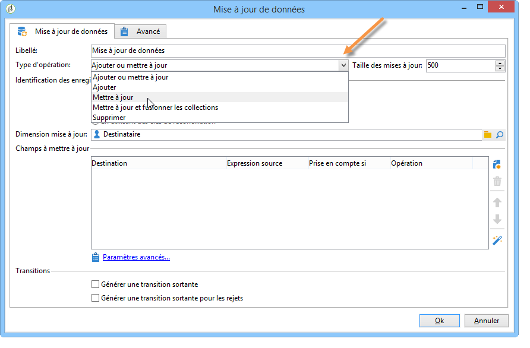
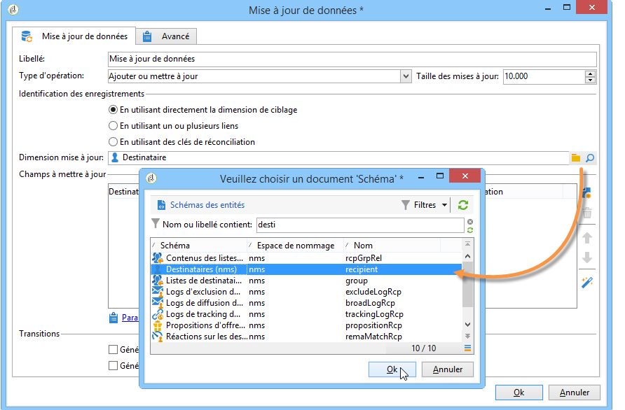
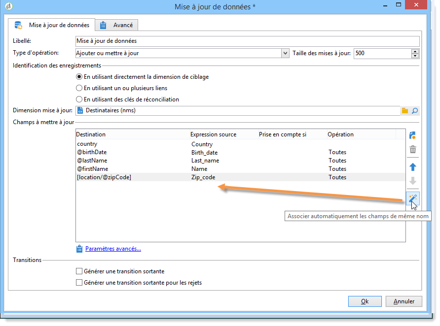
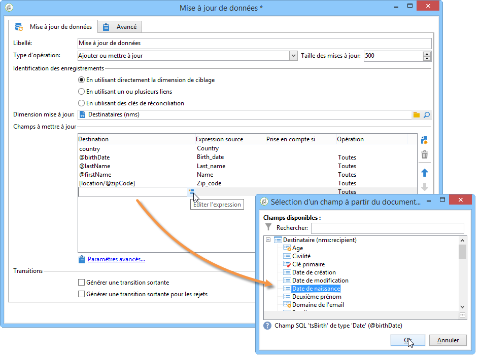
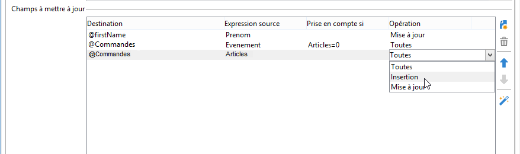
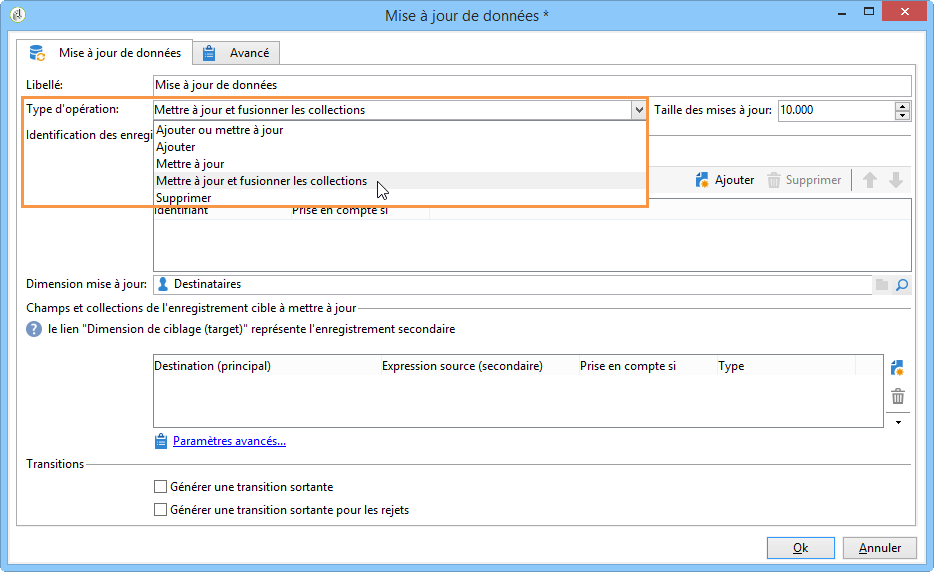
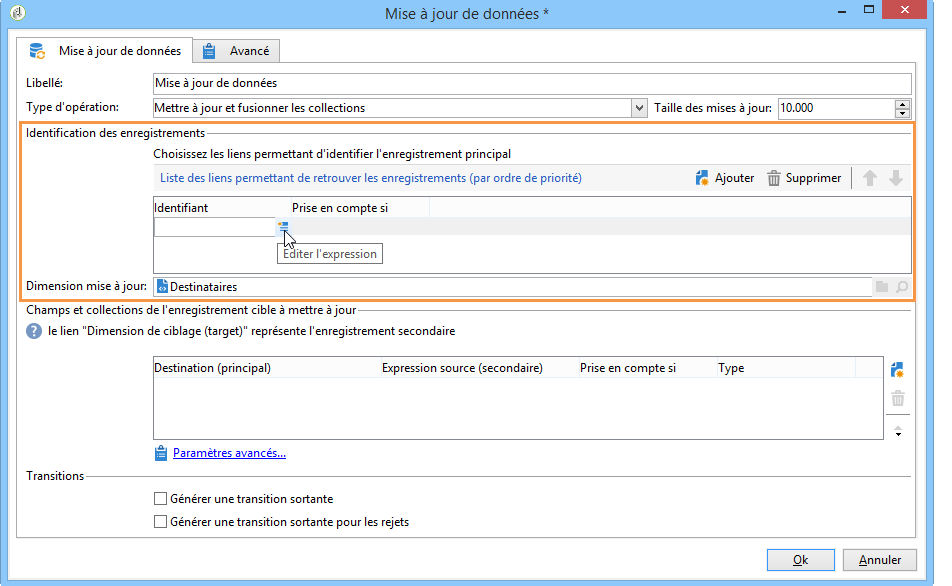
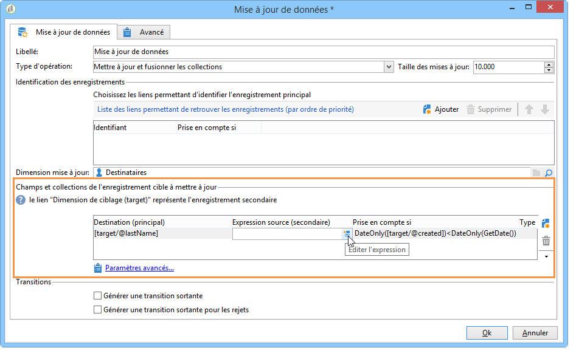

# Mise à jour de données{#update-data}

Une activité de type **Mise à jour de données** permet de mettre à jour en masse les champs de la base de données.

## Type d&#39;opération {#operation-type}

The **[!UICONTROL Operation type]** field lets you choose the process to be carried out on the data in the database:

* **[!UICONTROL Insert or update]**: ajoutez des données ou mettez-les à jour si elles ont déjà été ajoutées.
* **[!UICONTROL Insert]**: ajoutez uniquement des données.
* **[!UICONTROL Update]**: uniquement mettre à jour les données.
* **[!UICONTROL Update and merge collections]**: mettez à jour les données et choisissez un enregistrement &quot;maître&quot;, puis liez les éléments liés aux doublons dans cet enregistrement maître. Les doublons peuvent alors être supprimés sans créer d’éléments orphelins attachés.
* **[!UICONTROL Delete]**: supprimer des données.

Le **[!UICONTROL Batch size]** champ vous permet de sélectionner le nombre d’éléments de transition entrants à mettre à jour. Par exemple, si vous indiquez 500, les 500 premiers enregistrements traités seront mis à jour.

## Identification des enregistrements {#record-identification}

Indiquez comment identifier les enregistrements dans la base de données :

* Si les entrées de données se rapportent à une dimension de ciblage existante, sélectionnez l’ **[!UICONTROL By directly using the targeting dimension]** option et sélectionnez-la dans le **[!UICONTROL Updated dimension]** champ.

   You can display the fields for the selected dimension using the **[!UICONTROL Edit this link]** magnifying glass button.

* Dans le cas contraire, indiquez un ou plusieurs liens qui permettront d&#39;identifier les données dans la base ou utilisez directement des clés de réconciliation.

## Sélection des champs à mettre à jour {#selecting-the-fields-to-be-updated}

Utilisez cette **[!UICONTROL Automatically associate fields with the same name]** option pour qu’Adobe Campaign identifie automatiquement les champs à mettre à jour.

You can also use the **[!UICONTROL Insert]** icon to manually select the database fields to be updated.

Sélectionnez tous les champs à mettre à jour et, si nécessaire, ajoutez des conditions en fonction de la mise à jour à effectuer. Pour ce faire, utilisez la **[!UICONTROL Taken into account if]** colonne. Les conditions sont appliquées l’une après l’autre et conformément à l’ordre dans la liste. Utilisez les flèches à droite pour modifier l’ordre des mises à jour.

Vous pouvez utiliser plusieurs fois le même champ de destination.

Dans une **[!UICONTROL Insert or update]** opération, vous pouvez sélectionner la campagne à appliquer, individuellement ou pour chaque champ. Pour ce faire, sélectionnez une valeur dans la **[!UICONTROL Operation]** colonne.

The **[!UICONTROL modifiedDate]**, **[!UICONTROL modifiedBy]**, **[!UICONTROL createdDate]** and **[!UICONTROL createdBy]** fields are updated automatically during data updates, unless their management mode is configured specifically in the field update table.

La mise à jour des enregistrements n&#39;est réalisée que pour les enregistrements pour lesquels au moins une différence a été détectée. Si les valeurs sont les mêmes, aucune mise à jour n&#39;est effectuée.

The **[!UICONTROL Advanced parameters]** link lets you specify additional options to deal with updating data as well as managing duplicates. Vous pouvez également :

* **[!UICONTROL Disable automatic key management]**.
* **[!UICONTROL Disable audit]**.
* **[!UICONTROL Empty the destination value if the source value is empty (NULL)]**. Cette option est automatiquement cochée par défaut.
* **[!UICONTROL Update all columns with matching names]**.
* Specify conditions that consider source elements using an expression in the **[!UICONTROL Enabled if]** field.
* Spécifiez des conditions qui prennent en compte les doublons à l’aide d’une expression. Si vous cochez l’ **[!UICONTROL Ignore records which concern the same target]** option, seul le premier de la liste des expressions sera pris en compte.

**[!UICONTROL Generate an outbound transition]**

Crée une transition sortante qui sera activée à la fin de l&#39;exécution. Généralement, la mise à jour marque la fin d&#39;un workflow de ciblage et l&#39;option n&#39;est donc pas activée par défaut.

**[!UICONTROL Generate an outbound transition for the rejects]**

Crée une transition sortante contenant les enregistrements n&#39;ayant pas pu être traités correctement lors de la mise à jour (par exemple en cas de doublon). Généralement, la mise à jour marque la fin d&#39;un workflow de ciblage et l&#39;option n&#39;est donc pas activée par défaut.

## Mise à jour et fusion des collections {#updating-and-merging-collections}

La mise à jour des données et la fusion des collections permet de mettre à jour les données contenues dans un enregistrement à l&#39;aide de données provenant d&#39;un ou plusieurs enregistrements secondaires, afin de n&#39;en conserver qu&#39;un seul si vous le souhaitez. Ces mises à jour sont gérées par un ensemble de règles.

>[!NOTE]
>
>Cette option permet également de traiter les références aux enregistrements secondaires des tables de travail des workflows (targetWorkflow), des diffusions (targetDelivery) et des listes (targetList). Le cas échéant, ces liens apparaissent dans la liste de sélection des champs et collections.

1. Sélectionnez l’ **[!UICONTROL Update and merge collections]** opération.

   

1. Indiquez par ordre de priorité les liens permettant d&#39;identifier l&#39;enregistrement principal. Les liens disponibles varient en fonction de la transition entrante.

   

1. Indiquez les collections à déplacer vers l&#39;enregistrement primaire et les champs à mettre à jour.

   Renseignez également les règles s&#39;appliquant à ces derniers lorsqu&#39;un ou plusieurs enregistrements secondaires sont identifiés. Pour cela, vous pouvez vous aider de l&#39;outil de construction d&#39;expressions. Voir à ce propos cette [section](../../platform/using/defining-filter-conditions.md#building-expressions). Par exemple, en indiquant que c&#39;est la valeur mise à jour le plus récemment parmi les différents enregistrements qui doit être conservée.

   Indiquez ensuite les conditions de prise en compte de la règle.

   Indiquez enfin le type de mise à jour à effectuer. Vous pouvez par exemple choisir de supprimer les enregistrements secondaires après la mise à jour des données.

   Vous pouvez par exemple paramétrer la fusion de collections contenant des données hétérogènes telles que la liste des abonnements d&#39;un destinataire. Grâce aux règles, vous pouvez ainsi créer de nouveaux historiques d&#39;abonnements à partir des abonnements des enregistrements secondaires, ou encore déplacer la liste des abonnements d&#39;un enregistrement secondaire vers l&#39;enregistrement primaire.

1. Specify the order in which you would like the secondary records to be processed, by selecting **[!UICONTROL Advanced parameters]** > **[!UICONTROL Duplicates]**.

   

Les données des enregistrements secondaires sont associées à l&#39;enregistrement principal si les règles définies sont applicables. En fonction du type de mise à jour sélectionné, les enregistrements secondaires peuvent être supprimés.

## Exemple : mise à jour de données suite à un enrichissement {#example--update-data-following-an-enrichment}

L&#39; [étape 2 : L&#39;écriture de données enrichies dans la section de tableau](../../workflow/using/creating-a-summary-list.md#step-2--writing-enriched-data-to-the--purchases--table) Achats du cas d&#39;utilisation qui détaille la création d&#39;une liste de récapitulation offre un exemple de mise à jour de données après une activité d&#39;enrichissement.

## Paramètres d&#39;entrée {#input-parameters}

* tableName
* schema

Chacun des événements entrants doit spécifier une cible définie par ces paramètres.
