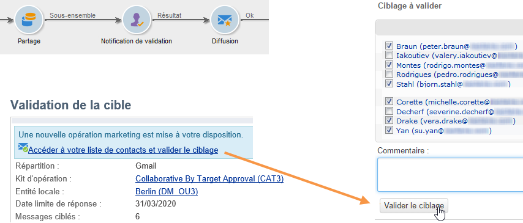
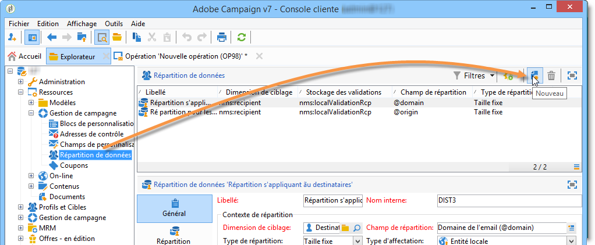
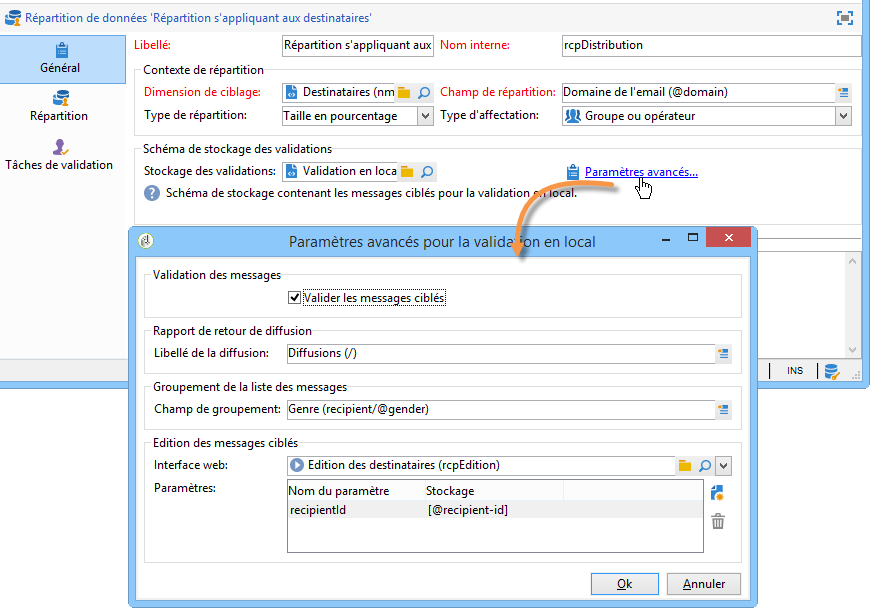
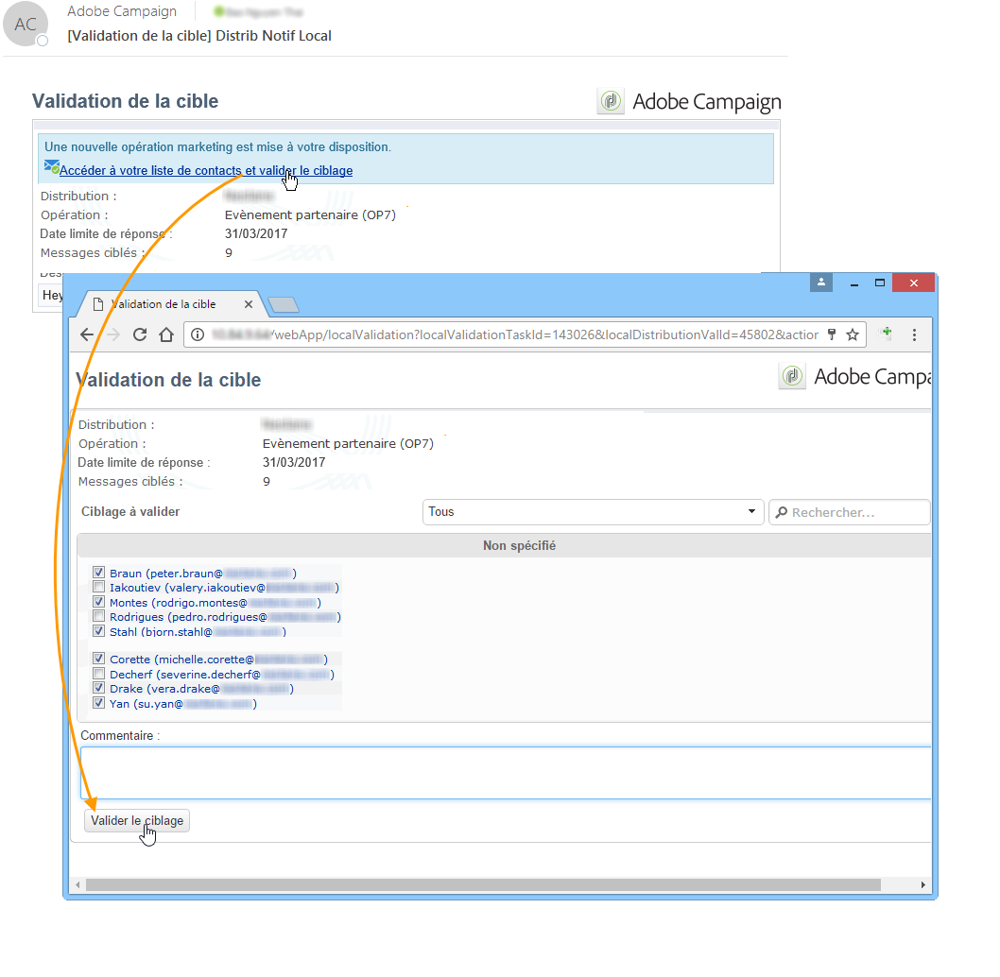
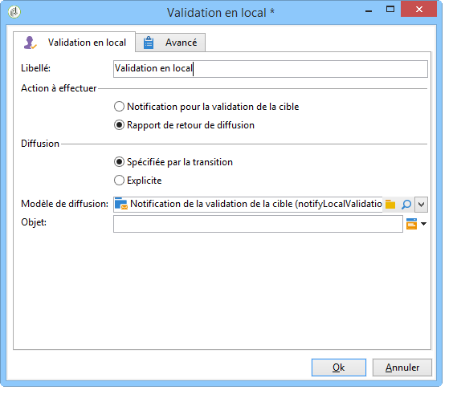
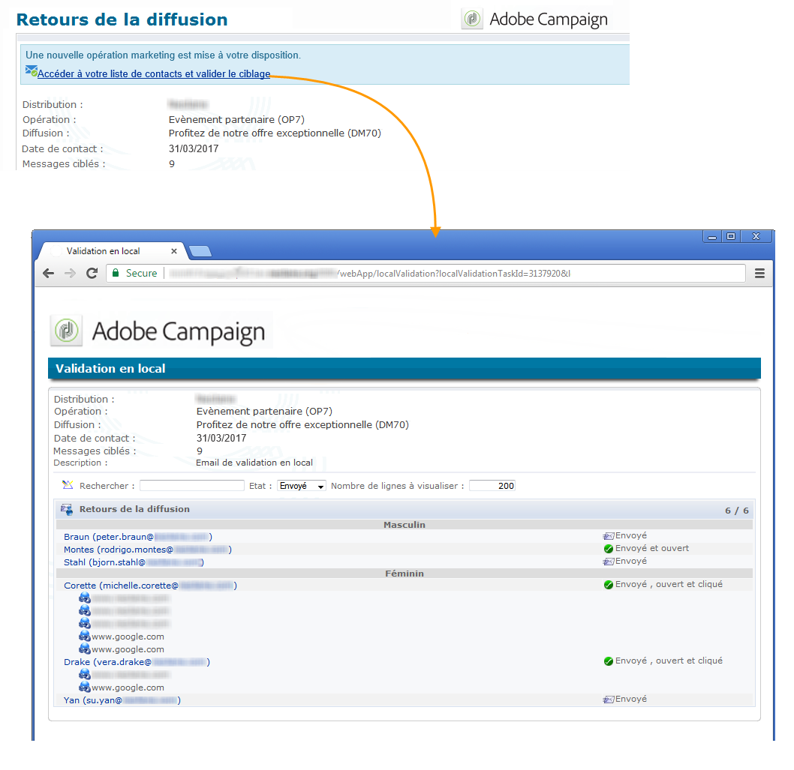
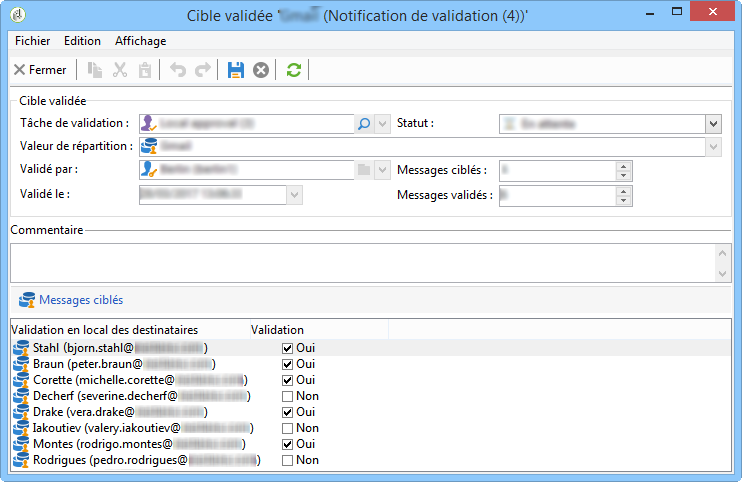

# Utiliser l&#39;activité Validation en local{#using-the-local-approval-activity}

The **[!UICONTROL Local approval]** activity integrated into a targeting workflow lets you set up a recipient approval process before the delivery is sent.

>[!CAUTION]
>
>Pour utiliser cette fonction, vous devez acquérir le module Distributed Marketing, qui est une option de Campaign. Vérifiez votre contrat de licence.

Pour réaliser ce cas d&#39;utilisation, nous avons créé le workflow de ciblage suivant :

Les étapes principales du processus de validation en local sont les suivantes :

1. The population resulting from targeting can be limited thanks to a **[!UICONTROL Split]** type activity using a data distribution model.

   

1. L’ **[!UICONTROL Local approval]** activité prend ensuite le relais et envoie un courrier électronique de notification à chaque superviseur local. L’activité est suspendue jusqu’à ce que chaque superviseur local approuve les destinataires qui leur sont affectés.

   

1. Une fois la date limite d’approbation atteinte, le processus recommence. Dans cet exemple, l’ **[!UICONTROL Delivery]** activité démarre et la diffusion est envoyée aux cibles approuvées.

   >[!NOTE]
   >
   >Une fois le délai d&#39;attente passé, les destinataires qui n&#39;ont pas été validés ne sont pas pris en compte dans le ciblage.

   

1. A few days later, the second **[!UICONTROL Local approval]** type activity sends a notification email to each local supervisor with a summary of the actions carried out by their contacts (clicks, opens, etc.).

   

## Etape 1 : création du modèle de répartition de données {#step-1--creating-the-data-distribution-template-}

Le modèle de distribution de données vous permet de limiter la population résultant du ciblage en fonction du regroupement de données tout en vous permettant d’affecter chaque valeur à un superviseur local. Dans cet exemple, nous avons défini le **[!UICONTROL Email address domain]** champ comme un champ de distribution et attribué un domaine à chaque superviseur local

Pour plus d’informations sur la création d’un modèle de distribution de données, voir [Limitation du nombre d’enregistrements de sous-ensembles par distribution](../../workflow/using/split.md#limiting-the-number-of-subset-records-per-data-distribution)de données.

1. Pour créer le modèle de distribution des données, accédez au **[!UICONTROL Resources > Campaign management > Data distribution]** noeud et cliquez sur **[!UICONTROL New]**.

   

1. Sélectionnez l’ **[!UICONTROL General]** onglet.

   

1. Entrez le **[!UICONTROL Label]** et le **[!UICONTROL Distribution context]**. Dans cet exemple, nous avons sélectionné le schéma de **[!UICONTROL Recipient]** ciblage et le **[!UICONTROL Email domain]** champ comme champ de distribution. La liste des destinataires est ventilée par domaine.
1. Dans le **[!UICONTROL Distribution type]** champ, sélectionnez le mode d’expression de la valeur de limite cible dans l’ **[!UICONTROL Distribution]** onglet. Ici, nous avons choisi **[!UICONTROL Percentage]**.
1. Dans le **[!UICONTROL Approval storage]** champ, saisissez le schéma de stockage des approbations correspondant au schéma de ciblage utilisé. Nous allons utiliser ici le schéma de stockage par défaut : **[!UICONTROL Local approval of recipients]**.
1. Cliquez ensuite sur le **[!UICONTROL Advanced parameters]** lien.

   

1. Keep the **[!UICONTROL Approve the targeted messages]** option checked so that all recipients are pre-selected from the list of recipients to approve.
1. Dans le **[!UICONTROL Delivery label]** champ, nous avons laissé l’expression par défaut (chaîne de calcul de la diffusion). Le libellé standard de la livraison sera utilisé dans la notification de retour.
1. In the **[!UICONTROL Grouping field]** section, we have selected the **[!UICONTROL Gender]** field as a grouping field for displaying recipients in the approval and feedback notifications.
1. Dans la **[!UICONTROL Edit targeted messages]** section, nous avons sélectionné l&#39; **[!UICONTROL Edit recipients]** application Web et le **[!UICONTROL recipientId]** paramètre. Dans les notifications d’approbation et de commentaires, les destinataires peuvent cliquer et pointer vers l’URL de l’application Web. Le paramètre d’URL supplémentaire sera **[!UICONTROL recipientId]**.
1. Cliquez ensuite sur l’ **[!UICONTROL Distribution]** onglet. Pour chaque domaine, saisissez les champs suivants :

   

   * **[!UICONTROL Value]**: saisissez la valeur du nom de domaine.
   * **[!UICONTROL Percentage / Fixed]**: pour chaque domaine, saisissez le nombre maximal. nombre de destinataires auxquels vous souhaitez envoyer la remise. Dans cet exemple, nous voulons limiter la diffusion à 10 % par domaine.
   * **[!UICONTROL Label]**: saisissez le libellé du domaine à afficher dans les notifications d’approbation et de commentaires.
   * **[!UICONTROL Group or operator]**: sélectionnez l’opérateur ou le groupe d’opérateurs affectés au domaine.

      >[!CAUTION]
      >
      >Vérifiez que les opérateurs disposent des droits adéquats.

## Etape 2 : création du workflow de ciblage {#step-2--creating-the-targeting-workflow}

Pour réaliser ce cas d&#39;utilisation, nous avons créé le workflow de ciblage suivant :

Les activités suivantes ont été ajoutées :

* Deux **[!UICONTROL Query]** activités :
* One **[!UICONTROL Intersection]** activity,
* One **[!UICONTROL Split]** activity,
* One **[!UICONTROL Local approval]** activity,
* One **[!UICONTROL Delivery]** activity,
* One **[!UICONTROL Wait]** activity,
* Une deuxième **[!UICONTROL Local approval]** activité,
* One **[!UICONTROL End]** activity.

### Requêtes, Intersection et Partage {#queries--intersection-and-split}

Le ciblage en amont se compose de deux requêtes, une intersection et une division. The population resulting from targeting can be limited using a **[!UICONTROL Split]** activity using a data distribution template.

Pour plus d’informations sur la configuration d’une activité fractionnée, voir [Fractionner](../../workflow/using/split.md). La création d’un modèle de distribution de données est détaillée dans [Limitation du nombre d’enregistrements de sous-ensembles par distribution](../../workflow/using/split.md#limiting-the-number-of-subset-records-per-data-distribution)de données.

Si vous ne souhaitez pas limiter la population de la requête, vous n’avez pas à utiliser les activités **[!UICONTROL Query]**, **[!UICONTROL Intersection]** et **[!UICONTROL Split]** . Dans ce cas, complétez le modèle de distribution de données dans la première **[!UICONTROL Local approval]** activité.

1. Dans la **[!UICONTROL Record count limitation]** section, sélectionnez l’ **[!UICONTROL Limit the selected records]** option et cliquez sur le **[!UICONTROL Edit]** lien.

   

1. Sélectionnez l’ **[!UICONTROL Keep only the first records after sorting]** option et cliquez sur **[!UICONTROL Next]**.

   

1. Dans la **[!UICONTROL Sort columns]** section, ajoutez le champ auquel le tri est appliqué. Ici, nous avons choisi le **[!UICONTROL Email]** champ. Clics **[!UICONTROL Next]**.

   

1. Sélectionnez l’ **[!UICONTROL By data distribution]** option, sélectionnez le modèle de distribution créé précédemment (voir [Étape 1 : Création du modèle](#step-1--creating-the-data-distribution-template-)de distribution des données) et cliquez sur **[!UICONTROL Finish]**.

   

Dans le modèle de répartition, nous avons choisi de limiter la population à 10% par valeur de groupement, ce qui correspond bien aux valeurs affichés dans le workflow (340 en entrée et 34 en sortie).

### Notification de validation {#approval-notification}

The **[!UICONTROL Local approval]** activity lets you send a notification to each local supervisor.

Pour plus d’informations sur la configuration de l’ **[!UICONTROL Local approval]** activité, voir Approbation locale.

Les champs à renseigner sont les suivants :

1. Dans la **[!UICONTROL Action to execute]** section, sélectionnez l’ **[!UICONTROL Target approval notification]** option.
1. Dans la **[!UICONTROL Distribution context]** section, sélectionnez l’ **[!UICONTROL Specified in the transition]** option.

   If you don&#39;t want to limit the targeted population, select the **[!UICONTROL Explicit]** option here and enter the distribution template created previously in the **[!UICONTROL Data distribution]** field.

1. Dans la section **[!UICONTROL Notification]**, sélectionnez le modèle de diffusion ainsi que l&#39;objet qui seront utilisés pour l&#39;email de notification. Ici, nous avons choisi le modèle par défaut : **[!UICONTROL Local approval notification]**.
1. Dans la **[!UICONTROL Approval schedule]** section, nous avons conservé la date limite d’approbation par défaut (3 jours) et ajouté un rappel. La livraison s&#39;arrête 3 jours après le début de l&#39;approbation. Une fois la date limite d’approbation atteinte, les destinataires qui n’ont pas été approuvés ne sont pas pris en compte par le ciblage.

The notification email sent by the **[!UICONTROL Local approval]** activity to local supervisors is as follows:

### Attente {#wait}

L’activité d’attente vous permet de différer le début de la deuxième activité d’approbation locale qui enverra la notification de retour d’informations de remise. Dans le **[!UICONTROL Duration]** champ, nous avons saisi la **[!UICONTROL 5d]** valeur (5 jours). Les actions effectuées par les destinataires pendant 5 jours après l’envoi de la livraison seront incluses dans la notification de retour.

### Notification de retour {#feedback-notification}

The second **[!UICONTROL Local approval]** activity lets you send a delivery feedback notification to each local supervisor.

Les champs à renseigner sont les suivants.

1. Dans la **[!UICONTROL Action to execute]** section, choisissez **[!UICONTROL Delivery feedback report]**.
1. Dans la **[!UICONTROL Delivery]** section, choisissez **[!UICONTROL Specified in the transition]**.
1. Dans la section **[!UICONTROL Notification]**, sélectionnez le modèle de diffusion ainsi que l&#39;objet qui seront utilisés pour l&#39;email de notification.

Once the deadline configured in the wait activity is reached, the second **[!UICONTROL Local approval]** type activity sends the following notification email to each local supervisor:

### Tracking des validations par l&#39;administrateur {#approval-tracking-by-the-administrator}

A chaque démarrage de l&#39;activité de validation en local, une tâche de validation est créée. L&#39;administrateur a la possibilité de contrôler chacune de ces tâches de validation.

Go to the targeting workflow of your campaign and click the **[!UICONTROL Local approval tasks]** tab.

The list of local approval tasks can also be accessed via the **[!UICONTROL Approval tasks]** tab of the data distribution template.

Sélectionnez la tâche à surveiller, puis cliquez sur le **[!UICONTROL Detail]** bouton. L’ **[!UICONTROL General]** onglet de la tâche d’approbation locale vous permet d’afficher des informations sur la tâche. Si nécessaire, vous pouvez modifier les dates d’approbation et de rappel.

Cet onglet affiche les informations suivantes :

* le libellé de la tâche ainsi que son identifiant
* le modèle de répartition utilisé
* le nombre de messages ciblés
* le workflow et l&#39;opération liés
* le planning de la tâche.

L&#39;onglet **[!UICONTROL Distribution]** de la tâche vous permet de visualiser les logs de validation, leur statut, le nombre de messages ciblés, la date de validation et l&#39;opérateur qui a validé.

Sélectionnez un journal d’approbation et cliquez sur le **[!UICONTROL Detail]** bouton pour afficher plus d’informations. L’ **[!UICONTROL General]** onglet du journal d’approbation local vous permet d’afficher les informations générales du journal. Vous pouvez également modifier l’état d’approbation.

Cet onglet affiche les informations suivantes :

* la tâche de validation liée
* le statut d&#39;approbation (**[!UICONTROL Approved]** ou **[!UICONTROL Pending]**)
* le modèle de répartition utilisé
* le responsable local qui a validé et la date de validation
* le nombre de messages ciblés et validés.

L’ **[!UICONTROL Targeted]** onglet du journal d’approbation affiche la liste des destinataires ciblés et leur état d’approbation. Vous pouvez modifier cet état si nécessaire.

