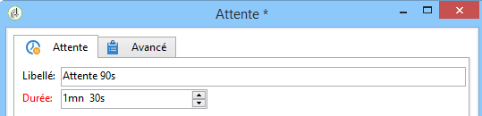

# Attente{#wait}

Une activité de type **Attente** active sa transition après un délai pouvant aller de quelques secondes à plusieurs mois. Une tâche d&#39;attente n&#39;est pas bloquante, le workflow peut exécuter d&#39;autres tâches en parallèle pendant que celle-ci attend.

L&#39;éditeur permet de saisir le libellé et la durée d&#39;attente, comme dans l&#39;exemple ci-dessous :

Dans le champ **[!UICONTROL Durée]**, la valeur peut être exprimée dans l&#39;unité de votre choix (en fonction des paramètres régionaux définis pour l&#39;utilisateur) :

* Si les paramètres régionaux ne sont pas définis : **s** pour les secondes, **m** pour les minutes, **h** pour les heures, **d** pour les jours, **y** pour les années. Lors de la validation, la valeur est automatiquement traduite dans l&#39;unité la plus lisible.

   L&#39;unité par défaut est le jour (**j**).

* Tandis que si, par exemple, les paramètres régionaux sont définis sur &#39;Français&#39; : **s** pour les secondes, **mn** pour les minutes, **h** pour les heures, **j** pour les jours, **m** pour les mois, **a** pour les années. Lors de la validation, la valeur est automatiquement traduite dans l&#39;unité la plus lisible, comme dans l&#39;exemple ci-dessus : **90s** a été traduit en **1mn 30s**.

   L&#39;unité par défaut est le jour (**j**).
