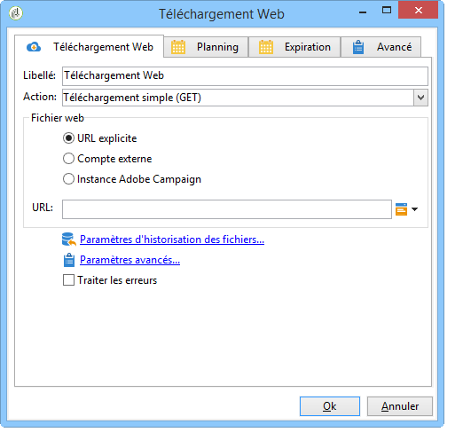
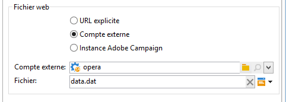
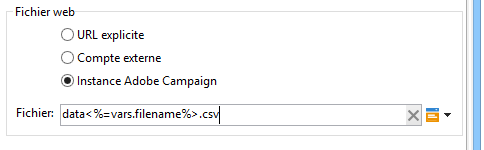
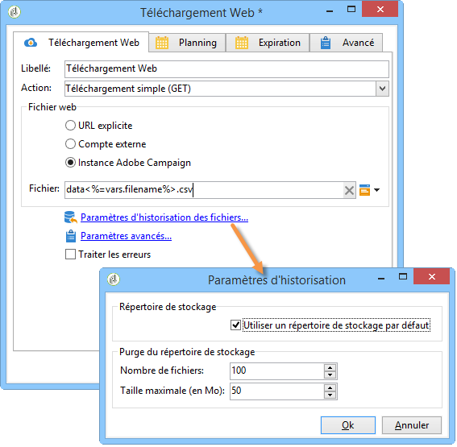
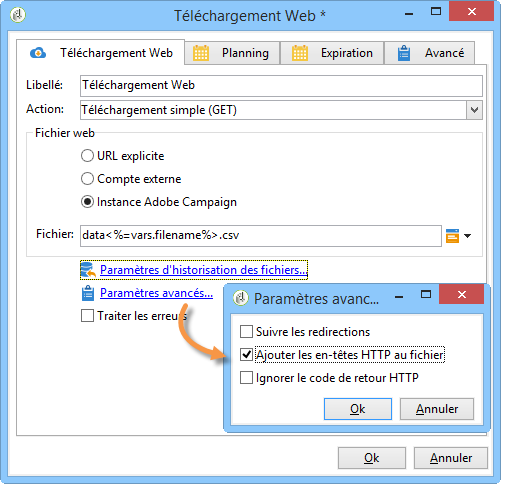

# Téléchargement Web{#web-download}

L&#39;activité de type **Téléchargement Web** permet de lancer le téléchargement d&#39;un fichier sur une URL explicite, un compte externe ou une instance Adobe Campaign. Le protocole utilisé est le HTTP. Il peut s&#39;agir d&#39;un téléchargement de type GET ou POST.

## Propriétés {#properties}

1. **Sélection du fichier web**

   Pour indiquer le fichier à télécharger, vous pouvez saisir directement l&#39;URL du fichier à télécharger, utiliser un compte HTTP externe où le fichier est stocké ou télécharger le fichier à partir d&#39;une instance Adobe Campaign. Les paramètres disponibles sont présentés ci-dessous :

   * Pour entrer directement l’URL du fichier à télécharger, sélectionnez l’ **[!UICONTROL Explicit URL]** option et indiquez l’URL dans le champ approprié. Cette URL peut être construite avec des données variables.

      

   * To use an **[!UICONTROL External account]**, select the account from the drop-down list, and specify the file to be downloaded.

      Les comptes externes sont configurés à partir du **[!UICONTROL Administration > Platform > External accounts]** noeud de l’arborescence Adobe Campaign. Les paramètres du compte peuvent être modifiés par l’ **[!UICONTROL Edit link]** icône.

      

   * To download the file from the Adobe Campaign instance, select the **[!UICONTROL Adobe Campaign Instance]** option.

      

1. **Historisation des fichiers**

   The **[!UICONTROL File historization settings...]** link lets you specify the file storage directory and the purge frequency of this directory.

   

   Les options disponibles sont les suivantes :

   * **[!UICONTROL Use a default storage directory]**: le fichier est toujours déplacé avant d’être traité. Si cette option est cochée, le fichier est déplacé dans le répertoire de stockage par défaut (répertoire **vars** du dossier d’installation d’Adobe Campaign). Pour spécifier un répertoire de stockage, décochez la case et entrez son chemin dans le **[!UICONTROL Storage directory]** champ
   * **[!UICONTROL Number of files]**: entrez le nombre maximal de fichiers à conserver dans le répertoire de stockage.
   * **[!UICONTROL Maximum size (in Mb)]**: entrez la capacité maximale du répertoire de stockage (en mégaoctets).
   Chaque fichier est toujours conservé 24 heures avant d&#39;être soumis aux règles de purge définies. La purge a lieu juste avant le début du traitement de l&#39;activité et ne prend donc pas en compte les fichiers du workflow en cours.

   Les fichiers sont toujours supprimés du plus ancien au plus récent. Les fichiers les plus anciens sont supprimés jusqu&#39;à ce que les deux règles de purge soient vérifiées. Ainsi, si une limite de 100 fichiers est définie, cela signifie que le répertoire de stockage contiendra toujours les 100 fichiers les plus récents avant le début du workflow, en plus des fichiers traités dans le workflow en cours.

   Si vous ne souhaitez plus définir de limite pour les options **[!UICONTROL Number of files]** et **[!UICONTROL Maximum size (in Mb)]** , entrez 0 comme valeur.

1. **Paramètres avancés**

   The **[!UICONTROL Advanced parameters...]** link lets you specify the additional options shown below:

   

   Cette **[!UICONTROL Process errors]** option est détaillée dans la section Erreurs [de](../../workflow/using/monitoring-workflow-execution.md#processing-errors)traitement.

## Paramètres de sortie {#output-parameters}

* filename

   Nom complet du fichier téléchargé.

