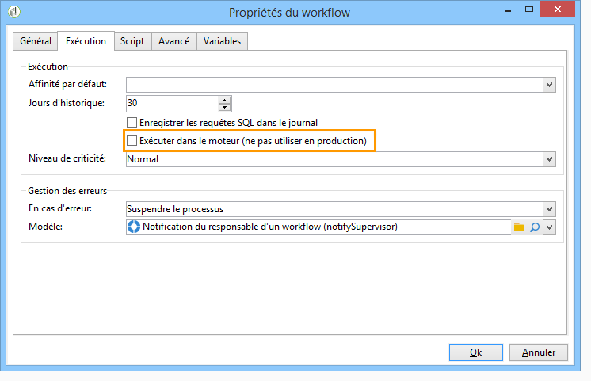
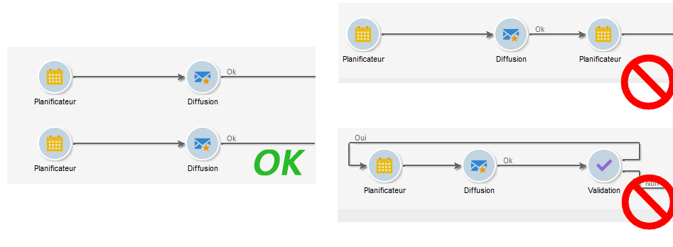
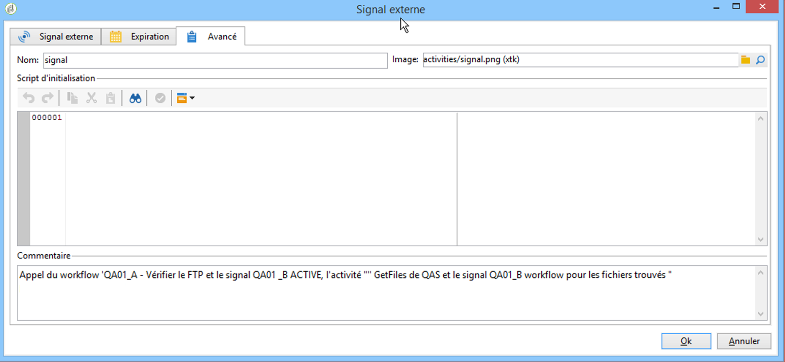

# Bonnes pratiques relatives aux workflows{#workflow-best-practices}

## Exécution et performance {#execution-and-performance}

Vous trouverez ci-dessous des instructions générales pour l’optimisation des performances de Campaign, notamment des bonnes pratiques à appliquer à vos workflows.

Des instructions de dépannage relatives à l’exécution des workflows sont également disponibles dans le [Guide de production de Campaign Classic v7](../../production/using/workflow-execution.md).

### Logs {#logs}

La méthode JavaScript **[!UICONTROL logInfo()]** est une solution qui permet de déboguer un workflow.Toutefois, vous devez l’utiliser avec précaution, en particulier pour les activités que vous exécutez fréquemment : elle peut surcharger les logs et augmenter considérablement la taille de la table des logs.Cependant, il se peut que la méthode **[!UICONTROL logInfo()]** ne soit pas suffisante.

Deux autres solutions sont proposées :

* **Conserver le résultat des populations intermédiaires entre deux exécutions**

  Cette option permet de conserver des tables temporaires entre deux exécutions d&#39;un workflow. Elle est disponible dans l&#39;onglet **[!UICONTROL Général]** des propriétés du workflow et peut être utilisée à des fins de développement et de test pour surveiller les données et vérifier les résultats. Vous pouvez utiliser cette option dans les environnements de développement, mais ne l’utilisez jamais dans les environnements de production. La conservation des tables temporaires peut entraîner une augmentation significative de la taille de la base de données et, par la suite, l&#39;atteinte de la limite de taille. De plus, cela ralentira la sauvegarde.

  Seules les tables de travail de la dernière exécution du workflow sont conservées. Les tables de travail des exécutions précédentes sont purgées par le workflow de **[!UICONTROL nettoyage]** qui s’exécute tous les jours.

  >[!CAUTION]
  >
  >Cette option ne doit jamais être cochée dans un workflow de production. Elle sert à analyser les résultats et est conçue uniquement à des fins de test. Elle ne doit donc être utilisée que dans les environnements de développement ou d’évaluation.

* **Enregistrer les requêtes SQL dans le journal**

  Cette option, disponible dans l’onglet **[!UICONTROL Exécution]** des propriétés d’un workflow, permet d’enregistrer toutes les requêtes SQL générées par l’outil à partir des différentes activités.Il s’agit d’un bon moyen de voir ce qui est réellement exécuté par la plateforme.Toutefois, cette option ne doit être utilisée que de façon temporaire pendant le développement et de manière non activée pendant la production.

Purgez les logs lorsqu’ils ne sont plus nécessaires. L’historique d’un workflow n’est pas purgé automatiquement : tous les messages sont conservés par défaut. L’historique peut être purgé à partir du menu **[!UICONTROL Fichier > Actions]** ou en cliquant sur le bouton Actions situé dans la barre d’outils au-dessus de la liste. Sélectionnez Purger l’historique.
Pour savoir comment purger vos logs, consultez cette [documentation](starting-a-workflow.md).

### Planification des workflows {#workflow-planning}

* Maintenez un niveau d’activité stable tout au long de la journée et évitez les pics afin d’empêcher la surcharge de l’instance. Pour ce faire, répartissez les heures de début des workflows de manière uniforme tout au long de la journée.
* Planifiez le chargement des données au cours de la nuit de façon à réduire les conflits entre les données.
* Les workflows longs peuvent avoir une incidence sur les ressources du serveur et de la base de données.Scindez les workflows les plus longs afin de réduire la durée de traitement.
* Pour réduire les temps d’exécution globaux, remplacez les activités exigeant beaucoup de temps par des activités simplifiées et plus rapides.
* Évitez d’exécuter plus de 20 workflows simultanément. Si trop de workflows sont exécutés en même temps, le système risque de manquer de ressources et peut devenir instable. Pour plus d’informations sur les raisons éventuelles empêchant votre workflow de démarrer, reportez-vous à cet [article](https://helpx.adobe.com/ie/campaign/kb/workflows-not-starting-in-a-campaign-technical-workflows.html).

### Option exécuter dans le moteur {#execute-in-the-engine-option}

Dans la fenêtre des **[!UICONTROL Propriétés du workflow]**, ne cochez jamais l’option **[!UICONTROL Exécuter dans le moteur]**.Lorsque cette option est activée, le workflow devient prioritaire, et tous les autres workflows sont stoppés par le moteur de workflow tant qu’il n’est pas terminé.

## Propriétés d&#39;exécution {#workflow-properties}

### Dossiers des workflows {#workflow-folders}

Adobe conseille de créer les workflows dans un dossier dédié.

Si le workflow a un impact sur l’ensemble de la plateforme (processus de nettoyage, par exemple), vous pouvez ajouter un sous-dossier au dossier intégré **[!UICONTROL Workflows techniques]**.

### Attribution d’un nom au workflow {#workflow-naming}

Pour trouver plus facilement les workflows qui ne fonctionnent pas de la manière attendue et résoudre les problèmes, Adobe recommande d&#39;attribuer aux workflows des libellés et des noms adéquats. Renseignez également le champ de description du workflow pour que l&#39;opérateur puisse facilement comprendre son objectif.

Si le workflow fait partie d&#39;un processus impliquant d&#39;autres workflows, vous pouvez saisir un libellé explicite, en utilisant par exemple des chiffres pour classer les workflows (par libellé).

Par exemple :

* 001 - Import - Import des destinataires
* 002 - Import - Import des ventes
* 003 - Import - Import des détails sur les ventes
* 010 - Export - Export des logs de diffusion
* 011 - Export - Export des logs de tracking

### Niveau de criticité d’un workflow {#workflow-severity}

Vous pouvez configurer le niveau de criticité d&#39;un workflow dans l&#39;onglet **[!UICONTROL Exécution]** des propriétés du workflow :

* Normal
* Production
* Critique

Si vous indiquez cette information lors de la création d&#39;un workflow, vous déterminerez le niveau de priorité du processus configuré.

Cette option n&#39;a aucun impact fonctionnel sur les workflows autres que les workflows d&#39;opération.

Les workflows de campagne (créés dans le cadre d’une opération/campagne) avec un niveau de priorité plus élevé sont exécutés en premier si l’opération comprend plusieurs processus qui sont supposés s’exécuter simultanément.Par défaut, seuls 10 processus peuvent être exécutés simultanément dans une campagne, selon l’option NmsOperation_LimitConcurrency.Par exemple, si une campagne contient 25 workflows, les workflows ayant une gravité plus élevée seront alors exécutés dans le premier pool de 10 processus.

### Surveillance des workflows {#workflow-monitoring}

Vous devez surveiller tous les workflows planifiés s&#39;exécutant dans des environnement de production afin d&#39;être averti en cas d&#39;erreur.

Dans les propriétés d’un workflow, sélectionnez un groupe de personnes responsables : le groupe **[!UICONTROL Superviseurs et superviseuses de workflow]** par défaut ou un groupe personnalisé.Assurez-vous qu’au moins un opérateur ou une opératrice appartient à ce groupe et qu’une adresse e-mail est configurée.

Avant de commencer à créer un workflow, pensez à définir des superviseurs et superviseuses de workflow.Ils seront avertis par e-mail en cas d’erreur.Pour plus d&#39;informations, consultez la section [Gérer les erreurs](monitoring-workflow-execution.md#managing-errors).

Vérifiez régulièrement l’onglet **[!UICONTROL Supervision]** pour connaître le statut des workflows actifs. Pour plus d&#39;informations, consultez la section [Supervision de l’instance](monitoring-workflow-execution.md#instance-supervision).

La carte thermique des workflows permet aux administrateurs de la plateforme Adobe Campaign de surveiller la charge sur l’instance et de planifier les workflows en conséquence. Voir à ce sujet [Surveillance des workflows](heatmap.md).

## Utilisation des activités {#using-activities}

>[!CAUTION]
>
>Vous pouvez copier et coller des activités dans un même workflow. Toutefois, nous vous déconseillons de copier et coller des activités dans différents workflows. Certains paramètres associés à des activités telles que Diffusions et Planificateur peuvent entraîner des conflits et des erreurs lors de l&#39;exécution du workflow de destination. Nous vous recommandons plutôt de **dupliquer** les workflows. Pour plus d&#39;informations, voir la section [Duplication des workflows](building-a-workflow.md#duplicating-workflows).

### Attribution d&#39;un nom à une activité {#name-of-the-activity}

Lors du développement de votre workflow, toutes les activités auront un nom, ainsi que tous les objets Adobe Campaign.Bien que le nom d’une activité soit généré par l’outil et ne puisse pas être modifié, il est recommandé de lui attribuer un nom explicite lors de sa configuration.Si vous le faites plus tard, cela peut interrompre le workflow avec des activités qui utilisent le nom d’une autre activité précédente.Il serait donc difficile de mettre à jour les noms par la suite.

Le nom d&#39;une activité figure dans l&#39;onglet **[!UICONTROL Avancé]**. Ne conservez pas le nom **[!UICONTROL query]**, **[!UICONTROL query1]** ou **[!UICONTROL query11]**. Attribuez aux activités un nom explicite comme **[!UICONTROL querySubscribedRecipients]**. Ce nom apparaît dans le journal et les logs SQL, le cas échéant, et permet de déboguer le workflow lors de sa configuration.

### Premières et dernières activités {#first-and-last-activities}

* Commencez toujours votre workflow par une activité **[!UICONTROL Début]** ou une activité **[!UICONTROL Planificateur]**. Lorsque cela est pertinent, vous pouvez également utiliser une activité **[!UICONTROL Signal externe]**.
* Lors de la construction de votre workflow, n&#39;utilisez qu&#39;une seule **** activité Planificateur par branche. Si une même branche d&#39;un workflow comporte plusieurs planificateurs (liés les uns aux autres), le nombre de tâches à exécuter sera multiplié de manière exponentielle, ce qui surchargerait considérablement la base. Cette règle s’applique également à toutes les activités comportant un onglet **[!UICONTROL Planification &amp; historique]**. En savoir plus sur la [planification](scheduler.md).

  

* Utilisez des activités **[!UICONTROL Fin]** pour chaque workflow.Cela permet à Adobe Campaign de libérer l’espace temporaire utilisé pour réaliser les calculs dans les workflows.Voir à ce sujet la section [Début et Fin](start-and-end.md).

### Code JavaScript dans une activité {#javascript-within-an-activity}

Vous souhaiterez peut-être ajouter du code JavaScript lors de l&#39;initialisation d&#39;une activité de workflow. Vous pouvez le faire dans l&#39;onglet **[!UICONTROL Avancé]** d&#39;une activité.

Pour repérer plus facilement le workflow, il est conseillé d&#39;utiliser deux tirets avant et après le libellé de l&#39;activité, comme dans l&#39;exemple suivant : -- Mon libellé --.

### Signal {#signal}

La plupart du temps, vous ne saurez pas d&#39;où vient l&#39;appel d&#39;un signal. Pour éviter ce problème, utilisez le champ **[!UICONTROL Commentaire]** de l’onglet **[!UICONTROL Avancé]** de l’activité de signal pour documenter l’origine attendue d’un signal pour l’activité en question.

## Mise à jour des workflows {#workflow-update}

Un workflow de production ne doit pas être mis à jour directement.À moins que le processus consiste à créer une campagne avec des modèles de workflow, les processus doivent d’abord être testés dans un environnement de développement.Après cette validation, le workflow peut être déployé et démarré en production.

Effectuez tous les tests dans les environnements de développement ou d’évaluation, et non dans les environnements de production, où les performances ne peuvent pas être garanties.

Les workflows archivés peuvent être conservés sur des plateformes de développement ou de test, dans un dossier Archivé. Un environnement de production doit en revanche rester aussi propre que possible.Les anciens workflows doivent être supprimés de l’environnement de production s’ils sont inactifs.
