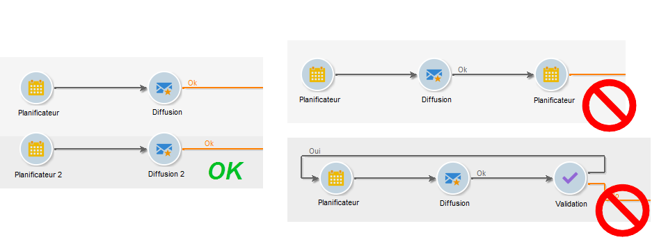

# Bonnes pratiques relatives aux workflows{#workflow-best-practices}

## Exécution et performance {#execution-and-performance}

Vous trouverez ci-dessous des instructions générales sur l’optimisation des performances des campagnes, y compris les meilleures pratiques à appliquer à vos processus.

Des instructions de dépannage relatives à l’exécution des processus sont également disponibles dans [cette section](../../production/using/workflow-execution.md).

### Logs {#logs}

La méthode JavaScript **[!UICONTROL logInfo()]** est une excellente solution pour déboguer un flux de travail. Elle est utile, mais elle doit être utilisée avec précaution, notamment pour les activités qui sont fréquemment exécutées : il peut surcharger les journaux et augmenter considérablement la taille de la table de journaux. Mais vous pourriez aussi avoir besoin de plus que **[!UICONTROL logInfo()]**.

Deux autres solutions sont proposées :

* **Conserver le résultat des populations intermédiaires entre deux exécutions**

   Cette option permet de conserver les tables temporaires entre deux exécutions d’un flux de travail. Il est disponible dans l’ **[!UICONTROL General]** onglet des propriétés du flux de travail et peut être utilisé à des fins de développement et de test pour surveiller les données et vérifier les résultats. Vous pouvez utiliser cette option dans les environnements de développement, mais jamais dans les environnements de production. Si vous conservez des tables temporaires, la taille de la base de données pourrait augmenter de manière significative et la taille limite pourrait être atteinte. En outre, cela ralentira la sauvegarde.

   Seules les tables de travail de la dernière exécution du processus sont conservées. Les tableaux de travail des exécutions précédentes sont purgés par le **[!UICONTROL cleanup]** flux de travail, qui s’exécute quotidiennement.

   >[!CAUTION]
   >
   >Cette option ne doit jamais être cochée dans un workflow de production. Cette option est utilisée pour analyser les résultats et est conçue uniquement à des fins de test. Elle doit donc être utilisée uniquement dans les environnements de développement ou d’évaluation.

* **Enregistrer les requêtes SQL dans le journal**

   Disponible dans l’ **[!UICONTROL Execution]** onglet des propriétés du flux de travail, cette option consigne toutes les requêtes SQL générées par l’outil à partir des différentes activités. C&#39;est une bonne façon de voir ce qui est réellement exécuté par la plateforme. Toutefois, cette option ne doit être utilisée que temporairement pendant le développement et non pas activée en production.

Purgez les journaux lorsqu’ils ne sont plus nécessaires. L’historique du flux de travail n’est pas purgé automatiquement : tous les messages sont conservés par défaut. L&#39;historique peut être purgé via le **[!UICONTROL File > Actions]** menu ou en cliquant sur le bouton Actions situé dans la barre d&#39;outils au-dessus de la liste. Sélectionnez Purger l’historique.
Pour savoir comment purger vos journaux, consultez cette [documentation](../../workflow/using/executing-a-workflow.md#actions-toolbar).

### Planification des workflows {#workflow-planning}

* Essayez de maintenir un niveau d’activité stable au cours de la journée et évitez les pics afin de ne pas surcharger l’instance. Pour cela, distribuez les heures de début des workflows tout au long de la journée.
* Planifiez le chargement des données au cours de la nuit de façon à réduire les conflits entre les données.
* Les workflows longs peuvent avoir une incidence sur les ressources du serveur et de la base de données. Fractionnez les workflows les plus longs pour réduire le temps de traitement.
* Pour réduire les temps d’exécution globaux, remplacez les activités exigeant beaucoup de temps par des activités simplifiées et plus rapides.
* Evitez d’exécuter plus de 20 processus simultanément. Si trop de workflows sont exécutés en même temps, le système risque de manquer de ressources et peut devenir instable. Pour plus d&#39;informations sur les raisons pour lesquelles votre flux de travail ne commence peut-être pas, reportez-vous à cet [article](https://helpx.adobe.com/ie/campaign/kb/workflows-not-starting-in-a-campaign-technical-workflows.html).

### Exécution des workflows {#workflow-execution}

Il est recommandé de ne pas planifier l&#39;exécution d&#39;un workflow à une fréquence supérieure à toutes les 15 minutes, afin de ne pas nuire aux performances générales du système et d&#39;éviter la création de blocs dans la base de données.

Evitez de laisser vos processus en pause. Si vous créez un processus temporaire, assurez-vous qu’il sera en mesure de se terminer correctement et de ne pas rester dans un **[!UICONTROL paused]** état. S’il est suspendu, cela signifie que vous devez conserver les tables temporaires et augmenter ainsi la taille de la base de données. Affectez des superviseurs de processus sous Propriétés du processus pour envoyer une alerte en cas d’échec ou de suspension d’un processus par le système.

Pour éviter que les workflows soient dans un état en pause :

* Vérifiez vos workflows régulièrement pour vous assurer qu&#39;il n&#39;y a pas d&#39;erreurs inattendues.
* Restez aussi simple que possible, par exemple en divisant les processus volumineux en plusieurs processus différents. Vous pouvez utiliser **[!UICONTROL External signal]** des activités pour déclencher leur exécution en fonction de l’exécution d’autres processus.
* Evitez d’avoir désactivé les activités avec des flux dans vos flux de travaux, en laissant les threads ouverts et en conduisant à de nombreuses tables temporaires pouvant consommer beaucoup d’espace. Ne conservez pas les activités dans **[!UICONTROL Do not enable]** ou **[!UICONTROL Enable but do not execute]** les états dans vos processus.

Arrêtez également les processus inutilisés. Les processus qui continuent à fonctionner conservent les connexions à la base de données.

N&#39;utilisez qu&#39;un arrêt inconditionnel dans les cas les plus rares. N’utilisez pas cette action régulièrement. L’inexécution d’une fermeture nette sur les connexions générées par les processus à la base de données a un impact sur les performances.

### Option exécuter dans le moteur {#execute-in-the-engine-option}

Dans la **[!UICONTROL Workflow properties]** fenêtre, ne cochez jamais l’ **[!UICONTROL Execute in the engine]** option. Lorsque cette option est activée, le flux de travaux est prioritaire et tous les autres flux de travaux sont arrêtés par le moteur de flux de travaux jusqu’à ce que celui-ci soit terminé.

## Propriétés d&#39;exécution  {#workflow-properties}

### Dossiers des workflows {#workflow-folders}

Adobe conseille de créer les workflows dans un dossier dédié.

If the workflow affects the whole platform (cleansing processes for example), you can consider adding a sub-folder in the built-in **[!UICONTROL Technical Workflows]** folder.

### Attribution d’un nom au workflow {#workflow-naming}

Pour trouver plus facilement les workflows qui ne fonctionnent pas de la manière attendue et résoudre les problèmes, Adobe recommande d&#39;attribuer aux workflows des libellés et des noms adéquats. Renseignez également le champ de description du workflow pour que l&#39;opérateur puisse facilement comprendre son objectif.

Si le workflow fait partie d&#39;un processus impliquant d&#39;autres workflows, vous pouvez saisir un libellé explicite, en utilisant par exemple des chiffres pour classer les workflows (par libellé).

Par exemple :

* 001 - Importer - Destinataires de l&#39;importation
* 002 - Importation - Ventes à l&#39;importation
* 003 - Importation - Détails des ventes à l&#39;importation
* 010 - Exportation - Journaux de livraison d’exportation
* 011 - Exportation - Journaux de suivi des exportations

### Niveau de criticité d’un workflow {#workflow-severity}

You can configure the severity of a workflow in the workflow properties, in the **[!UICONTROL Execution]** tab:

* Normal
* Production
* Critique

Si vous indiquez cette information lors de la création d&#39;un workflow, vous déterminerez le niveau de priorité du processus configuré.

Cette option n&#39;a aucun impact fonctionnel sur les workflows autres que les workflows d&#39;opération.

Les workflows d&#39;opération (créés dans le cadre d&#39;une opération/campagne) avec un niveau de priorité plus élevé sont exécutés en premier si l&#39;opération comprend plusieurs processus qui sont supposés s&#39;exécuter simultanément. Par défaut, seuls 10 processus peuvent s&#39;exécuter simultanément dans une opération, selon l&#39;option NmsOperation_LimitConcurrency. Par exemple, si une opération contient 25 workflows, ceux avec une priorité plus élevée seront exécutés dans le premier pool de 10 processus.

### Surveillance des workflows {#workflow-monitoring}

Vous devez surveiller tous les workflows planifiés s&#39;exécutant dans des environnement de production afin d&#39;être averti en cas d&#39;erreur.

Dans les propriétés du processus, sélectionnez un groupe de superviseurs, soit le groupe par défaut **[!UICONTROL Workflow supervisors]** soit un groupe personnalisé. Assurez-vous qu’au moins un opérateur appartient à ce groupe, avec un courrier électronique configuré.

Avant de commencer à créer un flux de travail, n’oubliez pas de définir les superviseurs du flux de travail. Ils seront avertis par email en cas d&#39;erreurs. For more on this, refer to [Managing errors](../../workflow/using/monitoring-workflow-execution.md#managing-errors).

Vérifier régulièrement l’ **[!UICONTROL Monitoring]** univers pour voir l’état général des processus actifs. For more on this, refer to [Instance supervision](../../workflow/using/monitoring-workflow-execution.md#instance-supervision).

La carte thermique des workflows permet aux administrateurs de la plate-forme Adobe Campaign de surveiller la charge sur l’instance et de planifier les workflows en conséquence. Voir à ce sujet [Surveillance des workflows](../../workflow/using/heatmap.md).

## Utilisation des activités {#using-activities}

>[!CAUTION]
>
>Vous pouvez copier et coller des activités dans un même flux de travail. Toutefois, nous vous déconseillons de copier des activités de collage dans différents processus. Certains paramètres associés à des activités telles que Livraisons et Planificateur peuvent entraîner des conflits et des erreurs lors de l’exécution du processus de destination. Nous vous recommandons plutôt de **dupliquer** les processus. Pour plus d’informations, voir [Duplication de processus](../../workflow/using/building-a-workflow.md#duplicating-workflows).

### Attribution d&#39;un nom à une activité {#name-of-the-activity}

Lors du développement de votre workflow, toutes les activités seront dotées d&#39;un nom, tout comme les objets Adobe Campaign. Bien que ce nom soit généré par l&#39;outil, il est recommandé d&#39;attribuer à une activité un nom explicite lors de sa configuration. Si vous le faites plus tard, le workflow peut être interrompu si les activités utilisent le nom d&#39;activités précédentes et la mise à jour des noms risque d&#39;être difficile.

Le nom de l’activité se trouve dans l’ **[!UICONTROL Advanced]** onglet. Ne les laissez pas nommés **[!UICONTROL query]**, **[!UICONTROL query1]**, **[!UICONTROL query11]**, mais donnez-leur des noms explicites comme **[!UICONTROL querySubscribedRecipients]**. Ce nom s&#39;affichera dans le journal et, le cas échéant, dans les journaux SQL, ce qui aidera à déboguer le processus lors de sa configuration.

### Premières et dernières activités {#first-and-last-activities}

* Commencez toujours votre flux de travail avec une **[!UICONTROL Start]** activité ou une **[!UICONTROL Scheduler]** activité. Le cas échéant, vous pouvez également utiliser une **[!UICONTROL External signal]** activité.
* When building your workflow, only use one **[!UICONTROL Scheduler]** activity per branch. Si une même branche d&#39;un workflow comporte plusieurs planificateurs (liés les uns aux autres), le nombre de tâches à exécuter sera multiplié de manière exponentielle, ce qui surchargerait considérablement la base. Cette règle s’applique également à toutes les activités avec un **[!UICONTROL Scheduling & History]** onglet. En savoir plus sur la [planification](../../workflow/using/scheduler.md).

   

* Utilisez **[!UICONTROL End]** les activités pour chaque flux de travail. Cela permet à Adobe Campaign de libérer de l’espace temporaire utilisé pour les calculs dans les flux de travaux. Pour plus d’informations à ce sujet, voir : [Début et Fin](../../workflow/using/start-and-end.md).

### Code JavaScript dans une activité {#javascript-within-an-activity}

Vous pouvez souhaiter ajouter du code JavaScript lors de l’initialisation d’une activité de flux de travail. Vous pouvez effectuer cette opération dans l’onglet **[!UICONTROL Advanced]** de l’activité.

Pour repérer plus facilement le workflow, il est conseillé d&#39;utiliser deux tirets avant et après le libellé de l&#39;activité, comme dans l&#39;exemple suivant : -- Mon libellé --.

### Signal {#signal}

La plupart du temps, vous ne savez pas d&#39;où provient le signal. Pour éviter ce problème, utilisez le **[!UICONTROL Comment]** champ dans l’ **[!UICONTROL Advanced]** onglet de l’activité de signal pour documenter l’origine attendue d’un signal pour cette activité.

## Mise à jour des workflows {#workflow-update}

Un workflow de production ne doit pas être directement mis à jour. À moins que le processus consiste à créer une opération avec des modèles de workflow, les processus doivent être d&#39;abord testés dans un environnement de développement. Après validation, le workflow peut être déployé et démarré en production.

Effectuez tous les tests dans les environnements de développement ou d’évaluation, et non dans les environnements de production. Les performances ne peuvent être garanties dans un tel cas.

Les workflows archivés peuvent être conservés sur des plateformes de développement ou de test, dans un dossier Archivé. Un environnement de production doit en revanche rester aussi propre que possible. Les anciens workflows doivent être supprimés de l&#39;environnement de production s&#39;ils sont inactifs.
