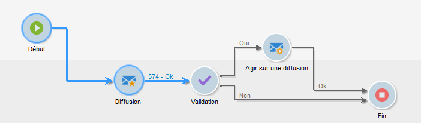

# Cycle de vie d&#39;un workflow {#workflow-life-cycle}

Le cycle de vie d&#39;un workflow comporte trois grandes étapes.

* **En édition**

   C&#39;est la phase de conception initiale : lorsqu&#39;un nouveau workflow est créé, il est en état d&#39;édition. Un tel workflow n&#39;est pas encore pris en charge par le serveur, il peut donc être modifié sans risque.

* **Démarré**

   Une fois la phase de conception terminée, le workflow peut être démarré. Dans cette phase, l&#39;instance est prise en charge par le serveur, les tâches élémentaires sont exécutées. Le workflow peut encore être modifié, mais avec certaines précautions.

* **Terminé**

   Un workflow est terminé lorsqu&#39;il n&#39;a plus de tâche en cours ou lorsqu&#39;un opérateur a arrêté explicitement l&#39;instance.

Par exemple, dans le workflow ci-dessous, les activités **Début** et **Diffusion** sont entourées tandis que l’activité **Validation** clignote.

Cela signifie que les deux premières activités ont été exécutées avec succès et que la validation est en cours, c&#39;est-à-dire que l&#39;activité est créée mais pas encore complétée.

Les caractères **574 - Ok** affichés au-dessus de la transition suivant l&#39;activité **Diffusion** signifient que la préparation de la diffusion a ciblé 574 destinataires et que l&#39;opération s&#39;est déroulée correctement. Ces informations, ajoutées sur les transitions au moment de l&#39;exécution, sont calculées par les activités traitant des données.

Le workflow est donc démarré et attend la décision d&#39;un opérateur du groupe spécifié dans l&#39;activité **Validation**. Les opérateurs du groupe ayant un email ou un numéro de téléphone mobile renseigné sont notifiés via ce média.

La gestion des opérateurs est présentée dans cette [section](../../platform/using/access-management.md).

Pour plus d&#39;informations sur la manière de surveiller vos workflows, voir [cette section](monitoring-workflow-execution.md).
