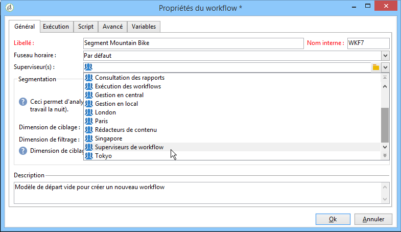

# Propriétés d&#39;exécution {#workflow-properties}

## Onglet Exécution {#execution-tab}

The **[!UICONTROL Execution]** tab of the **[!UICONTROL Properties]** window in a workflow is broken down into 3 sections:

### Planificateur {#scheduler}

Cette section n&#39;apparaît que dans les workflows d&#39;opérations.

* **[!UICONTROL Priority]**

   Le moteur de processus traite les processus à exécuter en fonction du critère de priorité défini dans ce champ. Par exemple, tous les processus avec une **[!UICONTROL Average]** priorité seront exécutés avant ceux avec une **[!UICONTROL Low]** priorité.

* **[!UICONTROL Schedule execution for a time of low activity]**

   Cette option reporte le début du processus à une période moins occupée. Certains flux de travail peuvent être coûteux en termes de ressources pour le moteur de base de données. Nous vous recommandons de programmer l’exécution pour un temps de faible activité (la nuit, par exemple). Les périodes de faible activité sont définies dans le flux de travail **[!UICONTROL Processes on campaigns]** technique.

### Exécution {#execution}

* **[!UICONTROL Default affinity]**

   Si votre installation comprend plusieurs serveurs de workflow, utilisez ce champ pour choisir sur quelle machine le workflow s&#39;exécutera. Si la valeur définie dans ce champ n&#39;existe au niveau d&#39;aucun serveur, le workflow restera en attente.

   Consultez cette [section](../../installation/using/configuring-campaign-server.md#high-availability-workflows-and-affinities).

* **[!UICONTROL History in days]**

   Les tables de travail de la base conservent un historique des exécutions (tâches, évènements, journal). Définissez ici le nombre de jours d&#39;historique que vous voulez conserver pour ce workflow : les processus de nettoyage de la base supprimeront chaque jour les historiques plus anciens. Si la valeur de ce champ est zéro, l&#39;historique ne sera jamais supprimé.

* **[!UICONTROL Log SQL queries in the journal]**

   Cette fonctionnalité est réservée aux utilisateurs experts. Elle concerne les workflows qui contiennent des activités de ciblage (requête, union, intersection, etc.). Lorsque cette option est cochée, les requêtes SQL envoyées vers la base lors de l&#39;exécution du workflow sont affichées dans Adobe Campaign : vous pouvez ainsi les analyser afin d&#39;optimiser les requêtes ou diagnostiquer d&#39;éventuels problèmes.

   Les requêtes sont affichées dans un **[!UICONTROL SQL logs]** onglet qui est ajouté au flux de travail (à l’exception des processus de campagne) et à l’ **[!UICONTROL Properties]** activité lorsque l’option est activée. L&#39; **[!UICONTROL Audit]** onglet inclut également des requêtes SQL.

   

* **[!UICONTROL Execute in the engine]**

   Cette option ne doit être utilisée qu&#39;à des fins de débuggage et jamais en production. Lorsque cette option est activée, le workflow devient prioritaire, et tous les autres workflows sont stoppés par le moteur de workflow tant qu&#39;il n&#39;est pas terminé.

### Gestion des erreurs  {#error-management}

* **[!UICONTROL Troubleshooting]**

   Ce champ vous permet de définir l&#39;action à effectuer lorsqu&#39;une tâche du workflow est en erreur. Deux options sont disponibles :

   * **[!UICONTROL Stop the process]**: le processus est automatiquement suspendu. l’état du processus devient **[!UICONTROL Failed]**. Une fois le problème résolu, redémarrez le processus à l’aide des **[!UICONTROL Start]** boutons ou **[!UICONTROL Restart]** .
   * **[!UICONTROL Ignore]**: l’état de la tâche qui a déclenché l’erreur devient **[!UICONTROL Failed]**, mais le processus conserve l’ **[!UICONTROL Started]** état. Cette configuration s’applique aux tâches récurrentes : si la branche inclut un planificateur, elle démarre normalement lors de la prochaine exécution du processus.

* **[!UICONTROL Consecutive errors]**

   Ce champ devient disponible lorsque la **[!UICONTROL Ignore]** valeur est sélectionnée dans le **[!UICONTROL In case of errors]** champ. Vous pouvez spécifier le nombre d’erreurs qui peuvent être ignorées avant l’arrêt du processus. Une fois ce nombre atteint, l’état du flux de travail devient **[!UICONTROL Failed]**. Si la valeur de ce champ est 0, le processus ne sera jamais arrêté quel que soit le nombre d’erreurs.

* **[!UICONTROL Template]**

   This field lets you select the notification template to be sent to the workflow supervisors when its status changes to **[!UICONTROL Failed]**.

   Les opérateurs concernés seront avertis par courrier électronique s&#39;il y a une adresse électronique dans leur profil. Pour définir les superviseurs de processus, accédez au **[!UICONTROL Supervisor(s)]** champ des propriétés (**[!UICONTROL General]** onglet).

   

   The **[!UICONTROL Notification to a workflow supervisor]** default template includes a link for accessing the Adobe Campaign console via the Web so that the recipient can work on the issue once they are logged on.

   Pour créer un modèle personnalisé, accédez à **[!UICONTROL Administration>Campaign management>Technical deliveries and templates]**.

